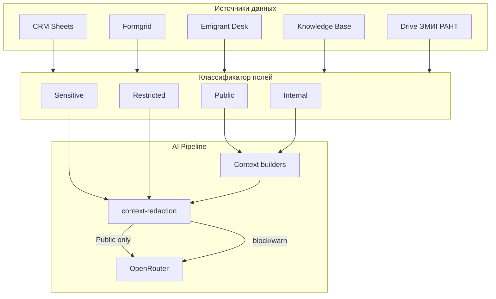

# AI Data Classification — классификация полей платформы

**Дата:** 2026-06-17  
**Статус:** аудит и политика (код не менялся)  
**Связанные документы:** `AI_GUARDRAILS_AND_SECURITY_AUDIT.md`, `SECURITY_PHASE_A_REPORT.md`, `CORPORATE_AI_ASSISTANT_DESIGN.md`

---

## 1. Назначение документа

Единая матрица классификации **всех значимых полей** Sharp & Spice Team Platform по четырём уровням доступа. Используется для:

- проектирования AI context builders и guardrails;
- аудита утечек в OpenRouter;
- разграничения ролей (`owner` / `manager`);
- планирования Security Phase B и корпоративного AI scope.

**Важно:** платформа — **внутренняя** (только сотрудники). «Public» здесь означает **допустимо передавать во внешний LLM (OpenRouter)** в рабочем контексте, а не «публично в интернете».

---

## 2. Уровни классификации

| Уровень | Определение | OpenRouter | UI платформы | Пример |
|---------|-------------|------------|--------------|--------|
| **Public** | Операционные данные кейса; нужны AI для работы менеджера | ✅ Разрешено | Все авторизованные | Имя, статус ВНЖ, направление |
| **Internal** | Служебные данные компании; только внутри платформы | ❌ Не отправлять | Все авторизованные | Комментарии менеджеров, team chat |
| **Sensitive** | Секреты, credentials, токены | ❌ Запрещено (hard block) | Только где необходимо для работы | `appPassword`, API keys |
| **Restricted** | Высокий риск; только определённые роли | ❌ Запрещено | `owner` или выделенная роль | Финансы, зарплаты, комиссии |

### 2.1. Правила приоритета

1. **Sensitive** перекрывает всё — никогда в OpenRouter, даже если поле «нужно AI».
2. **Restricted** перекрывает Public/Internal для UI и экспорта.
3. **Internal** не должно попадать в OpenRouter без явного исключения в политике.
4. При конфликте классов в одном документе (Drive) — действует **более строгий** уровень.

### 2.2. Роли платформы

| Роль | Код | Доступ |
|------|-----|--------|
| Владелец | `owner` | Полный доступ ко всем разделам, кроме явно Restricted (когда появится) |
| Менеджер | `manager` | CRM, AI, задачи, чат; Restricted — по политике |

Сегодня **финансового раздела с role-gate нет** — Restricted зарезервирован под будущие модули.

---

## 3. Поверхности OpenRouter (где применяется классификация)

| Поверхность | Endpoint / модуль | Модель | Что уходит наружу |
|-------------|---------------------|--------|-------------------|
| AI Workspace | `POST /api/ai-workspace` | Claude Sonnet 4 | System prompt + context block + история (4 turn) + вопрос |
| Client search intent | `client-search-intent.ts` | GPT-4o Mini | Только текст запроса менеджера → JSON |
| Client Card AI | `POST /api/clients/[id]/ai` | GPT-4o Mini | `buildClientAiContext()` + вопрос |

**Не используют OpenRouter:** Tasks, Team Chat, Notifications, Lead Review UI, Analytics UI, Presence.

**Защита Sensitive (Security Phase A):** `context-redaction.ts` — redact перед OpenRouter, в debug, transport, логах, истории чатов.

---

## 4. Сводная матрица по доменам

Условные обозначения:

- **Класс** — целевая классификация
- **В AI сейчас** — попадает ли в OpenRouter payload на 2026-06-17
- **Гэп** — расхождение целевого класса и фактического поведения

---

### 4.1. CRM — таблица «Клиенты Хорватия» (`Client`)

Источник: Google Sheets External, модель `src/lib/google-sheets/types.ts`, парсер `parse.ts`.

| Поле | Источник / колонка | Класс | В AI сейчас | Гэп |
|------|-------------------|-------|-------------|-----|
| `name` (ФИО/фамилия) | Фамилия | **Public** | ✅ Workspace, Client Card | — |
| `citizenship` (латиница) | Латиница | **Public** | ✅ | — |
| `passportNumber` | Номер паспорта | **Public** | ✅ | — |
| `email` | Электронная почта | **Public** | ✅ | — |
| `phone` | (legacy/demo колонки) | **Public** | ✅ Client Card | — |
| `country` | — | **Public** | ✅ candidates | — |
| `direction` | Хорватия (фикс.) | **Public** | ✅ | — |
| `status` | Статус кейса | **Public** | ✅ | — |
| `manager` | Имя референта / менеджер | **Public** | ✅ | — |
| `referentName` | Имя референта | **Public** | ⚠️ UI only; не в `formatClientForAi` | Покрытие |
| `bookingAddress` | Адрес букинга | **Public** | ✅ | — |
| `bookingRange` | Дата букинга | **Public** | ✅ | — |
| `submittedAt` | Дата подачи | **Public** | ✅ | — |
| `expectedApprovalAt` | Предполагаемое одобрение | **Public** | ✅ | — |
| `approvalAt` | Дата одобрения ВНЖ | **Public** | ✅ | — |
| `residenceCardIssuedAt` | Дата выдачи карточки ВНЖ | **Public** | ❌ не в formatters | Покрытие |
| `partnerName` | Партнер от кого клиент | **Public** | ✅ | — |
| `contract` | Договор | **Public** | ✅ | — |
| `notes` | Заметки (Sheets) | **Internal** | ⚠️ **Да** (до 400–500 симв.) | **Гэп B** |
| `appPassword` | Пароль для приложения | **Sensitive** | ❌ (Phase A) | — |
| `id` | ID / fallback паспорт | **Internal** | ✅ Client Card («ID в системе») | Пересмотр |
| `rowIndex` | Номер строки Sheets | **Internal** | ✅ debug, candidates | Допустимо |
| `lastActivity` | Последняя активность | **Public** | ✅ candidates | — |
| `createdAt` | Дата создания | **Public** | ⚠️ частично | — |

---

### 4.2. Заметки менеджеров — Supabase `client_notes` (`ClientNote`)

| Поле | Класс | В AI сейчас | Гэп |
|------|-------|-------------|-----|
| `text` | **Internal** | ⚠️ **Да** — Client Card AI | **Гэп B** |
| `author` | **Internal** | ✅ Client Card | **Гэп B** |
| `createdAt` | **Internal** | ✅ Client Card | **Гэп B** |
| `clientId` | **Internal** | ❌ | — |
| `id` | **Internal** | ❌ | — |

---

### 4.3. Анкеты и документы клиента (Sheets tabs)

| Поле | Класс | В AI сейчас | Гэп |
|------|-------|-------------|-----|
| `ClientSurvey.title` | **Public** | ✅ метаданные | — |
| `ClientSurvey.filledAt` | **Public** | ✅ | — |
| `ClientSurvey.processingStatus` | **Public** | ✅ | — |
| `ClientDocument.name` | **Public** | ✅ метаданные | — |
| `ClientDocument.category` | **Public** | ✅ | — |
| `ClientDocument.uploadedAt` | **Public** | ✅ | — |
| Содержимое документов (PDF) | **Internal** / **Restricted** | ❌ (только имена) | — |

---

### 4.4. Formgrid — «Новые клиенты» (динамические колонки анкеты)

Источник: `getFormgridClientFields`, `formgridRowToContext`, `formatFormgridRowDetailed`.

| Поле / тип | Класс | В AI сейчас | Гэп |
|------------|-------|-------------|-----|
| ФИО | **Public** | ✅ | — |
| Email | **Public** | ✅ | — |
| Телефон | **Public** | ✅ | — |
| № загранпаспорта | **Public** | ✅ | — |
| Дата рождения | **Public** | ✅ | — |
| Дата анкеты | **Public** | ✅ | — |
| Прочие колонки анкеты (survey) | **Public** / **Internal** | ✅ через `surveyData` / `debugRow`* | Зависит от колонки |
| Колонки с «пароль», «token», «secret» | **Sensitive** | ❌ (Phase A filter) | — |

\* После Phase A: sensitive keys исключаются из `debugRow` и transport.

---

### 4.5. Emigrant Croatia Desk (`EmigrantDeskClient`)

Источник: Supabase Desk (`profiles` + `cases`), slice в `client-field-sources.ts`.

| Поле | Класс | В AI сейчас | Гэп |
|------|-------|-------------|-----|
| `firstName`, `lastName` | **Public** | ✅ | — |
| `email` | **Public** | ✅ | — |
| `currentStatus` | **Public** | ✅ | — |
| `caseNumber` | **Public** | ✅ | — |
| `consulate` | **Public** | ✅ | — |
| `submissionCity` | **Public** | ✅ | — |
| `submissionDate` | **Public** | ✅ | — |
| `statusUpdatedAt` | **Public** | ✅ | — |
| `internalComment` | **Internal** | ⚠️ **Да** — Desk block | **Гэп B** |
| `id` (`user_id`) | **Sensitive** / **Internal** | ❌ | — |

---

### 4.6. Knowledge Base (Google Drive)

Источник: `kb-text.ts` → блок `=== KNOWLEDGE BASE ===`.

| Тип данных | Класс | В AI сейчас | Примечание |
|------------|-------|-------------|------------|
| Название файла | **Public** | ✅ | — |
| Путь в Drive | **Internal** | ✅ | — |
| Текстовый excerpt (до 4000 симв./файл) | **Public** / **Internal** / **Restricted** | ✅ | **Зависит от содержимого документа** |
| PDF со сканами без OCR | **Public** (metadata only) | ✅ имя файла | — |

**Риск:** в KB могут лежать регламенты (Public), внутренние инструкции (Internal), договоры с суммами (Restricted). Нужен **content review** папки KB.

---

### 4.7. Папка «ЭМИГРАНТ» (Google Drive)

Источник: `getEmigrantDriveTextForAi` → блок `=== ЭМИГРАНТ ===`.

| Тип данных | Класс | В AI сейчас | Примечание |
|------------|-------|-------------|------------|
| Имена файлов, пути | **Public** | ✅ | — |
| Текст договоров, паспортов, анкет (extract) | **Public** / **Internal** | ✅ | PII клиентов + возможны финансы |
| Содержимое без текстового слоя | **Public** (metadata) | ✅ | — |

**Риск:** документы клиентов могут содержать **Restricted** (суммы, комиссии) — сегодня **не фильтруется** перед OpenRouter.

---

### 4.8. AI Workspace — метаданные запроса

| Поле | Класс | В AI сейчас | Гэп |
|------|-------|-------------|-----|
| Вопрос менеджера (`message`) | **Internal** | ✅ | Допустимо (инициатор — сотрудник) |
| История чата (4 turn) | **Internal** | ✅ | Phase A: redact sensitive |
| `CLIENT SEARCH INTENT` (фильтры) | **Public** / **Internal** | ✅ Mini + block | — |
| `CLIENT CONTEXT` / `CANDIDATES` | см. CRM/Formgrid | ✅ | — |
| System prompt (`workspace-prompt.ts`) | **Internal** | ✅ | Инструкции, не клиентские данные |
| `pendingClientCandidates` (transport) | **Internal** | ❌ OpenRouter; round-trip API | Phase A: sanitized |
| `/debug_client` output | **Internal** | ❌ OpenRouter; UI only | Phase A: redacted |

---

### 4.9. Lead Review (CRM → Formgrid)

Источник: `lead-review-types.ts`. **OpenRouter не использует.**

| Поле | Класс | В AI | Роли UI |
|------|-------|------|---------|
| `name`, `passport`, `phone`, `email` | **Public** | ❌ | owner, manager |
| `surveyFields[]` | **Public** / **Internal** | ❌ | owner, manager |
| `dedup` matches | **Internal** | ❌ | owner, manager |
| `crmWritePreview` | **Internal** | ❌ | owner, manager |
| `review.note` | **Internal** | ❌ | owner, manager |

---

### 4.10. Задачи (`Task`)

Источник: Supabase `tasks`. **OpenRouter не использует.**

| Поле | Класс | В AI | Роли UI |
|------|-------|------|---------|
| `title`, `description` | **Internal** | ❌ | assignees + owner |
| `status`, `dueDate` | **Internal** | ❌ | по visibility rules |
| `reviewHistory.comment` | **Internal** | ❌ | участники задачи |
| `attachments` (binary) | **Internal** | ❌ | участники задачи |
| `createdByUserId`, IDs | **Internal** | ❌ | — |

---

### 4.11. Team Chat (`TeamChatMessage`)

**OpenRouter не использует.**

| Поле | Класс | В AI | Роли UI |
|------|-------|------|---------|
| `message_text` | **Internal** | ❌ | owner, manager |
| `audio_url`, `image_url`, `file_url` | **Internal** | ❌ | owner, manager |
| `user_name`, `user_role` | **Internal** | ❌ | owner, manager |

---

### 4.12. Уведомления (`Notification`)

| Поле | Класс | В AI | Роли UI |
|------|-------|------|---------|
| `title`, `message` | **Internal** | ❌ | получатель |
| `author_name` | **Internal** | ❌ | получатель |

---

### 4.13. Команда и сессия (`TeamMember`, `SessionUser`)

| Поле | Класс | В AI | Роли UI |
|------|-------|------|---------|
| `name`, `email` | **Internal** | ❌* | owner, manager |
| `role` | **Internal** | ❌ | — |
| `isOnline`, `lastActiveAt` | **Internal** | ❌ | owner, manager |

\* Может косвенно упоминаться в ответе AI, если менеджер спрашивает про коллегу.

---

### 4.14. Аналитика (`CroatiaAnalytics`)

**OpenRouter не использует.** UI только.

| Поле | Класс | Роли UI | Примечание |
|------|-------|---------|------------|
| Агрегаты (submitted, approved, rates) | **Public** / **Internal** | owner, manager | Операционная аналитика |
| `clientName`, `clientId` в forecasts | **Public** | owner, manager | PII в контексте отчёта |
| `inspector` (референт) | **Internal** | owner, manager | — |
| `AddressRow` (адреса букинга) | **Public** | owner, manager | — |
| Финансовый дашборд (планируется) | **Restricted** | owner (план) | Ещё не реализован |

---

### 4.15. Переменные окружения и секреты

| Переменная | Класс | OpenRouter | Где хранить |
|------------|-------|------------|-------------|
| `OPENROUTER_API_KEY` | **Sensitive** | Header only | Vercel env |
| `OPENAI_API_KEY` | **Sensitive** | — | Vercel env |
| `SUPABASE_SERVICE_ROLE_KEY` | **Sensitive** | ❌ | Vercel env |
| `EMIGRANT_SUPABASE_SERVICE_ROLE_KEY` | **Sensitive** | ❌ | Vercel env |
| `GOOGLE_PRIVATE_KEY` | **Sensitive** | ❌ | Vercel env |
| `AUTH_SECRET` | **Sensitive** | ❌ | Vercel env |
| `AUTH_PASSWORD_*` | **Sensitive** | ❌ | Vercel env |
| `AI_WORKSPACE_MODEL`, temperature | **Internal** | Config | Vercel env |
| `CRM_WRITE_*` | **Internal** | ❌ | Vercel env |

---

## 5. Матрица: поле → класс → OpenRouter → роль

### 5.1. Public (разрешено в OpenRouter)

| Категория | Поля |
|-----------|------|
| Идентификация кейса | ФИО, латиница, направление, страна |
| Статус и этапы | Статус CRM, статус Desk, даты подачи/одобрения/букинга |
| Контакты для работы | Email, телефон, паспорт |
| Операционное | Адрес букинга, партнёр, договор, менеджер/референт, № дела |
| KB / Drive (операционные документы) | Регламенты, инструкции, программы ВНЖ — после review |

### 5.2. Internal (платформа да; OpenRouter нет)

| Категория | Поля |
|-----------|------|
| Менеджерские | `notes` (Sheets), `ClientNote.text`, `internalComment` (Desk) |
| Коммуникации | Team chat, уведомления, review comments задач |
| Служебные | `rowIndex`, `debugRow` (sanitized), search scores, intent JSON |
| AI мета | История workspace-чатов, `/debug_client` |
| Lead Review | Dedup analysis, write preview |
| Сотрудники | Email/имя коллег (кроме публичного контекста кейса) |

### 5.3. Sensitive (hard block OpenRouter)

| Категория | Поля |
|-----------|------|
| Клиентские секреты | `appPassword`, пароли приложений |
| Платформенные секреты | API keys, service role keys, `AUTH_SECRET`, `AUTH_PASSWORD_*` |
| Токены | session JWT, OAuth tokens (если появятся) |
| Технические | `user_id` Desk (UUID), private keys |

**Enforcement:** `context-redaction.ts` (Security Phase A).

### 5.4. Restricted (role-gate; OpenRouter нет)

| Категория | Поля | Статус в платформе |
|-----------|------|-------------------|
| Финансы клиента | Суммы договоров, оплаты, комиссии | ⚠️ Могут быть в Drive/KB текстах |
| HR / зарплаты | Зарплаты сотрудников | ❌ Нет модуля |
| Внутренние расчёты | Маржа, партнёрские выплаты | ❌ Нет модуля |
| Демо «Финансовый профиль» | `demo-data.ts` survey title | Demo only, не в AI |

**Рекомендуемая роль:** `owner` или отдельная `finance` (будущее).

---

## 6. Текущие гэпы (целевой класс ≠ факт)

| # | Поле | Целевой класс | Факт (2026-06-17) | Приоритет |
|---|------|---------------|-------------------|-----------|
| G1 | `Client.notes` | Internal | В OpenRouter через `formatClientForAi` | P1 |
| G2 | `ClientNote.text` | Internal | В OpenRouter через Client Card AI | P1 |
| G3 | `EmigrantDesk.internalComment` | Internal | В OpenRouter через Desk block | P1 |
| G4 | Drive/KB document excerpts | Variable | Весь extract без классификации | P2 |
| G5 | `referentName`, `residenceCardIssuedAt` | Public | Не в основных formatters | P3 |
| G6 | Financial data in client PDFs | Restricted | Не детектируется | P2 |

---

## 7. Диаграмма потока классификации (целевая)



**Сегодня:** `RED` реализован для **Sensitive** (Phase A). Фильтр **Internal → exclude** — Phase B.

---

## 8. Рекомендации по внедрению (Phase B)

### 8.1. P1 — Internal out of OpenRouter

1. Убрать `notes` из `formatClientForAi` / `crmClientToContext.surveyData` или заменить на «есть заметки: да/нет».
2. Убрать `ClientNote.text` из `buildClientAiContext` — оставить count + дату.
3. Убрать `internalComment` из `formatPartsTechnicalBlocks` / Desk slice для OpenRouter.
4. Добавить unit-тесты: OpenRouter payload не содержит Internal markers.

### 8.2. P2 — Content-aware Drive/KB

1. Теги файлов в Drive: `ai-public`, `ai-internal`, `no-ai`.
2. Pre-scan excerpt на ключевые слова Restricted (сумма, €, комиссия, зарплата).
3. Block или summarize-only для Restricted.

### 8.3. P3 — Policy as code

```typescript
// Целевой модуль (проект)
src/lib/ai/data-classification.ts
  classifyField(domain, fieldName) → "public" | "internal" | "sensitive" | "restricted"
  filterContextForOpenRouter(contextBlock) → string
```

Связать с `CORPORATE_AI_ASSISTANT_DESIGN.md` scope layer.

---

## 9. Чеклист для ревью нового поля

При добавлении колонки в Sheets, поля в Supabase или документа в Drive:

1. Определить класс (Public / Internal / Sensitive / Restricted).
2. Указать: попадает ли в AI Workspace / Client Card AI.
3. Нужна ли role-gate в UI.
4. Добавить в эту таблицу (§4).
5. Если Sensitive — добавить в `isSensitiveFieldKey` / redaction.
6. Если Restricted — исключить из context builders.

---

## 10. Связь с выполненными работами

| Работа | Что покрыто |
|--------|-------------|
| Security Phase A | **Sensitive:** `appPassword`, tokens в debug/transport/OpenRouter/logs/chats |
| AI Guardrails (план) | Off-topic; не про классификацию полей |
| Corporate AI Design | Scope layer; матрица ALLOWED/BLOCKED запросов |

---

*Документ отражает состояние кодовой базы после коммита `61794cb` (Security Phase A).*
