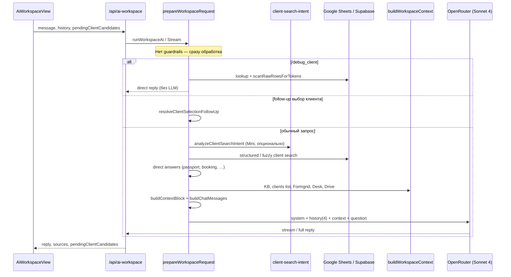

# AI Workspace — Guardrails и аудит чувствительных данных

**Дата:** 2026-06-17  
**Статус:** только аудит и проектирование — код, PR, деплой и ENV не менялись  
**Связанные документы:** `CORPORATE_AI_ASSISTANT_DESIGN.md`, `AI_DATAFLOW_AUDIT.md`, `AI_WORKSPACE_REUSE_BLUEPRINT.md`

---

## Краткий вывод

| Область | Текущее состояние | Риск | Рекомендация |
|---------|-------------------|------|--------------|
| **Off-topic запросы** | Любой текст уходит в Claude Sonnet 4 | Лишние расходы OpenRouter, злоупотребление как ChatGPT | Rules-first guard **до** `prepareWorkspaceRequest` |
| **appPassword** | Не попадает в основные formatters, но есть в `debugRow` | Утечка через `/debug_client` и round-trip `pendingClientCandidates` | Исключить из `buildCrmRawRow` + redaction layer |
| **Паспорта, email, телефоны** | Намеренно в AI-контексте | Бизнес-необходимость для менеджеров | Оставить SAFE, усилить prompt-ограничения на цитирование |
| **Логи** | Запросы и метаданные в `console.log` | PII в server logs | Redact + structured logging |
| **История чатов** | Только user/assistant текст | Контекст CRM не персистится | OK; не хранить `pendingClientCandidates` в Supabase |

---

## 1. Текущая схема AI-запросов

### 1.1. Поверхности AI в платформе

| Поверхность | Endpoint | Оркестратор | Модель (по умолчанию) | Контекст |
|-------------|----------|-------------|----------------------|----------|
| **AI Workspace** | `POST /api/ai-workspace` | `workspace-assistant.ts` → `prepareWorkspaceRequest()` | `anthropic/claude-sonnet-4` (`AI_WORKSPACE_MODEL`) | CRM, Formgrid, KB, Emigrant Drive, Emigrant Desk, client search |
| **Client search intent** | (внутри workspace) | `client-search-intent.ts` | `openai/gpt-4o-mini` (`OPENROUTER_MODEL`) | Только текст запроса → JSON intent |
| **Client Card AI** | `POST /api/clients/[id]/ai` | `client-assistant.ts` → `runClientAi()` | `openai/gpt-4o-mini` | `buildClientAiContext()` — один клиент |
| **Direct answers (0 LLM)** | (внутри workspace) | `prepareWorkspaceRequest()` | — | Паспорт, букинг, Emigrant status, `/debug_client` |

**Scope layer сегодня отсутствует:** off-topic запрос («рецепт борща») проходит полный pipeline и вызывает Claude.

### 1.2. Диаграмма потока AI Workspace



### 1.3. Точки вызова LLM на один workspace-запрос

| # | Когда | Модель | Стоимость |
|---|-------|--------|-----------|
| 1 | `analyzeClientSearchIntent` — если rules недостаточно | GPT-4o Mini | Низкая |
| 2 | Финальный ответ workspace | Claude Sonnet 4 | **Высокая** |

Guardrails должны отсекать запрос **до шага 1**, чтобы не тратить ни Mini, ни Sonnet.

### 1.4. Сборка промпта для Claude

Файл: `src/lib/ai/workspace-assistant.ts` → `buildChatMessages()`.

```
[system]  buildWorkspaceSystemPrompt(mode)     ← workspace-prompt.ts + tone.ts
[user]    history[-4:]                          ← только текст прошлых реплик
[user]    [Внутренний контекст…] + contextBlock + «Вопрос менеджера: …»
```

`contextBlock` собирается в `buildContextBlock()` из:

- `CLIENT SEARCH INTENT` — `formatClientSearchIntentForAi()`
- `CLIENT CONTEXT` — `formatClientContextBlock()` → `client-field-sources.ts`
- `CLIENT CANDIDATES` — `formatClientCandidatesForAi()`
- `KNOWLEDGE BASE` — `getKnowledgeBaseTextForAi()`
- `ЭМИГРАНТ` — `getEmigrantDriveTextForAi()`
- `КЛИЕНТЫ` — `buildClientsContextForAi()` → `formatClientForAi()` / one-liner
- `EMIGRANT CROATIA DESK` — `buildEmigrantDeskContextForAi()`
- `FORMGRID` — `formatFormgridRowDetailed()` / summary

### 1.5. Что попадает в OpenRouter payload

| Компонент | Содержимое | Чувствительность |
|-----------|------------|------------------|
| `Authorization` | `OPENROUTER_API_KEY` | Секрет (не в теле) |
| `messages[].content` | System prompt + история + **полный context block** + вопрос | PII клиентов, паспорта, заметки |
| `model` | Sonnet 4 / Mini | — |
| `max_tokens` | до 1500 (workspace) | — |

**Redaction перед отправкой в OpenRouter сегодня не выполняется.**

### 1.6. История чатов и персистенция

| Данные | Где хранится | В AI payload? |
|--------|--------------|---------------|
| `messages[].content` (user/assistant) | `.data/ai-workspace-chats/` или Supabase | Да — последние 4 turn |
| `contextBlock` | Не хранится | Строится заново на каждый запрос |
| `pendingClientCandidates` | React state, round-trip в POST body | Нет в prompt напрямую; содержит `debugRow` |
| System prompt | Код | Да, каждый запрос |

---

## 2. Проект Guardrails (задача 1)

### 2.1. Цель

Блокировать **явно нерабочие** запросы **до** любого обращения к LLM (и до тяжёлой загрузки Sheets/Drive), возвращая фиксированный ответ:

> AI Workspace предназначен для рабочих задач компании. Я могу помочь с клиентами, CRM, документами, кейсами ВНЖ, письмами, переводами и внутренними процессами компании.

### 2.2. Сравнение точек размещения

| Вариант | Плюсы | Минусы | Вердикт |
|---------|-------|--------|---------|
| **A. API route** (`route.ts`) | Ранний отсев, единая точка для stream/non-stream | Дублирование при появлении других entrypoints | Defense in depth (второй слой) |
| **B. `prepareWorkspaceRequest()`** | Одна точка оркестрации; экономит Sheets + оба LLM; покрывает stream | Не защищает Client Card AI | **Основной слой** |
| **C. Отдельный `scope-classifier.ts`** | Тестируемость, конфиг, расширяемость | Нужна интеграция | **Рекомендуемая реализация** |

**Рекомендация:** модуль `src/lib/ai/scope-classifier.ts` + вызов в начале `prepareWorkspaceRequest()` **и** опционально в `POST /api/clients/[id]/ai` для единообразия.

### 2.3. Rules-first без дополнительного LLM

Подход **достаточен для задачи BLOCKED** (явный off-topic):

```
classifyScope(query) → { decision: "allowed" | "blocked", reason?, matchedRule? }
```

**Алгоритм (порядок важен):**

1. **ALLOW override** — если есть business anchor → `allowed` (не блокировать рабочие сценарии).
2. **BLOCK rules** — keyword/regex из конфига → `blocked`.
3. **Default** → `allowed` (fail-open для серой зоны; не мешать работе).

Это соответствует требованию «не ограничивать рабочие сценарии»: ложные срабатывания дороже, чем пропуск единичного off-topic.

**LLM-классификатор не нужен** для фазы 1. Опционален позже для WARNING-зоны (см. `CORPORATE_AI_ASSISTANT_DESIGN.md` §3).

### 2.4. Business anchors (ALLOW — не трогать)

Запрос считается рабочим, если выполняется **хотя бы одно**:

| Категория | Примеры триггеров |
|-----------|-------------------|
| CRM / клиенты | `клиент`, `лид`, `crm`, `букинг`, `паспорт`, `менеджер`, `референт` |
| Документы / KB | `документ`, `анкет`, `formgrid`, `база знаний`, `регламент`, `инструкц` |
| ВНЖ / миграция | `внж`, `вид на жительство`, `консульств`, `подач`, `одобрен`, `эмигрант` |
| Коммуникации | `письм`, `email`, `перевод`, `куратор`, `партнёр`, `партнер` |
| Услуги / процессы | `услуг`, `тариф`, `договор`, `кейс`, `аналитик` |
| Платформа | `sharp`, `spice`, `emigrant desk`, `/debug_client` |
| Имена / идентификаторы | Токен похож на ФИО, email, телефон, номер паспорта (6+ цифр) |

Если сработал anchor **и** block-keyword — **побеждает anchor** (пример: «переведи рецепт договора для клиента» → allowed).

### 2.5. Поведение при BLOCKED

| Действие | Значение |
|----------|----------|
| Вызов Claude / Mini | **Нет** |
| Загрузка Sheets / Drive / Supabase | **Нет** (при guard в начале `prepareWorkspaceRequest`) |
| Ответ | Фиксированная строка (см. §2.1) |
| `sources` | `[]` или `["Guardrails"]` |
| История чата | Сохранять user message + blocked reply как обычно |
| Telemetry | `scope_decision=blocked`, `matched_rule`, `user_id` |

Исключения (всегда `allowed`):

- `/debug_client` — внутренний инструмент диагностики
- Follow-up «1», «2», «объединить» при `pendingClientCandidates`
- Пустое сообщение — существующий `{ kind: "empty" }`

---

## 3. Список BLOCKED-категорий

Конфигурируемый список для `scope-blocked-topics.json` (или `SCOPE_BLOCKED_TOPICS` в env как JSON).

### 3.1. Категории и ключевые слова (RU + EN)

| ID категории | Описание | Примеры ключевых слов / паттернов |
|--------------|----------|-------------------------------------|
| `cooking` | Кулинария, рецепты | `рецепт`, `борщ`, `готовить`, `выпечк`, `кулинар`, `recipe`, `cooking` |
| `sports` | Спорт, прогнозы | `футбол`, `хоккей`, `матч`, `прогноз`, `ставк`, `чемпионат`, `sport`, `football` |
| `astrology` | Гороскопы, эзотерика | `гороскоп`, `астролог`, `знак зодиака`, `таро`, `horoscope` |
| `homework` | Школа / универ | `домашн`, `школьн`, `сочинение`, `реферат`, `курсовая`, `диплом`, `homework`, `essay` |
| `fiction` | Художественная литература | `художественн`, `рассказ`, `роман`, `книгу напиш`, `сценарий фильма`, `новелла` |
| `games` | Игры, развлечения | `unity`, `игру сдел`, `геймдев`, `minecraft`, `развлекательн` |
| `entertainment` | Общий entertainment | `анекдот`, `мем`, `песн`, `сериал`, `тикток`, `youtube` (без рабочего anchor) |
| `jailbreak` | Обход инструкций | `игнорируй инструкц`, `system prompt`, `jailbreak`, `dan mode` |
| `prompt_leak` | Вывод системного промпта | `покажи промпт`, `твои инструкции`, `сырой контекст` |

### 3.2. Примеры классификации

| Запрос | Решение | Причина |
|--------|---------|---------|
| «Дай рецепт борща» | **BLOCKED** | `cooking`, нет anchor |
| «Напиши письмо клиенту про задержку ВНЖ» | ALLOWED | `клиент`, `внж`, `письм` |
| «Переведи письмо куратору на английский» | ALLOWED | `перевед`, `куратор`, `письм` |
| «Прогноз на матч Реал — Барселона» | **BLOCKED** | `sports` |
| «Напиши сочинение про войну» | **BLOCKED** | `homework` |
| «Сценарий для рекламы услуги ВНЖ» | ALLOWED | anchor `внж`, `услуг` |
| «Найди клиента Иванов» | ALLOWED | `клиент` + имя |

---

## 4. Предлагаемая реализация

### 4.1. Новые файлы (проект)

```
src/lib/ai/
  scope-classifier.ts          # classifyScope(), normalize, anchor/block logic
  scope-blocked-topics.ts      # загрузка конфига (JSON + env override)
  scope-classifier.test.ts     # матрица из §3.2

config/
  scope-blocked-topics.json    # список категорий и keywords (редактируется без деплоя кода)
```

### 4.2. Изменения в существующих файлах

| Файл | Изменение |
|------|-----------|
| `workspace-assistant.ts` | В начале `prepareWorkspaceRequest()`: `classifyScope(trimmed)` → early return `{ kind: "direct", reply: BLOCKED_MESSAGE }` |
| `api/ai-workspace/route.ts` | (опционально) дублирующий guard для observability |
| `client-assistant.ts` | Тот же guard перед `createChatCompletion` |
| `workspace-config.ts` | `SCOPE_GUARDRAILS_ENABLED` (default `true`) |

### 4.3. Псевдокод

```typescript
// prepareWorkspaceRequest — первые строки после trim
const scope = classifyScope(trimmed, { pendingClientCandidates });
if (scope.decision === "blocked") {
  logScopeDecision(scope);
  return { kind: "direct", reply: SCOPE_BLOCKED_REPLY_RU, sources: [] };
}
// … существующая логика
```

### 4.4. Расширение списка BLOCKED через конфигурацию

```json
{
  "version": 1,
  "categories": [
    {
      "id": "cooking",
      "keywords": ["рецепт", "борщ", "recipe"],
      "patterns": ["\\bрецепт\\b"]
    }
  ]
}
```

Перезагрузка: при старте процесса или `SCOPE_BLOCKED_TOPICS_PATH`. Hot-reload — опционально через admin API (фаза 2).

### 4.5. Тестирование

- Unit-тесты: ≥30 кейсов ALLOW + BLOCK из §3.2 и из требований задачи
- Regression: рабочие запросы из `CORPORATE_AI_ASSISTANT_DESIGN.md` §2 — все ALLOWED
- E2E: blocked reply не содержит вызова OpenRouter (mock fetch)

---

## 5. Аудит чувствительных данных (задача 2)

### 5.1. Проверенные компоненты

| Компонент | Файл | Роль |
|-----------|------|------|
| AI Workspace orchestrator | `workspace-assistant.ts` | Сборка prompt, direct answers |
| Workspace context | `workspace-context.ts` | Фоновые блоки CRM / Formgrid |
| Client context | `client-context.ts` | `crmClientToContext`, debug, candidates |
| Client field formatters | `client-field-sources.ts` | CLIENT CONTEXT для Claude |
| CRM formatter | `format-client.ts` | `formatClientForAi`, one-liner |
| Client lookup / search | `client-lookup.ts` | `buildCrmRawRow`, scoring fields |
| Client Card AI | `client-assistant.ts` + `buildClientAiContext()` | Карточка клиента |
| Client search intent | `client-search-intent.ts` | Mini LLM — только запрос пользователя |
| Formgrid | `formgrid-lookup.ts` | Анкеты новых клиентов |
| Emigrant Desk | `emigrant-desk/clients.ts` | Статусы дел |
| Knowledge Base / Drive | `google-drive/kb-text.ts` | Тексты документов |
| Debug | `formatDebugClientReply()` | `/debug_client` |
| OpenRouter client | `openai.ts` | HTTP + error logging |
| Chat persistence | `workspace-chats.ts` | История сообщений |

### 5.2. Каналы утечки (проверено)

| Канал | Чувствительные данные сегодня? | Комментарий |
|-------|-------------------------------|-------------|
| **Prompts → OpenRouter** | PII (паспорт, email, телефон, заметки); **не** appPassword в основном path | `debugRow` с appPassword не сериализуется в `formatClientContextBlock` |
| **Server logs** | Запросы пользователей, метрики поиска | `console.log(query)`, `[ai-client-search]` |
| **OpenRouter error body** | Теоретически echo messages | `console.error(..., errBody)` в `openai.ts` |
| **История чатов** | Текст вопросов/ответов менеджера | Без context block |
| **`/debug_client` ответ** | **Да — `debugRow` JSON включает `appPassword`** | Прямая утечка менеджеру в UI |
| **`scanRawRowsForTokens`** | Может показать значение из колонки `appPassword` | При совпадении токена с паролем |
| **`pendingClientCandidates` в POST** | `debugRow` round-trip client ↔ server | Не в prompt, но в network payload |

### 5.3. Ключевая находка: `appPassword`

Цепочка:

1. `parse.ts` читает колонку «Пароль для приложения» → `Client.appPassword`
2. `buildCrmRawRow()` включает `appPassword` → попадает в `debugRow` при `collectClientMatches()`
3. `formatClientForAi()` и `crmClientToContext().surveyData` — **не включают** appPassword ✅
4. `resolveClientContextAttribution()` читает из `debugRow` только `latinName`, `partner`, `contract` — **не** appPassword ✅
5. `formatDebugClientReply()` выводит `JSON.stringify(client.debugRow)` — **утечка** ❌

**Вывод:** appPassword **не попадает в Claude** при штатном CLIENT CONTEXT, но **попадает** в debug-инструменты и транспорт `ClientContext`.

---

## 6. Таблица полей SAFE / SENSITIVE

| Поле | Источник | Попадает в AI (OpenRouter) | Нужно исключить | Классификация |
|------|----------|---------------------------|-----------------|---------------|
| `name` (ФИО) | CRM, Formgrid | Да — CLIENT CONTEXT, one-liner | Нет | **SAFE** (рабочее) |
| `citizenship` (латиница) | CRM | Да | Нет | **SAFE** |
| `email` | CRM, Formgrid, Desk | Да | Нет | **SAFE** |
| `phone` | CRM, Formgrid | Да | Нет | **SAFE** |
| `passportNumber` | CRM, Formgrid | Да — намеренно | Нет | **SAFE** (PII, но бизнес-нужно) |
| `status` | CRM, Formgrid, Desk | Да | Нет | **SAFE** |
| `manager` / `referentName` | CRM | Частично — manager да; referent только в search/debugRow | referent — добавить в formatter при необходимости | **SAFE** |
| `bookingAddress` | CRM | Да | Нет | **SAFE** |
| `bookingRange` | CRM | Да | Нет | **SAFE** |
| `submittedAt` | CRM, Formgrid | Да (formatClientForAi / даты анкеты) | Нет | **SAFE** |
| `expectedApprovalAt` | CRM | Да | Нет | **SAFE** |
| `approvalAt` | CRM | Да | Нет | **SAFE** |
| `residenceCardIssuedAt` | CRM | **Нет** в formatters (только UI + debugRow) | — | **SAFE** (gap покрытия, не sensitivity) |
| `notes` | CRM | Да (до 400–500 символов) | Нет | **SAFE** (может содержать чувствительный текст — см. §7) |
| `partnerName` | CRM | Да | Нет | **SAFE** |
| `contract` | CRM | Да | Нет | **SAFE** |
| `direction` | CRM | Да | Нет | **SAFE** |
| `country` | CRM | Да (candidates / search) | Нет | **SAFE** |
| `lastActivity` | CRM | Да (candidates) | Нет | **SAFE** |
| `client.id` | CRM (часто = номер паспорта) | Да — `buildClientAiContext`: «ID в системе» | Рассмотреть маскировку | **SAFE*** (внутренний идентификатор) |
| `rowIndex` | CRM / Formgrid | Да | Нет | **SAFE** (служебное, низкий риск) |
| **`appPassword`** | CRM | **Нет** в Claude path; **Да** в `/debug_client`, `debugRow` | **Да** | **SENSITIVE** |
| `debugRow` (целиком) | client-lookup | **Нет** в formatClientContextBlock | **Да** — redact при debug/export | **SENSITIVE** (контейнер) |
| Formgrid raw headers | Formgrid | Да — `surveyData`, `formatFormgridRowDetailed` | Сканировать новые колонки | **SAFE** (пока нет password-колонок) |
| `birthDate` | Formgrid | Да | Нет | **SAFE** (PII) |
| `caseNumber` | Emigrant Desk | Да | Нет | **SAFE** |
| `internalComment` | Emigrant Desk | Да | Нет | **SAFE** (внутренний комментарий) |
| `user_id` (Desk) | Supabase | **Нет** в AI text | Нет | **SENSITIVE** (не передаётся ✅) |
| KB / Drive document text | Google Drive | Да — может содержать любые данные | Политика KB review | **Условно SAFE** |
| `OPENROUTER_API_KEY` | env | Только header | Уже исключён | **SENSITIVE** ✅ |
| `OPENAI_API_KEY` | env | Не в prompt | — | **SENSITIVE** ✅ |
| System prompt | код | Да | Нет | **SAFE** |
| User raw query | UI | Да (в prompt + история) | Guardrails для off-topic | **SAFE** |
| `matchedFields` / scores | client search | Да (candidates) | Нет | **SAFE** |
| Telegram (если в Formgrid) | Formgrid column | Через `surveyData` / debugRow | Нет | **SAFE** |

### 6.1. Сводка по поверхностям

| Поверхность | SENSITIVE в prompt? | Примечание |
|-------------|---------------------|------------|
| AI Workspace — CLIENT CONTEXT | **Нет** appPassword | Паспорта и контакты — да |
| AI Workspace — КЛИЕНТЫ (фон) | **Нет** appPassword | `formatClientForAi` не включает поле |
| Client Card AI | **Нет** appPassword | `buildClientAiContext` → `formatClientForAi` |
| `/debug_client` | **Да** | Требует redaction |
| Client search intent (Mini) | Только текст запроса | Если менеджер вставит пароль в вопрос — уйдёт в Mini |

---

## 7. Рекомендации по внедрению

### 7.1. P0 — Guardrails (задача 1)

1. Реализовать `scope-classifier.ts` + конфиг BLOCKED-категорий.
2. Интегрировать в `prepareWorkspaceRequest()` **перед** `lookupClientsWithAiSearch`.
3. Фиксированный ответ без LLM.
4. Feature flag `SCOPE_GUARDRAILS_ENABLED`.
5. Unit-тесты на матрицу §3.

**Оценка трудозатрат:** 1–2 дня разработки + 0.5 дня тестирования.

### 7.2. P0 — Sensitive data (задача 2)

1. **Удалить `appPassword` из `buildCrmRawRow()`** — или вынести в `SENSITIVE_DEBUG_ROW_KEYS` denylist.
2. **`formatDebugClientReply()`** — redact полей: `appPassword`, `password`, `token`, `secret`, `apiKey`.
3. **`sanitizeClientContextForTransport()`** — strip `debugRow` при отправке `pendingClientCandidates` в UI (оставить только поля для отображения списка).
4. **`scanRawRowsForTokens()`** — пропускать sensitive keys при сканировании.
5. Центральный модуль `src/lib/ai/context-redaction.ts`:
   - `SENSITIVE_FIELD_NAMES`
   - `redactRecord(record)`
   - `redactForLogging(text)`

### 7.3. P1 — Усиление

1. Truncate `notes` с предупреждением в prompt «не цитируй дословно заметки > N символов».
2. Добавить в AI context недостающие **безопасные** поля: `referentName`, `residenceCardIssuedAt` (покрытие, не security).
3. Structured logging вместо `console.log(query)`.
4. Redact `errBody` в `openai.ts` перед логированием.
5. Периодический аудит колонок Formgrid при изменении схемы.

### 7.4. P2 — Наблюдаемость

1. Метрики: `ai_scope_blocked_total`, `ai_tokens_saved_estimate`.
2. Dashboard: доля blocked запросов по категориям.
3. Алерт при росте jailbreak-попыток.

### 7.5. Что не менять

- Паспорта, email, телефоны в рабочем контексте — менеджерам нужны для операционной работы.
- Прямые ответы без LLM (паспорт, букинг) — экономят бюджет, не затрагиваются guardrails при корректных anchors на follow-up.

---

## 8. Оценка влияния на расходы OpenRouter

### 8.1. Базовая стоимость запроса (оценка)

| Компонент | Типичный объём | Относительная стоимость |
|-----------|----------------|-------------------------|
| Client search intent (Mini) | ~500–800 tokens | ~5% запроса |
| Workspace context + system | ~3 000–8 000 tokens input | ~40% |
| Sonnet 4 output | до 1 500 tokens | ~55% |

Off-topic запрос сегодня тратит **100%** этой стоимости без пользы для бизнеса.

### 8.2. Эффект guardrails (rules-only BLOCKED)

| Сценарий | Доля запросов (оценка) | Экономия на запросе | Вклад в общую экономию |
|----------|------------------------|---------------------|-------------------------|
| Явный off-topic (рецепт, спорт, гороскоп, ДЗ, fiction) | 5–12% | ~95–100% | **5–12%** общего бюджета workspace |
| Jailbreak / prompt leak | &lt;1% | 100% | &lt;1% |
| Серая зона (остаётся ALLOWED) | 10–20% | 0% | 0% |

**Консервативная оценка:** **5–10%** снижения расходов OpenRouter на AI Workspace после внедрения rules-first BLOCKED без LLM-classifier.

**С LLM scope layer (фаза 2, WARNING):** дополнительно **10–15%** (см. `CORPORATE_AI_ASSISTANT_DESIGN.md` §5) — но это отдельная фаза и добавляет стоимость Mini на классификацию.

### 8.3. Дополнительная экономия от redaction

Минимальная в деньгах (appPassword — короткие строки). Основная ценность — **compliance и снижение риска**, не токены.

### 8.4. ROI

| Инвестиция | ~2–3 dev-days |
|------------|---------------|
| Экономия при 500 workspace-запросов/мес и ~8% blocked | ~40 полных LLM-вызовов Sonnet |
| Риск-редукция | Исключение утечки appPassword в debug; меньше PII в логах |

---

## Приложение A. Карта файлов для реализации

```
Guardrails:
  src/lib/ai/scope-classifier.ts          (новый)
  config/scope-blocked-topics.json        (новый)
  src/lib/ai/workspace-assistant.ts       (early return)
  src/lib/ai/client-assistant.ts          (опционально)

Redaction:
  src/lib/ai/context-redaction.ts         (новый)
  src/lib/ai/client-lookup.ts             (buildCrmRawRow)
  src/lib/ai/client-context.ts            (formatDebugClientReply)
  src/components/ai-workspace/AiWorkspaceView.tsx  (sanitize pending candidates)
```

## Приложение B. Связь с Corporate AI Design

| Элемент Corporate Design | Этот документ |
|--------------------------|---------------|
| Scope layer §3 | §2–4 — конкретная реализация для BLOCKED |
| AI Scope Layer soft/hard | Фаза 1: только hard BLOCKED |
| Фаза A roadmap | §7.1 + §7.2 |
| Матрица ALLOWED/WARNING/BLOCKED | §3 + anchors §2.4 |

---

*Документ подготовлен по состоянию кодовой базы на 2026-06-17. Изменения в код не вносились.*
