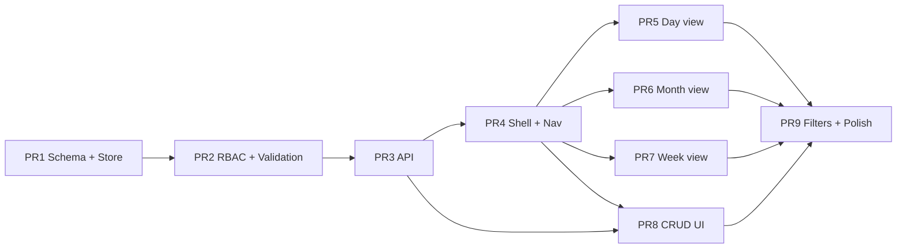

# Calendar Implementation Plan — MVP

**Дата:** 2026-06-20  
**Статус:** план внедрения — код, PR, merge, деплой и ENV не затрагиваются  
**Основа:** `CALENDAR_MVP_SPEC.md`, `INTERNAL_CALENDAR_SYSTEM_DESIGN.md`  
**Цель:** разбить MVP календаря на **9 маленьких merge-ready PR** с явными зависимостями, рисками и критериями приёмки

---

## Executive Summary

| Метрика | Значение |
|---------|----------|
| PR count | **9** |
| Новых файлов (итого) | **~28** |
| Изменённых файлов (итого) | **~3** (`permissions.ts`, `middleware.ts`, `package.json`) |
| Оценка календаря | **~12 рабочих дней** (1 dev), см. `CALENDAR_MVP_SPEC.md` §12.3 |
| Merge strategy | Последовательно PR 1→9; **PR 6 и PR 7** можно параллелить после PR 5 |

**Принцип:** каждый PR оставляет `main` в рабочем состоянии (`npm run build` проходит). UI-PR после PR 4 не ломают существующие разделы.

---

## Граф зависимостей PR

---

## Общий порядок реализации

| Шаг | PR | Слой | Результат после merge |
|-----|-----|------|------------------------|
| 1 | PR 1 | Data | Таблица + store, без HTTP/UI |
| 2 | PR 2 | Security | RBAC + validation + unit tests |
| 3 | PR 3 | API | 5 REST endpoints |
| 4 | PR 4 | App shell | `/calendar` в меню, toolbar, fetch |
| 5 | PR 5 | UI | Day agenda (read-only) |
| 6 | PR 6 | UI | Month grid |
| 7 | PR 7 | UI | Week grid |
| 8 | PR 8 | UI | Create / edit / delete |
| 9 | PR 9 | UX | Фильтры слоёв, URL, финальный QA |

**Vertical slice demo** возможен после **PR 8** (полный CRUD + хотя бы day view). После **PR 9** — MVP complete.

---

## Сводная таблица файлов по PR

| PR | Новые | Изменённые |
|----|-------|------------|
| 1 | 4 | 0 |
| 2 | 3 | 1 (`package.json`) |
| 3 | 2 | 0 |
| 4 | 6 | 2 (`permissions.ts`, `middleware.ts`) |
| 5 | 3 | 1 (`CalendarView.tsx`) |
| 6 | 3 | 1 (`CalendarView.tsx`) |
| 7 | 3 | 1 (`CalendarView.tsx`) |
| 8 | 5 | 2 (`CalendarView.tsx`, `CalendarToolbar.tsx`) |
| 9 | 3 | 3 (`CalendarView.tsx`, `CalendarToolbar.tsx`, `CalendarLayerFilters.tsx`) |
| **Итого** | **~32*** | **~3 уникальных** |

\*Некоторые файлы создаются в PR 4 и дорабатываются в PR 5–9 — это нормально.

---

# PR 1 — Schema + Repository + Store

## Цель

Заложить **слой данных** календаря: миграция Supabase, типы, repo, store с dual-storage (Supabase / `.data/calendar-events.json`). Без API и UI.

## Порядок внутри PR

1. `supabase/migrations/009_calendar.sql` — таблица `calendar_events`, индексы, CHECK constraints  
2. `src/lib/calendar/types.ts` — `CalendarEvent`, `CalendarScope`, input types  
3. `src/lib/calendar/constants.ts` — `COMPANY_ID`, `TIMEZONE`, цвета  
4. `src/lib/supabase/calendar-events-repo.ts` — CRUD + list by range (snake_case ↔ camelCase)  
5. `src/lib/calendar/store.ts` — `listEventsInRange`, `getEvent`, `createEvent`, `updateEvent`, `deleteEvent` с веткой `isSupabaseConfigured()`  
6. `.gitignore` — убедиться, что `.data/calendar-events.json` игнорируется (если ещё не покрыт `.data/`)

## Новые файлы

| Файл | Назначение |
|------|------------|
| `supabase/migrations/009_calendar.sql` | DDL `calendar_events` |
| `src/lib/calendar/types.ts` | TS-модели |
| `src/lib/calendar/constants.ts` | `sharp-spice`, `Europe/Zagreb` |
| `src/lib/supabase/calendar-events-repo.ts` | Supabase access |
| `src/lib/calendar/store.ts` | Dual-storage orchestration |

## Изменённые файлы

| Файл | Изменение |
|------|-----------|
| — | Нет обязательных изменений существующего кода |

Опционально: `CRM_CUTOVER_CHECKLIST.md` — строка «применить 009_calendar.sql» (только если команда ведёт чеклист; не обязательно для MVP).

## Риски

| Риск | Severity | Митигация |
|------|----------|-----------|
| Миграция не применена на prod Supabase | Medium | Документировать в PR description; store fallback на JSON |
| Несовпадение snake_case / camelCase | Low | Копировать паттерн `tasks-repo.ts` |
| `personal` без `owner_user_id` | Medium | CHECK в SQL + assert в store при create |
| Дублирование логики с tasks store | Low | Явно mirror structure, не abstract early |

## Что протестировать после PR

- [ ] SQL миграция выполняется без ошибок в Supabase SQL Editor  
- [ ] `store.createEvent` + `listEventsInRange` на JSON fallback (локально без Supabase)  
- [ ] `store` с Supabase: insert/select/update/delete одной записи  
- [ ] `end_at < start_at` отклоняется на уровне store/repo  
- [ ] `npm run build` — проходит (новые модули `server-only`, не импортируются в client)

## Критерии приёмки

- [ ] Таблица `calendar_events` соответствует `CALENDAR_MVP_SPEC.md` §7.2  
- [ ] Store реализует полный CRUD для обоих backend (Supabase + JSON)  
- [ ] Нет API routes, нет UI, нет изменений nav/middleware  
- [ ] Build green

**Оценка:** ~1.5 рабочих дня

---

# PR 2 — RBAC + Validation + Unit Tests

## Цель

Вынести **права доступа и валидацию** в отдельный слой до API. Покрыть матрицу owner/manager unit-тестами.

## Порядок внутри PR

1. `src/lib/calendar/validation.ts` — `validateCreateInput`, `validateUpdateInput`, `parseIsoRange`  
2. `src/lib/calendar/permissions.ts` — `canViewEvent`, `canEditEvent`, `canDeleteEvent`, `canCreateWithScope`  
3. `src/lib/calendar/permissions.test.ts` — матрица из MVP spec §5.2  
4. `src/lib/calendar/validation.test.ts` — title, dates, scope  
5. Интеграция: `store.ts` вызывает validation перед write (не permissions — permissions нужен `SessionUser`, их вызовет API в PR 3)

## Новые файлы

| Файл | Назначение |
|------|------------|
| `src/lib/calendar/validation.ts` | Input validation |
| `src/lib/calendar/permissions.ts` | RBAC helpers |
| `src/lib/calendar/permissions.test.ts` | RBAC tests |
| `src/lib/calendar/validation.test.ts` | Validation tests |

## Изменённые файлы

| Файл | Изменение |
|------|-----------|
| `src/lib/calendar/store.ts` | Вызов `validateCreateInput` / `validateUpdateInput` перед persist |
| `package.json` | Добавить новые `*.test.ts` в script `test` |

## Риски

| Риск | Severity | Митигация |
|------|----------|-----------|
| RBAC только в UI, не в API | **High** | PR 3 обязан использовать те же функции |
| Расхождение manager/owner rules с spec | Medium | Тест-кейсы 1:1 с таблицей §5.2 |
| Забыть добавить тесты в `package.json` | Low | CI `npm test` не запустит новые файлы |

## Что протестировать после PR

- [ ] `npm test` — permissions + validation tests green  
- [ ] `canViewEvent`: company → true для любого user; personal → только owner  
- [ ] `canEditEvent`: manager не редактирует чужой company; owner — да  
- [ ] Validation: пустой `title` → error; `endAt < startAt` → error  
- [ ] Store reject invalid input до записи в JSON/Supabase

## Критерии приёмки

- [ ] Все строки RBAC-матрицы MVP покрыты тестами  
- [ ] `permissions.ts` не импортирует React / Next  
- [ ] Store не принимает невалидные даты  
- [ ] Build + test green

**Оценка:** ~1 рабочий день  
**Зависит от:** PR 1

---

# PR 3 — Calendar REST API

## Цель

Опубликовать **5 HTTP endpoints** с session auth, RBAC и делегированием в store.

## Порядок внутри PR

1. `src/app/api/calendar/events/route.ts` — `GET` (list), `POST` (create)  
2. `src/app/api/calendar/events/[id]/route.ts` — `GET`, `PATCH`, `DELETE`  
3. List query: `from`, `to`, optional `scopes`; server-side filter personal по `session.id`  
4. POST: force `ownerUserId`, `companyId`, `createdByUserId`, `createdByName` from session  
5. PATCH/DELETE: `canEditEvent` / `canDeleteEvent` → 403  
6. GET by id: `canViewEvent` → 404 (не 403) для чужого personal — anti-enumeration

## Новые файлы

| Файл | Назначение |
|------|------------|
| `src/app/api/calendar/events/route.ts` | List + create |
| `src/app/api/calendar/events/[id]/route.ts` | Get + update + delete |

## Изменённые файлы

| Файл | Изменение |
|------|-----------|
| — | Нет (опционально: добавить smoke test script — out of scope MVP) |

## Риски

| Риск | Severity | Митигация |
|------|----------|-----------|
| IDOR — чужие personal events в list | **High** | Filter `owner_user_id = session.id` в store list для personal |
| Client подменяет `ownerUserId` в POST | **High** | Игнорировать body, set from session |
| `/api` не в middleware | Medium | Каждый handler: `getSession()` first (паттерн platform) |
| Утечка существования personal event | Medium | 404 на GET чужого personal |

## Что протестировать после PR

Ручные запросы (curl / Thunder Client / браузер fetch) под двумя сессиями (`manager-1`, `manager-2`, `veronika`):

- [ ] `GET /api/calendar/events?from=...&to=...` без cookie → 401  
- [ ] `POST` personal event → 201; второй manager не видит в list  
- [ ] `POST` company event → виден обоим managers  
- [ ] `PATCH` чужого company manager → 403; owner → 200  
- [ ] `DELETE` своего personal → 200  
- [ ] `GET` чужого personal by id → 404  
- [ ] Invalid body → 422  

## Критерии приёмки

- [ ] 5 endpoints соответствуют `CALENDAR_MVP_SPEC.md` §8  
- [ ] Все handlers используют `getSession()` + `permissions.ts`  
- [ ] Response shape: camelCase JSON  
- [ ] Build green; существующие API не затронуты

**Оценка:** ~1 рабочий день  
**Зависит от:** PR 1, PR 2

---

# PR 4 — Navigation + Calendar Page Shell

## Цель

Подключить **раздел «Календарь»** к приложению: nav, middleware, страница, toolbar, загрузка событий. Без сеток просмотра (placeholder).

## Порядок внутри PR

1. `src/lib/auth/permissions.ts` — `NAV_CALENDAR` после `NAV_TASKS`  
2. `middleware.ts` — matcher `/calendar`, `/calendar/:path*`  
3. `src/app/(app)/calendar/page.tsx` — `getSession()`, redirect, `AppShell`  
4. `src/components/calendar/CalendarView.tsx` — state: `events`, `loading`, `anchorDate`, `view`  
5. `src/components/calendar/CalendarToolbar.tsx` — ◀ ▶ Сегодня, переключатель view (пока без сеток)  
6. `src/components/calendar/CalendarEmptyState.tsx`  
7. `src/components/calendar/CalendarView.module.css`, `CalendarToolbar.module.css`  
8. Fetch `GET /api/calendar/events` при смене диапазона (util `getRangeForView` в `src/lib/calendar/range.ts`)

## Новые файлы

| Файл | Назначение |
|------|------------|
| `src/app/(app)/calendar/page.tsx` | Route page |
| `src/components/calendar/CalendarView.tsx` | Root client container |
| `src/components/calendar/CalendarView.module.css` | Layout |
| `src/components/calendar/CalendarToolbar.tsx` | Header controls |
| `src/components/calendar/CalendarToolbar.module.css` | Toolbar styles |
| `src/components/calendar/CalendarEmptyState.tsx` | Empty placeholder |
| `src/lib/calendar/range.ts` | `getRangeForView(view, anchorDate)` → `{ from, to }` |

## Изменённые файлы

| Файл | Изменение |
|------|-----------|
| `src/lib/auth/permissions.ts` | `NAV_CALENDAR` в `MANAGER_NAV` + `OWNER_NAV` |
| `middleware.ts` | Protected prefix `/calendar` |

## Риски

| Риск | Severity | Митигация |
|------|----------|-----------|
| Nav есть, API 401 | Low | Page server-side session; fetch credentials include cookies |
| Неверный диапазон `from`/`to` | Medium | Centralize в `range.ts`, unit test в PR 2 или здесь |
| Дублирование fetch при Strict Mode | Low | AbortController / dedupe как в TasksView |

## Что протестировать после PR

- [ ] Пункт «Календарь» в сайдбаре у manager и owner  
- [ ] `/calendar` без auth → redirect `/login`  
- [ ] Manager не может открыть `/analytics` — регрессия не сломана  
- [ ] Страница загружается, toolbar работает (◀ ▶ Сегодня)  
- [ ] Network tab: запрос к `/api/calendar/events` с корректными query params  
- [ ] Пустой календарь → `CalendarEmptyState`

## Критерии приёмки

- [ ] `/calendar` доступен всем auth users  
- [ ] Toolbar переключает `view` в state (month default)  
- [ ] Events fetch работает; список пока можно вывести debug-списком или скрыть до PR 5  
- [ ] Build green

**Оценка:** ~1 рабочий день  
**Зависит от:** PR 3

---

# PR 5 — Day View

## Цель

Реализовать режим **«День»** — agenda-список событий выбранной даты.

## Порядок внутри PR

1. `src/components/calendar/CalendarDayAgenda.tsx` — группировка по времени, all-day сверху  
2. `src/components/calendar/CalendarEventChip.tsx` — цвет по `scope`, клик → callback (modal в PR 8)  
3. `src/components/calendar/CalendarDayAgenda.module.css`, `CalendarEventChip.module.css`  
4. `src/lib/calendar/format.ts` — `formatEventTimeRange`, `formatDayLabel` (RU locale)  
5. `CalendarView.tsx` — рендер `view === 'day'`; toolbar day navigation меняет `anchorDate`  
6. URL sync: `?view=day&date=YYYY-MM-DD` (read on mount, write on change)

## Новые файлы

| Файл | Назначение |
|------|------------|
| `src/components/calendar/CalendarDayAgenda.tsx` | Day agenda |
| `src/components/calendar/CalendarDayAgenda.module.css` | Styles |
| `src/components/calendar/CalendarEventChip.tsx` | Event chip |
| `src/components/calendar/CalendarEventChip.module.css` | Chip styles |
| `src/lib/calendar/format.ts` | Date/time formatting |

## Изменённые файлы

| Файл | Изменение |
|------|-----------|
| `src/components/calendar/CalendarView.tsx` | Day branch + URL state |
| `src/components/calendar/CalendarToolbar.tsx` | Label текущего дня в day mode |

## Риски

| Риск | Severity | Митигация |
|------|----------|-----------|
| TZ: событие «переезжает» на другой день | Medium | Форматировать в `Europe/Zagreb` consistently |
| All-day events в wrong section | Low | Filter `allDay` first |
| Chip click no-op until PR 8 | Low | Optional: `console` / toast «скоро» или read-only alert |

## Что протестировать после PR

- [ ] Day view показывает personal (синий) и company (зелёный)  
- [ ] События отсортированы по `startAt`  
- [ ] ◀ ▶ меняют день и перезапрашивают API  
- [ ] `?view=day&date=...` работает после refresh  
- [ ] All-day event отображается корректно  
- [ ] Два аккаунта: personal A не виден B

## Критерии приёмки

- [ ] `view=day` полностью функционален для **чтения**  
- [ ] Цвета соответствуют spec (синий/зелёный)  
- [ ] Build green

**Оценка:** ~0.5–1 рабочий день  
**Зависит от:** PR 4

---

# PR 6 — Month View

## Цель

Реализовать режим **«Месяц»** — сетка 7×5/6 с чипами событий в ячейках дней.

## Порядок внутри PR

1. `src/components/calendar/CalendarMonthGrid.tsx` — заголовки Пн–Вс, ячейки, overflow «+N ещё»  
2. `src/components/calendar/CalendarMonthGrid.module.css`  
3. `src/lib/calendar/month.ts` — `buildMonthMatrix(anchorDate)`, `eventsForDay(events, date)`  
4. `CalendarView.tsx` — `view === 'month'` (default)  
5. Клик по дню → `setView('day')` + `setAnchorDate(day)`  
6. Fetch range: month ± 7 days (`range.ts` extension)

## Новые файлы

| Файл | Назначение |
|------|------------|
| `src/components/calendar/CalendarMonthGrid.tsx` | Month grid |
| `src/components/calendar/CalendarMonthGrid.module.css` | Grid styles |
| `src/lib/calendar/month.ts` | Month matrix helpers |

## Изменённые файлы

| Файл | Изменение |
|------|-----------|
| `src/lib/calendar/range.ts` | Month padding ±7 days |
| `src/components/calendar/CalendarView.tsx` | Month branch |

## Риски

| Риск | Severity | Митигация |
|------|----------|-----------|
| Слишком много чипов в ячейке | Medium | Max 3 chips + «+N ещё», full list в day on click |
| Неделя начинается с Вс vs Пн | Low | Monday-first (как в spec wireframe) |
| Performance при 100+ events | Low | MVP team size small; filter by day in memory |

## Что протестировать после PR

- [ ] Month grid корректен для текущего месяца  
- [ ] Дни соседних месяцев визуально приглушены  
- [ ] События в правильных ячейках  
- [ ] Клик по дню → day view  
- [ ] ◀ ▶ переключают месяц  
- [ ] `?view=month&date=...` после refresh

## Критерии приёмки

- [ ] Month — default view при открытии `/calendar`  
- [ ] Чипы окрашены по scope  
- [ ] Build green

**Оценка:** ~1.5 рабочих дня  
**Зависит от:** PR 4, PR 5 (переиспользует `CalendarEventChip`)  
**Параллельно с:** PR 7 (после PR 5)

---

# PR 7 — Week View

## Цель

Реализовать режим **«Неделя»** — 7 колонок, почасовая сетка 07:00–20:00.

## Порядок внутри PR

1. `src/components/calendar/CalendarWeekGrid.tsx` — time column + 7 day columns  
2. `src/components/calendar/CalendarWeekGrid.module.css`  
3. `src/lib/calendar/week.ts` — `getWeekDays(anchorDate)`, `layoutDayEvents(events, slotMinutes)`  
4. `CalendarView.tsx` — `view === 'week'`  
5. MVP overlap: **vertical stack** в слоте, без column splitting  
6. Клик по пустому слоту → callback `onSlotClick(date, time)` (wire to form in PR 8)

## Новые файлы

| Файл | Назначение |
|------|------------|
| `src/components/calendar/CalendarWeekGrid.tsx` | Week grid |
| `src/components/calendar/CalendarWeekGrid.module.css` | Grid styles |
| `src/lib/calendar/week.ts` | Week layout helpers |

## Изменённые файлы

| Файл | Изменение |
|------|-----------|
| `src/lib/calendar/range.ts` | Week: Mon 00:00 – Sun 23:59 |
| `src/components/calendar/CalendarView.tsx` | Week branch + `onSlotClick` stub |

## Риски

| Риск | Severity | Митигация |
|------|----------|-----------|
| Overlapping events layout | **High** | MVP: stack, limit height + scroll in cell |
| Scroll sync time column | Medium | Single scroll container |
| Mobile unusable | Medium | Acceptable for MVP; day view as mobile fallback (PR 9) |
| All-day in week grid | Medium | Dedicated row above hourly grid |

## Что протестировать после PR

- [ ] Week shows Mon–Sun for selected week  
- [ ] Events at correct hour rows  
- [ ] Overlapping events both visible (stacked)  
- [ ] All-day row works  
- [ ] ◀ ▶ change week  
- [ ] Horizontal scroll on narrow viewport  
- [ ] Click slot fires handler (logged or no-op until PR 8)

## Критерии приёмки

- [ ] `view=week` functional for read  
- [ ] Hour range 07:00–20:00, 30-min implicit slots  
- [ ] Build green

**Оценка:** ~2 рабочих дня  
**Зависит от:** PR 4, PR 5 (`CalendarEventChip`)  
**Параллельно с:** PR 6

---

# PR 8 — Event CRUD UI

## Цель

Полный **create / read / edit / delete** через модалку и форму. Замыкание vertical slice MVP.

## Порядок внутри PR

1. `src/components/calendar/CalendarEventForm.tsx` — fields per spec §3.1  
2. `src/components/calendar/CalendarEventModal.tsx` — view mode + edit mode + delete confirm  
3. CSS modules для form + modal  
4. `src/lib/calendar/permissions-client.ts` — mirror server rules for button visibility (`canEditEvent` для UI)  
5. `CalendarView.tsx` — state: `selectedEvent`, `formMode`, wire chip click → modal  
6. `CalendarToolbar.tsx` — «+ Создать событие» → form  
7. Week/Day slot click → form with prefilled date/time  
8. Toast on success (reuse `TasksView` Toast pattern or simple inline message)

## Новые файлы

| Файл | Назначение |
|------|------------|
| `src/components/calendar/CalendarEventForm.tsx` | Create/edit form |
| `src/components/calendar/CalendarEventForm.module.css` | Form styles |
| `src/components/calendar/CalendarEventModal.tsx` | Detail + actions |
| `src/components/calendar/CalendarEventModal.module.css` | Modal styles |
| `src/lib/calendar/permissions-client.ts` | UI permission helpers |

## Изменённые файлы

| Файл | Изменение |
|------|-----------|
| `src/components/calendar/CalendarView.tsx` | Modal state, POST/PATCH/DELETE fetch, refresh list |
| `src/components/calendar/CalendarToolbar.tsx` | Create button handler |
| `src/components/calendar/CalendarWeekGrid.tsx` | Slot click → open form |
| `src/components/calendar/CalendarDayAgenda.tsx` | Chip click → open modal |

## Риски

| Риск | Severity | Митигация |
|------|----------|-----------|
| UI показывает Edit, API 403 | Medium | `permissions-client.ts` mirrors server |
| Optimistic update desync | Medium | Refetch list after mutation success |
| `allDay` toggle breaks times | Medium | Reset times on toggle; server normalizes |
| Double submit | Low | Disable button while loading |

## Что протестировать после PR

Полный manual test plan (MVP spec §11.2):

- [ ] Create personal → only self sees  
- [ ] Create company → all see  
- [ ] Edit own personal  
- [ ] Manager cannot edit other's company (no button + API 403)  
- [ ] Owner edits other's company  
- [ ] Delete with confirm  
- [ ] Validation errors in form (empty title)  
- [ ] Event appears in day/week/month after create  

## Критерии приёмки

- [ ] CRUD end-to-end через UI  
- [ ] RBAC кнопок соответствует §5.2  
- [ ] После операций список обновляется  
- [ ] Build green

**Оценка:** ~1.5 рабочих дня  
**Зависит от:** PR 3, PR 4; желательно PR 5 (day) для полного UX

---

# PR 9 — Layer Filters + URL Polish + MVP Completion

## Цель

Завершить MVP: **фильтры слоёв**, легенда, стабильный URL state, responsive defaults, финальный QA.

## Порядок внутри PR

1. `src/components/calendar/CalendarLayerFilters.tsx` — ☑ Мои / ☑ Компания  
2. `src/components/calendar/CalendarLegend.tsx` — ● Личное ● Компания  
3. `CalendarView.tsx` — client filter by `scope`; persist `calendar:layers` in `localStorage`  
4. API `scopes` query param при fetch (optional optimization)  
5. URL: sync `view`, `date`, optionally `layers`  
6. Mobile: if `window.innerWidth < 768` default `view=day` on first visit  
7. Polish: loading skeleton, error state on fetch fail  
8. Run full `CALENDAR_MVP_SPEC.md` §11.2 checklist; fix regressions

## Новые файлы

| Файл | Назначение |
|------|------------|
| `src/components/calendar/CalendarLayerFilters.tsx` | Layer toggles |
| `src/components/calendar/CalendarLayerFilters.module.css` | Filter styles |
| `src/components/calendar/CalendarLegend.tsx` | Color legend |

## Изменённые файлы

| Файл | Изменение |
|------|-----------|
| `src/components/calendar/CalendarView.tsx` | Filters, localStorage, error/loading polish |
| `src/components/calendar/CalendarToolbar.tsx` | Integrate filters + legend |
| `src/app/api/calendar/events/route.ts` | Honor `scopes` query (if not in PR 3) |

## Риски

| Риск | Severity | Митигация |
|------|----------|-----------|
| Filter client-only hides data still fetched | Low | Acceptable MVP; optional server `scopes` |
| localStorage out of sync with URL | Low | URL takes precedence on load |
| Scope creep (CRM layer) | Medium | Code review against §10 out-of-scope |

## Что протестировать после PR

Full MVP exit criteria:

- [ ] S1–S7 из `CALENDAR_MVP_SPEC.md` §6  
- [ ] §11.2 manual test plan — все 9 пунктов  
- [ ] `npm run build`  
- [ ] `npm test` (permissions + validation)  
- [ ] Regression: tasks, clients, login unaffected  
- [ ] JSON fallback path without Supabase  

## Критерии приёмки

- [ ] **MVP complete** per `CALENDAR_MVP_SPEC.md` Executive Summary  
- [ ] Фильтры работают без перезагрузки  
- [ ] Deep link `?view=week&date=...` shareable  
- [ ] Документация PR description ссылается на migration 009 для deploy

**Оценка:** ~1 рабочий день  
**Зависит от:** PR 5, PR 6, PR 7, PR 8

---

## Deploy checklist (после merge всех PR)

Не выполнять в рамках плана — напоминание для production:

| # | Шаг |
|---|-----|
| 1 | Применить `009_calendar.sql` в Supabase SQL Editor |
| 2 | Deploy Vercel (без новых ENV для MVP) |
| 3 | Smoke test `/calendar` на production под owner + manager |
| 4 | Убедиться, что `SUPABASE_*` настроены (иначе JSON fallback на ephemeral FS — **не для prod**) |

---

## Что явно OUT OF SCOPE всех 9 PR

См. `CALENDAR_MVP_SPEC.md` §10: AI, CRM, leads, notifications, deadlines, Google Calendar, multi-tenant, participants, audit log, drag-and-drop, RRULE, dashboard widget.

---

## Сводка оценок по PR

| PR | Название | Дни | Cumulative |
|----|----------|-----|------------|
| 1 | Schema + Store | 1.5 | 1.5 |
| 2 | RBAC + Validation | 1.0 | 2.5 |
| 3 | REST API | 1.0 | 3.5 |
| 4 | Shell + Nav | 1.0 | 4.5 |
| 5 | Day view | 0.75 | 5.25 |
| 6 | Month view | 1.5 | 6.75 |
| 7 | Week view | 2.0 | 8.75 |
| 8 | CRUD UI | 1.5 | 10.25 |
| 9 | Filters + Polish | 1.0 | **~11.25** |

С буфером на QA и review: **~12 рабочих дней** (согласовано с MVP spec).

---

## Рекомендации по review

| PR | Focus review |
|----|--------------|
| 1 | SQL constraints, dual-storage parity |
| 2 | RBAC test coverage vs spec table |
| 3 | IDOR, session injection, status codes |
| 4 | Middleware regression |
| 5–7 | TZ, layout edge cases |
| 8 | Permission UI vs API consistency |
| 9 | Full manual QA script |

---

**Документ подготовлен без реализации кода, создания PR, merge, деплоя и изменений ENV.**
