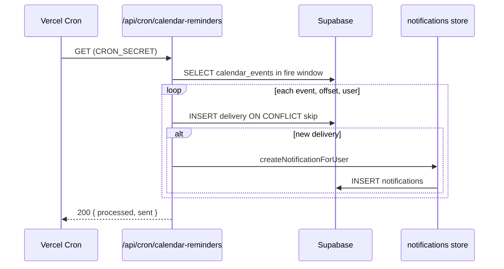

# CALENDAR_NOTIFICATIONS_DESIGN

**Дата:** 2026-06-22  
**Статус:** **УТВЕРЖДЁН** — готов к реализации (см. `CALENDAR_NOTIFICATIONS_IMPLEMENTATION_PLAN.md`)  
**Контекст:** Calendar MVP в production (`calendar_events`, in-app notifications, `Europe/Zagreb`)

---

## 1. Цель

Добавить **in-app напоминания** о событиях календаря через существующий центр уведомлений платформы:

| Offset | Текст (пример) |
|--------|----------------|
| **24 часа** до начала | «Завтра в 10:00 — Встреча с клиентом» |
| **1 час** до начала | «Через 1 час — Встреча с клиентом» |

**Каналы MVP:** только колокольчик + счётчик непрочитанных.  
**Вне MVP:** Email, WhatsApp, Telegram, SMS, browser push.

---

## 2. Требования (зафиксировано)

### 2.1. Типы напоминаний

Фиксированные offset для MVP (не настраиваемые пользователем):

```text
REMINDER_OFFSETS_MINUTES = [1440, 60]   // 24h, 1h
```

### 2.2. Получатели

| Scope | MVP | Phase 2 (оценка) |
|-------|-----|------------------|
| **personal** | Только `owner_user_id` | Без изменений |
| **company** | Все сотрудники с доступом к календарю (owner + managers, без deleted users) | Только **участники** события (`calendar_event_participants`) |

**Определение «доступ к календарю» в MVP:** `listTeamUsers()` минус `getDeletedUserIds()` — те же пользователи, что видят `NAV_CALENDAR` (owner + manager-1…3).

### 2.3. Каналы

| Канал | MVP |
|-------|-----|
| `notifications` (in-app) | ✅ |
| `NotificationBell` + unread badge | ✅ |
| Toast при новом уведомлении | ✅ (опционально, см. §6) |
| Email / мессенджеры | ❌ |

### 2.4. Флаг `send_reminders` на событии

На каждом событии календаря — поле **`send_reminders boolean`**.

| Scope | Default |
|-------|---------|
| `personal` | `true` |
| `company` | `true` |

**Поведение:**

| `send_reminders` | 24h reminder | 1h reminder |
|------------------|:------------:|:-----------:|
| `true` (default) | ✅ по правилам §5 | ✅ по правилам §5 |
| `false` | ❌ не создаётся | ❌ не создаётся |

- Флаг задаётся при **создании** и **редактировании** события (UI: чекбокс в форме).
- Cron **пропускает** события с `send_reminders = false` — до проверки offset и recipients.
- Переключение `true → false`: будущие напоминания не отправляются; уже доставленные in-app уведомления **не отзываются**.
- Переключение `false → true`: если окна 24h/1h ещё не прошли — cron отправит при следующем tick; прошедшие offset **не догоняются**.

**Хранение:** колонка `send_reminders` на `calendar_events` (§4.4).

---

## 3. Интеграция с существующей системой уведомлений

### 3.1. Что уже есть

| Компонент | Путь | Роль |
|-----------|------|------|
| Таблица | `notifications` (`001_platform.sql`) | Хранение in-app уведомлений per user |
| Store | `src/lib/notifications/store.ts` | Dual-storage Supabase + `.data` fallback |
| Emit helpers | `src/lib/notifications/emit.ts` | `createNotificationForUser`, `createNotificationsForTeam` |
| API | `GET /api/notifications` | Список + `unread` count |
| UI | `NotificationBell`, `NotificationProvider` | Колокольчик, polling ~30s |
| Фоновый watcher | `formgrid-watch.ts` | Паттерн throttle + `app_state` (только для Formgrid, **не** для calendar) |

**Схема `notifications` (текущая):**

```sql
notifications (
  id text PK,
  user_id text NOT NULL,
  type text NOT NULL,
  title text NOT NULL,
  message text NOT NULL,
  author_name text,
  is_read boolean DEFAULT false,
  created_at timestamptz DEFAULT now()
)
```

Индекс: `notifications_user_created_idx (user_id, created_at desc)`.

### 3.2. Что переиспользуем без изменений схемы `notifications`

| Возможность | Как |
|-------------|-----|
| Доставка in-app | `createNotificationForUser()` / `createNotificationsForTeam()` |
| Счётчик непрочитанных | `getUnreadCount()` — **без изменений** |
| Read / read-all / delete | Существующие API — **без изменений** |
| Fan-out по команде | `createNotificationsForTeam({ onlyUserIds })` |

### 3.3. Что нужно расширить (код, не схема `notifications`)

| Файл | Изменение |
|------|-----------|
| `src/lib/notifications/types.ts` | + `calendar_reminder` в `NOTIFICATION_TYPES` |
| `src/lib/notifications/emit.ts` | + `notifyCalendarReminder({...})` |
| `src/lib/notifications/navigation.ts` | + href `/calendar?event={id}` |
| `src/components/notifications/constants.ts` | + label «Напоминание» + icon 📅 |

### 3.4. Нужна ли новая таблица?

| Таблица | Нужна? | Зачем |
|---------|--------|-------|
| `notifications` | **Нет** (уже есть) | UI-доставка пользователю |
| `calendar_events` | **Да** (расширение) | + колонка `send_reminders` |
| **`calendar_reminder_deliveries`** | **Да** | Idempotency: «это напоминание уже отправлено» |
| `app_state` | **Нет** для dedup | Слишком хрупко при fan-out и redeploy |

**Вывод:** одна новая таблица `calendar_reminder_deliveries` + расширение типов уведомлений. Таблицу `notifications` **не меняем** в MVP (metadata event_id — в `message`/`title` или Phase 2 колонка `metadata jsonb`).

### 3.5. Влияние на текущие уведомления

| Аспект | Влияние |
|--------|---------|
| Существующие типы (`task_*`, `team_chat`, …) | **Нет** — только новый `type` |
| Unread count | Суммируется с calendar reminders — **ожидаемо** |
| Polling `/api/notifications` | Без изменений контракта |
| Formgrid watch | **Не трогаем** — calendar reminders на отдельном cron |
| Производительность | +2 уведомления × N users на company event — при 4 users и ~100 events/мес negligible |

---

## 4. Структура хранения напоминаний

### 4.1. Модель: «вычислять при cron, фиксировать при отправке»

MVP **не** хранит отдельную очередь «запланированных jobs» на каждое событие. Вместо этого:

1. **Источник истины** — строка в `calendar_events` (`start_at`, `all_day`, `scope`, `owner_user_id`, `send_reminders`, `updated_at`).
2. **Журнал доставки** — `calendar_reminder_deliveries` (что уже отправлено).
3. **In-app запись** — строка в `notifications` (что видит пользователь).

```text
calendar_events
       │
       │  cron: fire_time = effective_start - offset
       ▼
calendar_reminder_deliveries  ──(if new)──►  notifications
     UNIQUE dedup key              createNotificationForUser
```

### 4.2. Новая таблица `calendar_reminder_deliveries`

**Migration:** `011_calendar_reminder_deliveries.sql`

```sql
create table if not exists calendar_reminder_deliveries (
  id text primary key,
  event_id text not null references calendar_events(id) on delete cascade,
  user_id text not null,
  offset_minutes int not null check (offset_minutes in (1440, 60)),
  fire_at timestamptz not null,          -- когда сработало окно cron
  notification_id text,                  -- ссылка на notifications.id (nullable до insert)
  event_updated_at timestamptz not null, -- snapshot updated_at на момент отправки
  created_at timestamptz not null default now(),
  unique (event_id, user_id, offset_minutes)
);

create index calendar_reminder_deliveries_fire_idx
  on calendar_reminder_deliveries (fire_at);

create index calendar_reminder_deliveries_event_idx
  on calendar_reminder_deliveries (event_id);
```

| Поле | Назначение |
|------|------------|
| `event_id + user_id + offset_minutes` | **Уникальный ключ** — защита от повторной отправки |
| `fire_at` | Аудит: когда cron зафиксировал доставку |
| `event_updated_at` | Диагностика: версия события при отправке |
| `notification_id` | Связь с in-app уведомлением (опционально) |
| `ON DELETE CASCADE` | При удалении события — очистка журнала |

### 4.3. Расширение `calendar_events`: `send_reminders`

**Migration:** `010_calendar_send_reminders.sql`

```sql
alter table calendar_events
  add column if not exists send_reminders boolean not null default true;
```

| Колонка | Тип | NULL | Default | Назначение |
|---------|-----|------|---------|------------|
| `send_reminders` | `boolean` | NO | `true` | Вкл/выкл напоминания 24h + 1h для этого события |

**Backfill:** существующие строки после `009_calendar.sql` получают `default true` автоматически.

**Application layer:**

- `CalendarEvent.sendReminders: boolean`
- `CreateCalendarEventInput` / `UpdateCalendarEventInput` — опционально `sendReminders`
- Default при create: `true` для `personal` и `company` (явно в store/validation, не полагаться только на DB default)

### 4.4. Почему не хранить delivery state только в `calendar_events`

| Подход | Плюс | Минус |
|--------|------|-------|
| Колонка `reminder_minutes int[]` на событии | Гибкость Phase 2 | Не решает dedup per user |
| Отдельная очередь jobs | Точное планирование | Сложнее sync при edit/delete |
| **Delivery log (выбрано)** | Простой MVP, надёжный dedup | Cron scan каждые N минут |

`send_reminders` — **настройка события**; `calendar_reminder_deliveries` — **журнал факта отправки**.

---

## 5. Как определять, что уведомление уже отправлено

### 5.1. Алгоритм (per cron tick)

Для каждого offset `O ∈ {1440, 60}`:

```text
1. Если event.send_reminders = false → пропуск (оба offset)
2. effective_start = computeEffectiveStart(event)   // §9
3. fire_target     = effective_start - O minutes
4. Если fire_target < now - GRACE_WINDOW → пропуск (опоздали)
5. Если fire_target > now + CRON_WINDOW      → пропуск (ещё рано)
6. Иначе → кандидат на отправку
7. recipients = resolveRecipients(event)           // §2.2
8. Для каждого user:
     INSERT calendar_reminder_deliveries (...)
     ON CONFLICT (event_id, user_id, offset_minutes) DO NOTHING
     RETURNING id
     → если inserted: createNotificationForUser(...)
```

**Отправлено** = существует строка в `calendar_reminder_deliveries` с данным `(event_id, user_id, offset_minutes)`.

### 5.2. Константы окна cron

```text
CRON_INTERVAL     = 5 min   // Vercel Cron (рекомендуется)
GRACE_WINDOW      = 10 min  // насколько «опоздавший» cron ещё шлёт
CRON_WINDOW       = 5 min   // совпадает с интервалом cron
```

**Итого:** напоминание попадает в окно `[fire_target - 10m, fire_target + 5m]`.

---

## 6. Cron / Scheduler стратегия

### 6.1. Рекомендация MVP: Vercel Cron

Сейчас в репозитории **нет** `vercel.json` с cron. Calendar reminders **нельзя** вешать только на polling `/api/notifications` (как Formgrid) — напоминания должны срабатывать, даже если никто не онлайн.

```json
{
  "crons": [{
    "path": "/api/cron/calendar-reminders",
    "schedule": "*/5 * * * *"
  }]
}
```

**Route:** `GET /api/cron/calendar-reminders`

| Защита | Реализация |
|--------|------------|
| Авторизация | Header `Authorization: Bearer ${CRON_SECRET}` |
| Vercel | `CRON_SECRET` в ENV production |
| Идемпотентность | DB unique constraint (§5) |

### 6.2. Альтернативы (не MVP)

| Вариант | Когда |
|---------|-------|
| Supabase `pg_cron` | Если команда предпочитает DB-side scheduler |
| External worker (GitHub Actions) | Fallback без Vercel Pro cron |
| Polling на `/api/notifications` | **Не рекомендуется** для calendar |

### 6.3. Query cron (псевдокод)

```text
now = UTC now
from = now - GRACE_WINDOW
to   = now + CRON_WINDOW

for offset in [1440, 60]:
  candidates = SELECT * FROM calendar_events
    WHERE send_reminders = true
      AND compute_fire_time(start_at, all_day, offset) BETWEEN from AND to

  for event in candidates:
    for user in resolveRecipients(event):
      tryDeliver(event, user, offset)
```

**Индекс:** существующий `calendar_events_range_idx` достаточен при малом объёме; при росте — partial index по `start_at`.

---

## 7. Поведение после редактирования события

### 7.1. Какие поля влияют на reminders

| Поле | Влияние |
|------|---------|
| `send_reminders` | `false` → cron не шлёт; `true→false` → только будущие блокируются |
| `start_at` | Меняется время 24h / 1h напоминаний |
| `all_day` | Меняется `effective_start` (§9) |
| `title` | Меняется текст уведомления (только будущие) |
| `scope` | Меняется список получателей |
| `description`, `location` | **Не влияют** на MVP reminders |

### 7.2. Стратегия MVP: «не отзывать, не переотправлять»

При `PATCH /api/calendar/events/:id`:

```text
1. Если изменились start_at или all_day:
     DELETE FROM calendar_reminder_deliveries
     WHERE event_id = :id
       AND offset_minutes = O
       AND NOT EXISTS (уже отправлено для нового fire_target)
```

**Упрощённый MVP (SAFE):**

```text
При изменении start_at, all_day или send_reminders (false → true):
  DELETE FROM calendar_reminder_deliveries WHERE event_id = :id

При изменении send_reminders (true → false):
  delivery log не трогаем; cron просто пропускает событие
```

| Сценарий | Поведение |
|----------|-----------|
| `send_reminders` выключили | Будущие 24h/1h **не создаются** ✅ |
| `send_reminders` включили до start | Delivery log сброшен → cron может отправить оставшиеся offset ✅ |
| Событие сдвинули **вперёд** | Старые offset сброшены → новые напоминания придут в новое окно ✅ |
| Событие сдвинули **назад** (раньше) | Уже отправленные **не отзываются**; если новое окно ещё не прошло — придёт новое ⚠️ |
| Уже ушло 24h, сдвинули на завтра | 24h придёт снова ✅ |
| Только title изменили | Delivery log **не трогаем** — текст в notifications уже отправленных не меняется ✅ |

**Не делаем в MVP:** редактирование уже созданных `notifications` при изменении title.

### 7.3. Phase 2 (опционально)

- `calendar_event_changed` — отдельное уведомление «Время события изменено» (вне scope MVP reminders).

---

## 8. Поведение после удаления события

```text
DELETE calendar_events WHERE id = :id
  → ON DELETE CASCADE удаляет calendar_reminder_deliveries
  → notifications остаются (история in-app)
```

| Аспект | MVP |
|--------|-----|
| Будущие reminders | **Не отправятся** (события нет) |
| Уже отправленные in-app | **Остаются** в колокольчике |
| Deep link `/calendar?event=deleted` | UI: «Событие не найдено» (Phase 2 polish) |

**Опционально (не MVP):** при delete помечать связанные unread `calendar_reminder` notifications как read — усложнение без `notification_id` ↔ `event_id` в schema.

---

## 9. Поведение для all-day событий

### 9.1. Текущее хранение (как в UI)

Из `form.ts`:

```text
all_day = true:
  start_at = YYYY-MM-DD 00:00:00  (Europe/Zagreb → UTC)
  end_at   = YYYY-MM-DD 23:59:59  (Europe/Zagreb → UTC)
```

### 9.2. Effective start для reminders

```text
effective_start(event):
  if event.all_day:
    return local_midnight(event.start_at date, CALENDAR_TIMEZONE)  // 00:00 Zagreb
  else:
    return event.start_at
```

### 9.3. Примеры (TZ = Europe/Zagreb)

| Событие | effective_start (local) | 24h reminder (local) | 1h reminder (local) |
|---------|-------------------------|----------------------|---------------------|
| All-day 25 июня | 25.06 00:00 | 24.06 00:00 | 24.06 23:00 |
| Timed 25.06 10:00 | 25.06 10:00 | 24.06 10:00 | 25.06 09:00 |

### 9.4. Событие создано «в последний момент»

| Условие | Поведение |
|---------|-----------|
| До start < 24h | Offset 1440 **пропускается** (fire_target в прошлом) |
| До start < 1h | Offset 60 **пропускается** |
| До start < 5 min | Оба пропускаются |

**Не шлём** «мгновенное» напоминание при создании события в MVP — только 24h и 1h offsets.

---

## 10. Поведение при повторном деплое

| Риск | Митигация |
|------|-----------|
| In-memory state потерян | **Нет in-memory state** — только Supabase |
| Двойной cron при scale | `UNIQUE (event_id, user_id, offset_minutes)` |
| Cron пропущен 30 min | `GRACE_WINDOW = 10m` — поздние напоминания **не** догоняются (осознанный trade-off MVP) |
| Cold start Vercel | Cron route stateless, < 30s execution |

**После redeploy:** следующий cron tick продолжает с того же DB state — **без** специальной инициализации.

**Ограничение MVP:** если cron не работал > GRACE_WINDOW, напоминание **теряется** (не backlog). Документировать в runbook.

---

## 11. Защита от повторной отправки

### 11.1. Уровни защиты

| Уровень | Механизм |
|---------|----------|
| **L1 — DB** | `UNIQUE (event_id, user_id, offset_minutes)` + `INSERT … ON CONFLICT DO NOTHING` |
| **L2 — Transaction** | Insert delivery → create notification в одной логической операции |
| **L3 — Cron auth** | `CRON_SECRET` — только Vercel cron вызывает endpoint |

### 11.2. Race condition (два cron overlap)

```text
Worker A: INSERT delivery → success → create notification
Worker B: INSERT delivery → conflict → skip
```

PostgreSQL unique constraint — достаточно для MVP.

### 11.3. Company fan-out

4 users × 2 offsets = **8 delivery rows** per event — каждая со своим `user_id` в unique key.

---

## 12. Формат in-app уведомления

### 12.1. Новый тип

```typescript
type: "calendar_reminder"
```

### 12.2. Payload

| Поле | Значение |
|------|----------|
| `title` | `24h`: «Напоминание: завтра» · `1h`: «Напоминание: через 1 час» |
| `message` | `{HH:mm} — {event.title}` или `Весь день — {title}` для all-day |
| `author_name` | `null` |
| `user_id` | recipient |

### 12.3. Navigation

```typescript
// navigation.ts
case "calendar_reminder":
  return `/calendar?event=${eventId}`;  // eventId из delivery log или encoded в message
```

**Toast:** добавить `calendar_reminder` в `TOAST_NOTIFICATION_TYPES` — пользователь увидит всплывающее напоминание (рекомендуется).

---

## 13. Phase 2: участники company events

### 13.1. Проблема MVP fan-out

Company event → уведомление **всем** (4+ человек). Для встречи «только Злата + Вероника» — шум.

### 13.2. Phase 2 модель

```sql
calendar_event_participants (
  event_id text references calendar_events(id) on delete cascade,
  user_id text not null,
  primary key (event_id, user_id)
)
```

```text
resolveRecipients(event):
  if event.scope == 'personal':
    return [event.owner_user_id]
  if has participants:
    return participants
  else:
    return allCalendarUsers()   // fallback как MVP
```

| Критерий | MVP | Phase 2 |
|----------|-----|---------|
| Company fan-out | Вся команда | Участники (+ creator?) |
| UI выбора участников | ❌ | ✅ в форме события |
| Сложность | Низкая | Средняя |
| Риск шума | Средний | Низкий |

**Рекомендация:** MVP с full-team fan-out приемлем для команды 4–5 человек; Phase 2 — после обратной связи.

---

## 14. Архитектура (диаграмма)



```text
src/lib/calendar/
  reminders.ts          # computeEffectiveStart, resolveRecipients, fire window
  reminders-cron.ts       # runCalendarReminderCron()

src/lib/notifications/
  emit.ts                 # notifyCalendarReminder()

src/app/api/cron/
  calendar-reminders/route.ts

supabase/migrations/
  010_calendar_send_reminders.sql
  011_calendar_reminder_deliveries.sql
```

---

## 15. MVP объём работ

| # | Задача | Файлы / артефакты |
|---|--------|-------------------|
| 1 | Migration `010_calendar_send_reminders.sql` | `send_reminders` на `calendar_events` |
| 2 | Migration `011_calendar_reminder_deliveries.sql` | delivery log |
| 3 | Reminder engine (compute + recipients + `send_reminders` skip) | `src/lib/calendar/reminders.ts` |
| 4 | Delivery repo | `src/lib/supabase/calendar-reminder-deliveries-repo.ts` |
| 5 | Cron route + `CRON_SECRET` + `vercel.json` | `src/app/api/cron/...`, ENV |
| 6 | `notifyCalendarReminder` + type `calendar_reminder` | `emit.ts`, `types.ts` |
| 7 | UI: bell, href, toast + form checkbox `send_reminders` | `constants.ts`, `navigation.ts`, `CalendarEventForm` |
| 8 | Invalidate deliveries on event update | hook в `calendar/store.ts` или handlers |
| 9 | Tests | `reminders.test.ts`, `form.test.ts` |
| 10 | Runbook | когда cron silent > 10m |

**Не в MVP:**

- User-configurable offsets
- Email / push / мессенджеры
- `calendar_event_participants`
- `calendar_event_changed` notifications
- Metadata column на `notifications`
- Отзыв уже отправленных reminders при edit

---

## 16. Оценка сложности

| Область | Оценка | Комментарий |
|---------|--------|-------------|
| DB migration | **S** | Одна таблица, FK cascade |
| Reminder engine | **M** | TZ + all-day + skip past offsets |
| Cron + Vercel | **M** | Первый cron в проекте, нужен `CRON_SECRET` |
| Notifications integration | **S** | Паттерн как `emit.ts` |
| Edit/delete hooks | **S** | DELETE deliveries on time change |
| UI polish (deep link) | **S–M** | `?event=` в CalendarView |
| Phase 2 participants | **L** | Schema + UI + migration данных |

**Итого MVP:** ~**3–5 dev-days** (1 разработчик, с тестами и production smoke).

---

## 17. Рекомендуемый порядок реализации

```text
PR #1  Migration 010 + 011 + types + repo
         ↓
PR #2  Reminder engine + unit tests
         ↓
PR #3  Cron route + vercel.json + CRON_SECRET
         ↓
PR #4  emit + notification type + bell UI
         ↓
PR #5  Edit hooks + API sendReminders
         ↓
PR #6  Form checkbox + deep link + production smoke
```

См. детали: `CALENDAR_NOTIFICATIONS_IMPLEMENTATION_PLAN.md`.

**Порядок deploy:**

1. Apply `010_*.sql` + `011_*.sql` на production Supabase  
2. Set `CRON_SECRET` на Vercel  
3. Deploy (активирует cron)  
4. Создать тестовое событие через 2h → проверить 1h reminder  

---

## 18. SAFE / RISKY

### SAFE ✅

| Решение | Почему |
|---------|--------|
| Reuse `notifications` table | Проверенный паттерн, unread count бесплатно |
| Delivery log с UNIQUE | Надёжный dedup, переживает redeploy |
| Vercel Cron 5 min | Стандарт для Next.js на Vercel |
| Fixed offsets [24h, 1h] | Нет per-offset UI; вкл/выкл — один чекбокс `send_reminders` |
| `send_reminders` default true | Opt-out per event, не ломает существующие события |
| DELETE deliveries on time edit | Простая инвалидация |
| Personal → single recipient | Совпадает с RBAC календаря |

### RISKY ⚠️

| Риск | Митигация |
|------|-----------|
| Cron downtime > 10m → пропуск reminder | Мониторинг cron logs; Phase 2 увеличить GRACE или backlog |
| Company → spam всей команде | Приемлемо для 4 users; Phase 2 participants |
| All-day 1h = 23:00 prev day | Документировать; UX copy «за 1 час» |
| Нет `metadata` на notifications | Deep link через delivery log lookup by notification_id |
| Первый cron в проекте | Тест на preview + `CRON_SECRET` rotation doc |
| TZ drift (DST) | Использовать `CALENDAR_TIMEZONE` + `Temporal` / `date-fns-tz` consistently |

### Не делать в MVP ❌

| Anti-pattern | Причина |
|--------------|---------|
| Dedup через `app_state` JSON | Race + fan-out |
| Только polling `/api/notifications` | Не сработает ночью |
| Хранить «scheduled» без delivery log | Сложный sync при edit |
| Отправлять email «на будущее» | Out of scope |

---

## 19. Чеклист готовности к реализации

- [x] Подтверждены offsets: 24h + 1h only  
- [x] Подтверждён `send_reminders` (default `true`, personal + company)  
- [x] Подтверждён fan-out company → вся команда (MVP)  
- [ ] `CRON_SECRET` будет добавлен в Vercel production  
- [ ] Vercel plan поддерживает Cron (Hobby: 1 cron/day limit — **проверить plan**)  
- [ ] Runbook: пропущенный cron, тестовое событие  

> **Важно:** Vercel Hobby ограничивает cron (1×/день). Для `*/5 * * * *` может потребоваться **Pro** или external scheduler. Проверить до старта PR #2.

---

## 20. Связанные документы

| Документ | Связь |
|----------|-------|
| `CALENDAR_MVP_SPEC.md` | Schema `calendar_events`, all-day |
| `INTERNAL_CALENDAR_SYSTEM_DESIGN.md` | §8 Notifications (Phase 4 roadmap) |
| `RELEASE_EXECUTION_CHECKLIST.md` | Паттерн migration + deploy |
| `CALENDAR_NOTIFICATIONS_IMPLEMENTATION_PLAN.md` | PR-план реализации |
| `001_platform.sql` | `notifications`, `app_state` |

---

**Документ подготовлен без кода, PR, commit, push и deploy.**
