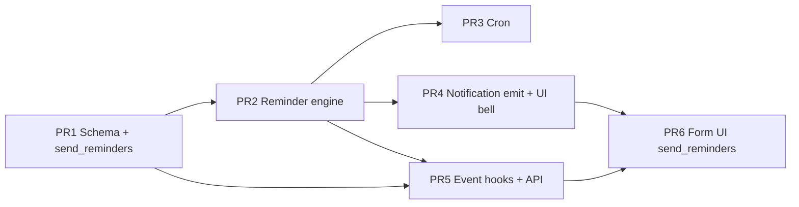

# Calendar Notifications — Implementation Plan

**Дата:** 2026-06-22  
**Статус:** план реализации — код, PR, merge, deploy **не выполняются**  
**Основа:** `CALENDAR_NOTIFICATIONS_DESIGN.md` (**утверждён**)  
**Предусловие:** Calendar MVP в production (`009_calendar.sql` применена)

---

## Executive Summary

| Метрика | Значение |
|---------|----------|
| PR count | **6** |
| Новых migrations | **2** (`010`, `011`) |
| Новых ENV | **1** (`CRON_SECRET`) |
| Новый infra | `vercel.json` cron (первый в проекте) |
| Оценка | **~4–6 dev-days** (1 dev, с тестами + production smoke) |
| Merge strategy | Последовательно PR 1→6; PR 3 и PR 4 можно параллелить после PR 2 |

**Принцип:** каждый PR оставляет `main` рабочим (`npm test`, `npm run build`). До PR 5 cron не активен в production (нет `vercel.json` / ENV). До PR 6 UI-чекбокс не обязателен для backend smoke (API default `sendReminders: true`).

---

## Scope (напоминание)

| Включено | Исключено |
|----------|-----------|
| In-app reminders 24h + 1h | Email, WhatsApp, Telegram, SMS |
| `send_reminders` на событии (default `true`) | Per-offset настройки (только 24h или только 1h) |
| Personal → owner; Company → вся команда | `calendar_event_participants` (Phase 2) |
| `calendar_reminder` в NotificationBell | Browser push |

---

## Граф зависимостей PR



---

## Сводка по PR

| PR | Название | Schema | Cron | Notifications | UI | Tests |
|----|----------|:------:|:----:|:-------------:|:--:|:-----:|
| 1 | Schema + types + repo | ✅ | — | — | — | ✅ |
| 2 | Reminder engine | — | — | — | — | ✅ |
| 3 | Cron route + vercel.json | — | ✅ | — | — | ✅ |
| 4 | Notification generation + bell | — | — | ✅ | ✅ bell | ✅ |
| 5 | Edit hooks + delivery reset | — | — | hook | — | ✅ |
| 6 | Form checkbox `send_reminders` | — | — | — | ✅ form | ✅ |

---

## PR #1 — Schema, `send_reminders`, delivery table, types

### Цель

Заложить data layer: колонка на событии, журнал доставки, типы, repo — **без cron и без UI**.

### Schema changes

**`010_calendar_send_reminders.sql`**

```sql
alter table calendar_events
  add column if not exists send_reminders boolean not null default true;
```

**`011_calendar_reminder_deliveries.sql`**

```sql
create table if not exists calendar_reminder_deliveries (
  id text primary key,
  event_id text not null references calendar_events(id) on delete cascade,
  user_id text not null,
  offset_minutes int not null check (offset_minutes in (1440, 60)),
  fire_at timestamptz not null,
  notification_id text,
  event_updated_at timestamptz not null,
  created_at timestamptz not null default now(),
  unique (event_id, user_id, offset_minutes)
);

create index if not exists calendar_reminder_deliveries_fire_idx
  on calendar_reminder_deliveries (fire_at);

create index if not exists calendar_reminder_deliveries_event_idx
  on calendar_reminder_deliveries (event_id);
```

### Код (новые / изменённые файлы)

| Файл | Действие |
|------|----------|
| `supabase/migrations/010_calendar_send_reminders.sql` | new |
| `supabase/migrations/011_calendar_reminder_deliveries.sql` | new |
| `src/lib/calendar/types.ts` | + `sendReminders: boolean` на `CalendarEvent`, inputs |
| `src/lib/supabase/calendar-events-repo.ts` | map `send_reminders` |
| `src/lib/calendar/store.ts` | default `sendReminders: true` on create |
| `src/lib/supabase/calendar-reminder-deliveries-repo.ts` | new: insert-on-conflict, deleteByEventId |
| `src/lib/calendar/constants.ts` | + `REMINDER_OFFSETS_MINUTES`, window constants |

### Тесты

| Файл | Покрытие |
|------|----------|
| `src/lib/calendar/store.test.ts` (или extend validation) | create default `sendReminders: true` personal + company |
| repo mapping smoke | `send_reminders` round-trip |

### Критерии приёмки

- [ ] `npm test` / `npm run build` green
- [ ] Migration 010 + 011 применены на dev Supabase (или JSON fallback не ломается)
- [ ] Существующие события: `send_reminders = true` после 010

### Deploy note

Можно merge без cron — колонка и таблица не влияют на текущий UX.

---

## PR #2 — Reminder engine (pure logic)

### Цель

Вычисление fire window, effective start, recipients, skip rules — **без HTTP cron**.

### Schema changes

Нет (использует PR #1).

### Новые модули

| Файл | Содержание |
|------|------------|
| `src/lib/calendar/reminders.ts` | `computeEffectiveStart`, `computeFireTarget`, `isInFireWindow`, `resolveRecipients`, `shouldSkipEvent` (incl. `!sendReminders`) |
| `src/lib/calendar/reminders-cron.ts` | `runCalendarReminderCron()` — orchestration (пока без route) |

### Логика `shouldSkipEvent`

```text
skip if:
  - event.sendReminders === false
  - fire_target outside [now - GRACE, now + CRON_WINDOW]
  - offset already past (created last-minute)
```

### Тесты

| Файл | Кейсы |
|------|-------|
| `src/lib/calendar/reminders.test.ts` | effective start timed + all-day (Europe/Zagreb) |
| | fire window boundaries |
| | skip when `sendReminders: false` |
| | skip 24h when event < 24h away |
| | personal → 1 recipient; company → N team users |
| | mock delivery insert dedup |

### Критерии приёмки

- [ ] 100% critical paths в `reminders.test.ts`
- [ ] Нет импортов из `app/api` в lib

---

## PR #3 — Cron route + Vercel scheduler

### Цель

Периодический запуск `runCalendarReminderCron()` в production.

### Schema changes

Нет.

### Cron

| Артефакт | Содержание |
|----------|------------|
| `vercel.json` | `{ "crons": [{ "path": "/api/cron/calendar-reminders", "schedule": "*/5 * * * *" }] }` |
| `src/app/api/cron/calendar-reminders/route.ts` | `GET`, verify `Authorization: Bearer ${CRON_SECRET}` |
| `.env.example` | + `CRON_SECRET=` |

**ENV (Vercel production):** `CRON_SECRET` — random 32+ chars.

### Поведение route

```text
1. Auth CRON_SECRET
2. runCalendarReminderCron()
3. Return 200 { processed, sent, skipped }
```

### Тесты

| Файл | Кейсы |
|------|-------|
| `src/lib/calendar/reminders-cron.test.ts` | integration с mock store + mock notifications |
| route test (optional) | 401 без secret; 200 с secret |

### Критерии приёмки

- [ ] Cron route не доступен без secret
- [ ] Manual `curl` с secret на preview → 200
- [ ] **Проверить Vercel plan** (Hobby = 1 cron/day → нужен Pro или external scheduler)

### Deploy note

1. Set `CRON_SECRET` на Vercel **до** merge или сразу после  
2. Deploy активирует cron  
3. Smoke: событие через ~65 min, `send_reminders: true` → 1h reminder

---

## PR #4 — Notification generation + NotificationBell UI

### Цель

Доставка in-app уведомлений и отображение в колокольчике.

### Schema changes

Нет (`notifications` table без изменений).

### Notification generation

| Файл | Изменение |
|------|-----------|
| `src/lib/notifications/types.ts` | + `calendar_reminder` |
| `src/lib/notifications/emit.ts` | + `notifyCalendarReminder({ event, offsetMinutes, userId })` |
| `reminders-cron.ts` | после successful delivery insert → `notifyCalendarReminder` |

**Payload:**

| offset | title | message |
|--------|-------|---------|
| 1440 | «Напоминание: завтра» | `{time} — {title}` / «Весь день — {title}» |
| 60 | «Напоминание: через 1 час» | то же |

### UI (NotificationBell)

| Файл | Изменение |
|------|-----------|
| `src/components/notifications/constants.ts` | label + icon 📅 |
| `src/lib/notifications/navigation.ts` | `calendar_reminder` → `/calendar?event={id}` |
| `src/lib/notifications/navigation.ts` | + `calendar` section; optional toast in `TOAST_NOTIFICATION_TYPES` |
| `NotificationProvider` | без изменений контракта (polling тот же) |

### Тесты

| Файл | Кейсы |
|------|-------|
| `emit` unit / cron integration | notification created per user |
| `navigation.test.ts` (new) | href для `calendar_reminder` |

### Критерии приёмки

- [ ] Unread count увеличивается после cron delivery
- [ ] Клик по уведомлению → `/calendar?event=...`
- [ ] Toast (если включён) для `calendar_reminder`

---

## PR #5 — Event lifecycle hooks (edit / delete / API)

### Цель

Синхронизация delivery log и API с `send_reminders`.

### Schema changes

Нет.

### Handlers / store

| Событие | Действие |
|---------|----------|
| **PATCH** `start_at` / `all_day` changed | `deleteDeliveriesByEventId(eventId)` |
| **PATCH** `sendReminders` `false → true` | `deleteDeliveriesByEventId(eventId)` |
| **PATCH** `sendReminders` `true → false` | delivery log **не** трогаем |
| **DELETE** event | CASCADE (DB) |
| **POST** create | `sendReminders` из body или default `true` |

| Файл | Изменение |
|------|-----------|
| `src/lib/calendar/handlers.ts` | parse `sendReminders` in create/update |
| `src/lib/calendar/validation.ts` | optional boolean validation |
| `src/lib/calendar/store.ts` | persist + hook delete deliveries |
| `src/lib/calendar/handlers.test.ts` | API accepts `sendReminders` |

### API contract

```json
// POST/PATCH body (optional)
{ "sendReminders": true }
```

### Тесты

| Кейс | Ожидание |
|------|----------|
| PATCH start_at | deliveries cleared |
| PATCH sendReminders false | cron skip (covered in PR2) |
| PATCH sendReminders true after false | deliveries cleared |

### Критерии приёмки

- [ ] API round-trip `sendReminders`
- [ ] Edit time → reminder может прийти повторно в новое окно

---

## PR #6 — UI settings: checkbox в форме события

### Цель

Пользователь управляет `send_reminders` при create/edit.

### Schema changes

Нет.

### UI settings

| Файл | Изменение |
|------|-----------|
| `src/lib/calendar/form.ts` | + `sendReminders: boolean` default `true` |
| `src/components/calendar/CalendarEventForm.tsx` | чекбокс «Напоминания (за 24 ч и за 1 ч)» |
| `CalendarEventForm.module.css` | стиль чекбокса |
| `CalendarEventModal.tsx` | view mode: показать «Напоминания: вкл/выкл» |
| `CalendarView.tsx` | deep link `?event=` → open modal (из PR #4 href) |

**UX copy (RU):**

- Label: «Напоминания за 24 часа и за 1 час»
- Hint: «Уведомление в колокольчике. Только на платформе.»
- Default: **включено** (personal и company)

### Тесты

| Файл | Кейсы |
|------|-------|
| `src/lib/calendar/form.test.ts` | default true; payload includes `sendReminders` |
| `form.test.ts` | false → API body `sendReminders: false` |

### Критерии приёмки

- [ ] Create с выкл. чекбоксом → cron не шлёт
- [ ] Edit: toggle сохраняется
- [ ] View modal показывает статус
- [ ] Deep link из notification открывает событие

### Manual smoke (production)

| # | Шаг |
|---|-----|
| 1 | Событие через 70 min, reminders **on** → 1h notification |
| 2 | Событие через 70 min, reminders **off** → нет notification |
| 3 | Company event, reminders on → все managers + owner |
| 4 | Personal event → только owner |

---

## Cross-cutting: защита от дублей

Реализуется в PR #1 (schema) + PR #2 (logic) + PR #3 (cron):

```text
INSERT calendar_reminder_deliveries … ON CONFLICT DO NOTHING
  → if inserted → notifyCalendarReminder
```

Не зависит от `send_reminders` кроме skip на шаге 0.

---

## Cross-cutting: all-day

Реализуется в PR #2 tests; smoke в PR #6:

- All-day завтра → 24h reminder сегодня 00:00 Zagreb
- 1h reminder → 23:00 предыдущего дня

---

## Cross-cutting: redeploy

PR #3: cron stateless — после redeploy следующий tick продолжает с DB. Документировать в PR description: GRACE_WINDOW = 10m, без backlog.

---

## Порядок production deploy

```text
1. Merge PR #1 → apply 010 + 011 на Supabase
2. Merge PR #2–#5 (можно пакетом после review)
3. Перед PR #3 merge: CRON_SECRET на Vercel
4. Merge PR #3 → deploy → cron active
5. Merge PR #4–#6 → deploy
6. Manual smoke (§ PR #6)
```

**Rollback:** Promote previous Vercel deployment; таблицы остаются; cron перестаёт вызываться.

---

## Оценка сложности по областям

| Область | PR | Сложность |
|---------|-----|-----------|
| Schema changes | 1 | S |
| Reminder engine + TZ | 2 | M |
| Cron + Vercel | 3 | M |
| Notification generation | 4 | S |
| Event hooks | 5 | S |
| UI settings | 6 | S |
| **Итого** | 1–6 | **M** (~4–6 days) |

---

## SAFE / RISKY

### SAFE ✅

| Решение | PR |
|---------|-----|
| `send_reminders` default `true` — обратная совместимость | 1, 6 |
| Отдельная delivery table | 1 |
| Opt-out одним чекбоксом (оба offset) | 6 |
| Reuse `notifications` | 4 |
| Hooks только на time / re-enable reminders | 5 |

### RISKY ⚠️

| Риск | PR | Митигация |
|------|-----|-----------|
| Vercel Hobby cron limit | 3 | Проверить plan; GitHub Actions fallback |
| Cron miss > 10m | 3 | Monitoring; doc in runbook |
| Company spam | 4 | Phase 2 participants |
| User disables reminders after 24h sent | 5 | Expected: 1h still blocked if false |

---

## Файловая карта (итого)

```text
supabase/migrations/
  010_calendar_send_reminders.sql
  011_calendar_reminder_deliveries.sql

src/lib/calendar/
  reminders.ts
  reminders.ts.test.ts
  reminders-cron.ts
  reminders-cron.test.ts
  types.ts                    (modified)
  store.ts                    (modified)
  handlers.ts                 (modified)
  form.ts                     (modified)

src/lib/supabase/
  calendar-events-repo.ts     (modified)
  calendar-reminder-deliveries-repo.ts

src/lib/notifications/
  types.ts                    (modified)
  emit.ts                     (modified)
  navigation.ts               (modified)

src/app/api/cron/
  calendar-reminders/route.ts

src/components/calendar/
  CalendarEventForm.tsx       (modified)
  CalendarEventModal.tsx      (modified)

src/components/notifications/
  constants.ts                (modified)

vercel.json                   (new)
.env.example                  (modified)
```

---

## Связанные документы

| Документ | Роль |
|----------|------|
| `CALENDAR_NOTIFICATIONS_DESIGN.md` | Утверждённый дизайн |
| `CALENDAR_MVP_SPEC.md` | Базовая schema events |
| `RELEASE_EXECUTION_CHECKLIST.md` | Паттерн migration → deploy → smoke |

---

**План подготовлен без кода, PR, commit, push и deploy.**
