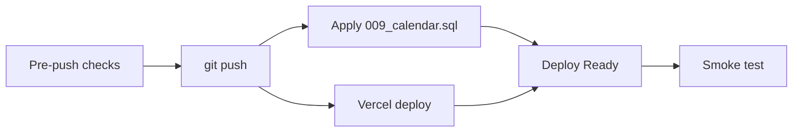

# Calendar MVP — Release Plan

**Дата:** 2026-06-22  
**Цель:** безопасный выпуск Calendar MVP (PR #1–#7) на production  
**Scope релиза:** Month + Day views, CRUD UI, API, migration `009_calendar.sql`  
**Out of scope релиза:** Week View (placeholder), PR #9 polish, CRM/AI интеграции  
**Статус документа:** план — push, deploy, migration **не выполнялись**

---

## Executive Summary

| Этап | Действие |
|------|----------|
| 1 | 7 коммитов уже на локальном `main` |
| 2 | Pre-push проверки (тесты, build, ENV review) |
| 3 | `git push origin main` |
| 4 | Migration `009_calendar.sql` на **production** Supabase |
| 5 | Vercel deploy (авто после push) |
| 6 | Post-deploy smoke (owner + manager) |

**Критическое правило:** migration должна быть применена **до того**, как пользователи откроют `/calendar` на новом деплое. Безопасный порядок: **push → migration → дождаться deploy → smoke test**.

---

## 1. Коммиты, входящие в релиз

Все коммиты между `origin/main` и локальным `HEAD` (7 штук):

| # | Hash | PR | Содержание |
|---|------|-----|------------|
| 1 | `539077a` | PR #1 | Schema, types, store, repo, `009_calendar.sql` |
| 2 | `1e901ed` | PR #2 | RBAC, validation, unit tests |
| 3 | `334783d` | PR #3 | REST API `/api/calendar/events` |
| 4 | `c813f45` | PR #4 | Nav, shell, toolbar, filters, fetch |
| 5 | `2c76d57` | PR #5 | Day View, EventChip, format |
| 6 | `279fb35` | PR #6 | Month grid, month.ts |
| 7 | `e7fd08d` | PR #7 | CRUD UI, form, modal |

```text
origin/main ──► 539077a ──► 1e901ed ──► 334783d ──► c813f45 ──► 2c76d57 ──► 279fb35 ──► e7fd08d (HEAD)
```

### Не входят в релиз (untracked, не коммитить в этом выпуске)

- Документация: `CALENDAR_*.md`, `WEEK_VS_MONTH_ANALYSIS.md`, `PLATFORM_SECURITY_AUDIT.md`
- Скриншоты: `reports/`
- Capture scripts: `scripts/capture-pr*.mjs`
- Локальные: `.env.development.local`, `.data/calendar-events.json`

---

## 2. Порядок выполнения: commit → push → deploy → migration

### Фаза 0 — Commits ✅ (выполнено)

Все 7 PR закоммичены локально. **Новых commit перед релизом не требуется**, если pre-push проверки зелёные.

### Фаза 1 — Pre-push (см. §3)

Выполнить чеклист **до** `git push`.

### Фаза 2 — Push

```text
git push origin main
```

- Триггерит Vercel production deploy (если `main` = production branch).
- Не делать force push.

### Фаза 3 — Migration (параллельно или сразу после push)

```text
Supabase Dashboard → SQL Editor → выполнить supabase/migrations/009_calendar.sql
```

**Почему migration после push, но до smoke test:**

| Порядок | Риск |
|---------|------|
| Migration **до** первого захода на `/calendar` | ✅ Минимальный |
| Deploy **без** migration | ❌ Пустой календарь, CRUD падает |
| Migration **до** push | ✅ Допустимо (таблица пустая, старый код её не трогает) |

**Рекомендуемая последовательность:**



1. Pre-push checks  
2. `git push origin main`  
3. Сразу применить `009_calendar.sql` на **том же** Supabase project, что в Vercel ENV  
4. Дождаться Vercel deploy **Ready**  
5. Post-deploy smoke test  

### Фаза 4 — Deploy

- Автоматически через Vercel при push на `main`.
- **Новых ENV для календаря не добавлять** — используются существующие `NEXT_PUBLIC_SUPABASE_URL` + `SUPABASE_SERVICE_ROLE_KEY`.
- Убедиться, что на Vercel **нет** override с пустыми `SUPABASE_*`.

### Фаза 5 — Post-deploy (см. §4)

Smoke test owner + manager.

---

## 3. Что проверить до push

### Build & tests

| # | Проверка | Команда / критерий |
|---|----------|-------------------|
| 1 | Unit tests | `npm test` → **123/123** |
| 2 | Production build | `npm run build` → success |
| 3 | Lint (опционально) | `npm run lint` → no errors |

### Git

| # | Проверка | Критерий |
|---|----------|----------|
| 4 | Ветка | `main`, 7 коммитов ahead of `origin/main` |
| 5 | Состав коммитов | Только PR #1–#7, без лишних файлов |
| 6 | Нет секретов | `.env.local`, `.data/` не в коммитах |

### ENV (Vercel — проверить в dashboard, не менять без нужды)

| # | Переменная | Критерий |
|---|------------|----------|
| 7 | `AUTH_SECRET` | Set, не dev-default |
| 8 | `AUTH_PASSWORD_*` | bcrypt hashes для production |
| 9 | `NEXT_PUBLIC_SUPABASE_URL` | Set, указывает на prod project |
| 10 | `SUPABASE_SERVICE_ROLE_KEY` | Set, server-only |

### Supabase (до migration)

| # | Проверка | Критерий |
|---|----------|----------|
| 11 | Таблица отсутствует | `calendar_events` ещё нет (ожидаемо) |
| 12 | SQL файл готов | `supabase/migrations/009_calendar.sql` в репозитории |

### Продуктовое решение

| # | Решение | Зафиксировать |
|---|---------|---------------|
| 13 | Week View = placeholder | Команда принимает ограниченный MVP |
| 14 | Окно релиза | Минимум 30 мин на smoke после deploy |

---

## 4. Что проверить после deploy

### Инфраструктура

| # | Проверка | Ожидание |
|---|----------|----------|
| 1 | Vercel deployment | Status: **Ready** |
| 2 | Supabase migration | `select count(*) from calendar_events;` — без ошибки |
| 3 | Vercel logs | Нет `[calendar] supabase list/create` errors при smoke |

### Функциональность (кратко)

| # | Проверка | Ожидание |
|---|----------|----------|
| 4 | `/calendar` без auth | Redirect → `/login` |
| 5 | Nav «Календарь» | Виден у owner и manager |
| 6 | Month grid | Сетка отображается |
| 7 | Create → list | Событие появляется после create |
| 8 | Persistence | Событие остаётся после F5 |
| 9 | Week tab | Placeholder (известное ограничение) |

### Regression (5 мин)

| # | Route | Ожидание |
|---|-------|----------|
| 10 | `/tasks` | Работает |
| 11 | `/clients` | Работает |
| 12 | `/ai-workspace` | Работает |
| 13 | `/crm/leads` | Работает |

---

## 5. Rollback-варианты

### A. Откат кода (рекомендуется первым)

| Действие | Как | Потеря данных |
|----------|-----|---------------|
| Vercel Instant Rollback | Dashboard → Deployments → предыдущий → **Promote to Production** | Нет (календарь скрыт в nav старой версии*) |
| Git revert | `git revert` коммитов PR #1–#7 + push | Нет данных в БД |

\*PR #4 добавил nav — при откате до PR #3 nav исчезнет; пользователи не попадут на `/calendar`.

**Данные в `calendar_events` сохраняются** — таблица остаётся в Supabase.

### B. Откат migration (крайний случай)

```sql
-- ТОЛЬКО если нужно полностью убрать календарь из БД
drop table if exists calendar_events;
```

| Плюс | Минус |
|------|-------|
| Чистая БД | **Удаляет все события** |
| | Необратимо без backup |

**Рекомендация:** не удалять таблицу при rollback кода — оставить для повторного deploy.

### C. Частичный rollback

| Сценарий | Действие |
|----------|----------|
| UI сломан, API OK | Hotfix forward (не rollback) |
| CRUD сломан, read OK | Проверить Supabase connectivity + logs |
| Только Week View | Не rollback — известный placeholder |

### D. Rollback matrix

| Проблема | Rollback код | Rollback DB | Рекомендация |
|----------|--------------|-------------|--------------|
| UI crash на `/calendar` | ✅ Vercel rollback | ❌ не нужен | A |
| CRUD 500 errors | Диагностика ENV/migration | ❌ | §7 |
| Чужие personal видны | **Немедленный** rollback код | ❌ | A + incident |
| Пустой календарь | Migration fix, не rollback | Проверить 009 | §6 |

---

## 6. Migration успешна, UI не работает

### Симптомы

- `calendar_events` существует в Supabase
- `/calendar` — белый экран, 500, или бесконечная загрузка
- Другие разделы работают

### Диагностика (по порядку)

| Шаг | Проверка | Действие |
|-----|----------|----------|
| 1 | Vercel deployment logs | Build error? → redeploy |
| 2 | Browser console | JS error? → зафиксировать, hotfix |
| 3 | Network tab `/calendar` | 500 на page load? |
| 4 | Network `GET /api/calendar/events` | 401 → session/cookie issue |
| 5 | Vercel Function logs | Runtime error в API route |

### Действия

1. **Vercel rollback** к предыдущему deployment (§5A).
2. Сообщить команде: календарь временно недоступен; CRM/Tasks не затронуты.
3. Воспроизвести на staging / локально с prod ENV.
4. Hotfix → push → deploy (migration повторно **не нужна**).

### Не делать

- Не удалять таблицу `calendar_events`.
- Не менять `AUTH_SECRET` без понимания последствий (сбросит сессии).

---

## 7. UI работает, CRUD не сохраняет данные

### Симптомы

- Month/Day отображаются
- Create показывает toast «Создано», но событие исчезает после F5
- Или toast с ошибкой / пустой календарь всегда

### Диагностика

| Шаг | Проверка | Ожидание | Если не так |
|-----|----------|----------|-------------|
| 1 | `POST /api/calendar/events` | **201** | 401/403/422/500 → см. ответ |
| 2 | Response body | `{ event: { id, ... } }` | Нет event → API error |
| 3 | `GET /api/calendar/events` после create | Событие в массиве | Пусто → list/store issue |
| 4 | Supabase Table Editor | Строка в `calendar_events` | Пусто → insert failed |
| 5 | Vercel ENV | `SUPABASE_*` на prod project | Wrong project → данные «в другом месте» |
| 6 | Vercel logs | `[calendar] supabase create` | Error → DB/permissions |

### Типичные причины

| Причина | Fix |
|---------|-----|
| Migration не на том Supabase project | Применить 009 на correct project |
| `SUPABASE_SERVICE_ROLE_KEY` неверный | Обновить ENV, redeploy |
| Migration не применена | Применить 009 |
| List error swallowed → `[]` | Проверить logs `[calendar] supabase list` |
| Слои фильтров выключены | Включить «Мои» / «Компания» в UI |

### Действия

1. Проверить Supabase Table Editor вручную после create.
2. Если insert в БД есть, но UI пустой → проблема list/filter/range.
3. Если insert нет → проблема API/store/ENV.
4. **Не rollback** до диагностики — часто fix = migration или ENV.

---

## 8. Smoke test — Owner (Вероника)

**Аккаунт:** `owner` / `veronika`  
**Время:** ~15 мин  
**URL:** `https://<production-domain>/calendar`

| # | Шаг | Ожидание |
|---|-----|----------|
| 1 | Login → sidebar | Пункт «Календарь» виден |
| 2 | Открыть `/calendar` | Month grid, toolbar «июнь 2026» (или текущий месяц) |
| 3 | «+ Создать событие» | Модалка, тип Личное/Компания |
| 4 | Create **company** event: «Smoke test — собрание», сегодня 14:00–15:00 | Toast «Событие создано» |
| 5 | Событие в month grid | Зелёный chip |
| 6 | Клик по chip | Modal: название, время, автор |
| 7 | Edit → изменить название → Save | Toast «Обновлено», новое имя в grid |
| 8 | F5 страницы | Событие на месте |
| 9 | Переключить **День** | Agenda показывает событие |
| 10 | Create **personal** event | Синий chip |
| 11 | Delete company event → confirm | Toast «Удалено», исчезло из grid |
| 12 | Переключить **Неделя** | Placeholder (ожидаемо) |
| 13 | ◀ ▶ / Сегодня | Навигация работает |
| 14 | Фильтры слоёв | Снять «Компания» → company events скрыты |

**Pass:** шаги 1–11, 13–14 без ошибок. Шаг 12 — placeholder, не fail.

---

## 9. Smoke test — Manager (Злата)

**Аккаунт:** `manager` / `manager-1` (Злата)  
**Время:** ~15 мин  
**Предусловие:** owner создал company event на шаге 4 (или manager создаёт свой)

| # | Шаг | Ожидание |
|---|-----|----------|
| 1 | Login → `/calendar` | Month grid загружается |
| 2 | Видит **company** event от owner | Зелёный chip |
| 3 | Create **personal**: «Smoke — консультация», завтра 10:00–11:00 | Toast «Создано», синий chip |
| 4 | F5 | Personal event на месте |
| 5 | Клик personal chip → View | Modal открывается |
| 6 | Edit personal → OK | Сохраняется |
| 7 | Попытка Edit **чужой** company (создан owner) | Кнопка «Редактировать» **скрыта** |
| 8 | Login как **другой manager** (Юля) | Personal Златы **не виден** |
| 9 | Company event от owner/Златы | Виден у Юли |
| 10 | Create personal у Юли | Только у Юли |
| 11 | Delete own personal → confirm | Удалено |
| 12 | Day view → клик по дню с событием | Agenda корректна |
| 13 | Empty day → empty state + «Создать» | Кнопка активна |

**Pass:** privacy personal (шаги 8–10), company shared (2, 9), CRUD own events (3–6, 11).

---

## GO / NO GO CRITERIA

### GO — можно выпускать

Все условия **обязательны**:

| # | Критерий |
|---|----------|
| G1 | `npm test` 123/123 и `npm run build` green на `HEAD` |
| G2 | 7 коммитов PR #1–#7 готовы к push |
| G3 | Vercel ENV: `AUTH_SECRET`, `SUPABASE_*` настроены на **production** project |
| G4 | Команда принимает **Week View = placeholder** |
| G5 | Есть 30+ мин на migration + smoke test после deploy |
| G6 | Owner и минимум 1 manager доступны для smoke test |
| G7 | Rollback plan понятен (Vercel previous deployment) |

**Условно GO** (допустимо при явном согласии):

| # | Критерий | Компромисс |
|---|----------|------------|
| G8 | PR #9 polish не готов | Release как **Limited MVP** |
| G9 | Документация untracked | Не блокирует код |

### NO GO — не выпускать

Любое из условий **блокирует** релиз:

| # | Критерий | Почему |
|---|----------|--------|
| N1 | `npm test` или `npm run build` fail | Сломанный код |
| N2 | `SUPABASE_*` не настроены на Vercel | Нет persistence / silent empty |
| N3 | Нет доступа к Supabase SQL Editor для migration | CRUD не заработает |
| N4 | Нет времени на smoke test | Риск silent failure |
| N5 | Обнаружена утечка personal events между managers в тестах | Security incident |
| N6 | `AUTH_SECRET` или passwords — dev defaults на production | Security risk |
| N7 | Команда ожидает полноценный Week View | Scope mismatch |

### Decision matrix

| Ситуация | Решение |
|----------|---------|
| Все G1–G7 ✅, N1–N7 ❌ | **GO** |
| G1–G7 ✅, но нет G8 согласия на Limited MVP | **NO GO** (дождаться Week View) |
| Migration невозможна сегодня | **NO GO** (deploy без migration бессмысленен) |
| Smoke test fail на staging | **NO GO** до fix |

---

## Release timeline (рекомендуемый)

| Время | Действие | Ответственный |
|-------|----------|---------------|
| T+0 | Pre-push checklist (§3) | Dev |
| T+5 min | `git push origin main` | Dev |
| T+5 min | Apply `009_calendar.sql` | Dev / DBA |
| T+10 min | Vercel deploy Ready | Auto |
| T+15 min | Smoke owner (§8) | Owner |
| T+30 min | Smoke manager (§9) | Manager |
| T+35 min | Regression §4 | Dev |
| T+40 min | **GO LIVE** announcement | Owner |

---

## Communication template

**Для команды после успешного smoke:**

> Календарь доступен в меню «Календарь».  
> Работает: месяц, день, создание/редактирование/удаление событий.  
> Личные (синие) — только вы. Компания (зелёные) — вся команда.  
> Режим «Неделя» — скоро.  
> Вопросы → [контакт].

---

## Связанные документы

- `CALENDAR_PRODUCTION_READINESS_AUDIT.md` — аудит готовности
- `CALENDAR_MVP_STATUS_REPORT.md` — статус PR #1–#7
- `supabase/migrations/009_calendar.sql` — DDL для migration
- `CALENDAR_MVP_SPEC.md` — спецификация MVP

---

**Документ подготовлен без push, deploy, migration и написания кода.**
