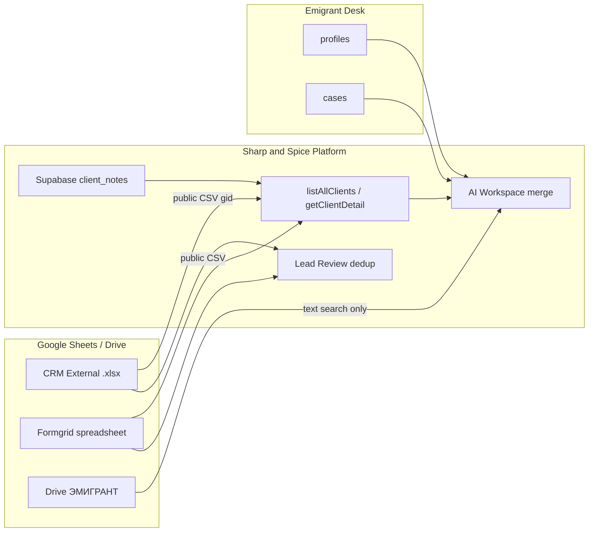

# Client Data Source of Truth Report

**Дата:** 9 июня 2026  
**Статус:** только аудит. Код и данные не менялись.  
**Контекст:** подготовка к миграции CRM (`.xlsx` → Google Sheets) и внедрению **Unified Client Index (UCI)**.

---

## Executive summary

Клиентские данные сегодня **распределены по 5+ хранилищам** без единого `client_id`. Якорь идентичности в коде — **нормализованный номер загранпаспорта** (`Client.id` в CRM = паспорт). Всё остальное склеивается эвристически (merge CRM ↔ Formgrid, текстовый поиск Desk ↔ Sheets).

| Слой | Роль |
|------|------|
| **CRM External** (`138W2nHQcJu…`, gid `1431336126`) | Операционная таблица дел по Хорватии (~93 клиента) |
| **Formgrid** (отдельный spreadsheet) | Анкеты лидов (~62 строки), контакты и полное ФИО |
| **Emigrant Croatia Desk** (отдельный Supabase) | Кабинет клиента: статус дела, № дела, консульство |
| **Supabase `client_notes`** | Заметки менеджеров на платформе (не в CRM-листе) |
| **Google Drive «ЭМИГРАНТ»** | Файлы клиентов для AI (без привязки по ID) |

**Production-режим сейчас:** CRM читается через **public CSV**; телефон/email в CRM **не заполняются** (`—`); вкладки Notes/Documents/Forms в CRM-файле **не используются**.

---

## Архитектура источников (схема)

---

## Таблица полей: источник, SoT, конфликты

Легенда **«Главный источник»** — откуда платформа **должна** брать каноническое значение для UCI / UI (по текущей логике кода).  
**«Конфликт»** — могут ли расходиться два активных источника при одном человеке.

| Поле | Где хранится сейчас | Главный источник (для UCI) | Есть ли конфликт |
|------|---------------------|----------------------------|------------------|
| **ФИО** | CRM: колонка «Фамилия» (часто только фамилия). Formgrid: полное ФИО. Desk: `first_name` + `last_name`. | **Formgrid** (полнота) + **CRM** (операционная фамилия в таблице). При merge: **длиннейшее имя** (`pickLongestName`). | **Да** — CRM фамилия vs Formgrid/Desk полное ФИО |
| **Паспорт** | CRM External: «Номер паспорта» → `Client.id`. Formgrid: «№ заграничного паспорта». Desk: иногда `case_number` (не паспорт). | **CRM** (primary key списка клиентов). Дедуп: **паспорт** (`passportsMatch`). | **Да** — редко разный формат (`76 3157608` vs `763157608`); Desk `case_number` ≠ паспорт |
| **Телефон** | Formgrid: колонка «Телефон». CRM: **не хранится** (`phone = "—"`). Desk: **нет**. | **Formgrid** | **Нет** в CRM (пусто); конфликт возможен только Formgrid vs Telegram в debugRow |
| **Email** | Formgrid. Desk: `profiles.email`. CRM: **не хранится** (`email = "—"`). | **Formgrid**; fallback **Desk** (если нет Formgrid). Приоритет в attribution: Formgrid > CRM (`SHEET_FIELD_PRIORITY`). | **Да** — Formgrid vs Desk email |
| **Дата рождения** | Formgrid: «Дата рождения». CRM / Desk / Supabase: **нет колонки**. | **Formgrid** | **Нет** (единственный источник) |
| **Страна** | CRM: захардкожено `Хорватия` в парсере. Formgrid: не в `ClientContext.country`. | **CRM** (константа для Хорватии) | **Нет** (везде Хорватия) |
| **Направление** | CRM: `Хорватия`. Formgrid: `Хорватия` в context. | **CRM** | **Нет** |
| **Статус клиента** | CRM: **выводится** из колонки «Заметки» + «Дата одобрения ВНЖ» (`deriveCroatiaExternalStatus`). Formgrid: `Новая заявка`. | **CRM** (derived lifecycle). Formgrid только для лидов без CRM. | **Да** — «Статус не указан» vs «Новая заявка» vs derived «В работе»/«Завершён» |
| **Статус дела** | Emigrant Desk: `cases.current_status`. CRM: **нет отдельного поля** (путается с derived client status). | **Emigrant Desk** | **Да** — Desk `current_status` vs CRM derived status (код помечает conflict в `client-field-sources.ts`) |
| **Менеджер** | CRM: колонка «Имя референта» → `manager` + `referentName`. Formgrid: **нет**. | **CRM** | **Нет** |
| **Референт** | CRM: «Имя референта» → `referentName` (дублирует `manager`). | **CRM** | **Нет** (дубль внутри CRM) |
| **Букинг** | CRM: «Адрес букинга», «Дата букинга (от и до)». | **CRM** | **Нет** |
| **Документы** | Код: вкладка `Documents` в CRM spreadsheet (**не активна** в public CSV режиме). Drive: папка `GOOGLE_DRIVE_EMIGRANT_FOLDER_ID` (текст для AI). Desk: загрузки клиента **не читаются** платформой. | **Drive / Desk** (вне платформы); в UI платформы — **нет SoT** | **N/A** (не синхронизируются) |
| **Заметки** | **Два разных типа:** (1) CRM колонка «Заметки» → `client.notes`; (2) Supabase `client_notes` (UI карточки клиента). Sheets `Notes!` — только если **нет** public CSV. | **CRM** — операционный текст дела; **Supabase** — внутренние заметки команды | **Нет** между CRM и Supabase (разные назначения); **да** если когда-нибудь включат Sheets Notes |
| **Номер дела** | Emigrant Desk: `cases.case_number`. CRM / Formgrid: **нет**. | **Emigrant Desk** | **Нет** с CRM (разные сущности); связь только по **поиску имени** |

### Дополнительные поля CRM (нет в запросе, но важны для миграции)

| Поле | Где | SoT | Конфликт |
|------|-----|-----|----------|
| ФИО латиницей | CRM col B → `citizenship` | CRM | С Formgrid col «ФИО латиницей» при импорте |
| Дата подачи | CRM «Дата подачи»; Formgrid `Submitted At`; Desk `submission_date` | **CRM** (операции); Desk — свой workflow | **Да** — три календаря |
| Дата одобрения ВНЖ | CRM | CRM | Нет |
| Пароль приложения | CRM | CRM | Нет |
| Партнёр (`портнер от кого клиент`) | CRM col M — **в листе есть**, в модель `Client` **не маппится** | CRM (потеря при чтении кода) | Риск потери при автопарсере |
| `appPassword`, `residenceCardIssuedAt` | CRM | CRM | Нет |

---

## Дублирование данных

| Данные | Копии | Комментарий |
|--------|-------|-------------|
| ФИО | CRM (фамилия), Formgrid (полное), Desk (first+last) | Merge в AI, не в БД |
| Паспорт | CRM id, Formgrid, иногда в заметках CRM | Strong dedup key |
| Email | Formgrid, Desk | Desk подключается только в AI по имени |
| Телефон | Только Formgrid (+ Telegram в debugRow анкеты) | |
| Статус | CRM derived, Formgrid label, Desk case status | Три разные семантики |
| Референт / менеджер | `manager` = `referentName` в CRM | Внутренний дубль |
| Заметки | CRM колонка vs Supabase notes | Разный смысл, не синхронизируются |
| Анкета | Formgrid row (вся строка) vs Sheets `Forms!` (не используется) | |
| Документы | Drive files vs Sheets `Documents!` (не используется) | |

---

## Где данные могут расходиться

1. **ФИО:** CRM «Давлятова» vs Formgrid «Давлятова Лола Бахтиёровна» — ожидаемо, не баг.
2. **Статус:** CRM «Статус не указан» / «В работе» (из текста заметок) vs Desk «documents_submitted» и т.п. — **конфликт семантики**, код явно детектирует в AI attribution.
3. **Дата подачи:** CRM `submittedAt` vs Desk `submission_date` vs Formgrid timestamp — могут отличаться на дни.
4. **Email:** Formgrid vs Desk — при совпадении человека по имени, разные email попадут в conflict.
5. **Identity link Desk ↔ CRM:** только `findEmigrantDeskClientByQuery(name)` — **нет** связи по паспорту/email → ложные промахи/склейки.
6. **Lead Review:** dedup по паспорту CRM ↔ Formgrid; клиент только в Desk **не виден** в CRM dedup.
7. **Партнёр (col M):** есть в таблице, **теряется** при парсинге — расхождение «таблица vs платформа».

---

## Зависимости кода (CRM spreadsheet / gid)

### Переменные окружения

| ENV | Назначение |
|-----|------------|
| `GOOGLE_SHEETS_SPREADSHEET_ID` | ID файла CRM (`138W2nHQcJu_xRsI2RBqeD6Oq8Tg9FbKH`) |
| `GOOGLE_SHEETS_PUBLIC_CLIENTS_GID` | `1431336126` — вкладка External |
| `GOOGLE_SHEETS_CLIENTS_RANGE` | Sheets API range (fallback `Clients!` — **не External**) |
| `GOOGLE_SHEETS_NOTES_RANGE` | `Notes!` — неактивен в public CSV режиме |
| `GOOGLE_SHEETS_DOCUMENTS_RANGE` | `Documents!` — неактивен |
| `GOOGLE_SHEETS_FORMS_RANGE` | `Forms!` — неактивен |

### Файлы с прямой привязкой к CRM ID / gid

| Файл |
|------|
| `src/lib/google-sheets/google-sheets-client.ts` |
| `src/lib/google-sheets/auth.ts` |
| `src/lib/google-sheets/parse.ts` |
| `src/lib/google-sheets/service.ts` |
| `src/lib/relocation/forms.ts` (`CROATIA_CLIENTS_SHEET_URL`, hardcoded gid) |
| `src/lib/ai/clients-diagnostic.ts` |
| `.env.example` |

### Потребители данных CRM (через `listAllClients` / `Client`)

| Модуль | Поля |
|--------|------|
| `src/app/(app)/clients/*` | весь список и карточка |
| `src/lib/ai/client-lookup.ts` | поиск, merge |
| `src/lib/ai/structured-client-search.ts` | intent search |
| `src/lib/ai/workspace-assistant.ts` | AI context |
| `src/lib/leads/lead-review-service.ts` | dedup лидов |
| `src/lib/analytics/croatia.ts` | аналитика |
| `src/lib/dashboard/stats.ts` | счётчики |
| `src/components/relocation/RelocationView.tsx` | ссылка на таблицу |

Formgrid использует **отдельный** `GOOGLE_SHEETS_FORMGRID_SPREADSHEET_ID`.

---

## Рекомендуемый Source of Truth по доменам (для UCI)

Целевая модель «один клиент — один паспорт — много источников»:

| Домен | Рекомендуемый SoT | Почему |
|-------|-------------------|--------|
| **Идентичность (anchor)** | **Паспорт** (нормализованный) | `Client.id`, dedup, Lead Review |
| **Контакты (телефон, email)** | **Formgrid** → затем Desk | CRM колонок нет |
| **Полное ФИО, дата рождения, анкета** | **Formgrid** | Единственный полный профиль |
| **Операционное дело (букинг, референт, даты ВНЖ, пароль приложения)** | **CRM External** | Ежедневная работа команды |
| **Статус дела (workflow кабинета)** | **Emigrant Desk** | `cases.current_status` |
| **Статус клиента (витрина CRM)** | **CRM** (derived) | До появления явной колонки — из заметок |
| **Внутренние заметки команды** | **Supabase `client_notes`** | Уже отделены от CRM |
| **Файлы** | **Google Drive ЭМИГРАНТ** (+ будущая привязка по passport) | Не в Sheets |
| **Номер дела** | **Emigrant Desk** | `case_number` |

UCI должен хранить: `passport_norm` + ссылки `crm_row`, `formgrid_row`, `desk_user_id` + `field_provenance`.

---

## Что нельзя потерять при миграции CRM

### Критично (все строки External)

| Колонка CRM | Риск |
|-------------|------|
| Фамилия | Потеря идентификации в списке |
| Номер паспорта | Потеря `Client.id`, слом dedup и Lead Review |
| Заметки | Потеря derived status и истории дел |
| Дата одобрения ВНЖ | Статус «Завершён» |
| Адрес / даты букинга | Операционные данные |
| Имя референта | Менеджер в UI |
| Пароль для приложения | Доступ клиента к приложению |
| Даты подачи / ожидаемого одобрения | Таймлайн |
| ФИО латиницей (col B) | Поле `citizenship` в UI |
| Дата выдачи карточки ВНЖ | |
| **Партнёр (col M)** | Сейчас не в коде — **сохранить в листе**, иначе потеряется навсегда |

### Вне CRM, но нельзя потерять при UCI

| Хранилище | Данные |
|-----------|--------|
| **Formgrid** | Полное ФИО, телефон, email, дата рождения, вся анкета |
| **Supabase `client_notes`** | Заметки менеджеров на платформе |
| **Emigrant Desk** | Статусы дел, № дела, консульство, internal_comment |
| **Google Drive** | Документы клиентов |
| **Lead review store** (`app_state.formgrid_lead_reviews`) | Статусы очереди лидов |

---

## Что сейчас не находится в CRM

| Поле / сущность | Где реально |
|-----------------|-------------|
| Телефон | Formgrid |
| Email | Formgrid (+ Desk) |
| Дата рождения | Formgrid |
| Полное ФИО | Formgrid, Desk |
| Статус дела (workflow) | Emigrant Desk |
| Номер дела | Emigrant Desk |
| Заметки менеджеров платформы | Supabase `client_notes` |
| Документы (файлы) | Google Drive; не в CRM |
| Анкета (структурированная) | Formgrid spreadsheet |
| Telegram | Formgrid debugRow (если колонка есть) |
| Партнёр (col M) | Только в листе CRM — **не в API платформы** |
| Lead review status | Supabase `app_state` |

---

## Влияние миграции CRM на SoT

| Аспект | Влияние |
|--------|---------|
| Паспорт, букинг, референт, CRM-заметки | Остаются SoT в CRM; миграция должна сохранить **все колонки A–M** |
| Телефон/email | **Не затронуты** — останутся в Formgrid |
| Статус дела | **Не затронут** — Desk |
| Platform notes | **Не затронуты** — Supabase |
| `Client.id` | Сохранится, если паспорта не испортятся при импорте (формат «Текст») |
| `gid` / Spreadsheet ID | Могут измениться → обновить ENV (см. `CRM_GOOGLE_SHEETS_MIGRATION_PLAN.md`) |

После миграции **SoT по полям не меняется** — меняется только **транспорт** (xlsx → native Sheets) и возможность **записи** в CRM.

---

## Пробелы для UCI (вне scope миграции, но блокеры индекса)

1. Нет таблицы `unified_clients` / `client_source_links`.
2. Desk ↔ CRM связь только по **имени** (хрупко).
3. Колонка «Партнёр» не в модели `Client`.
4. Два типа «заметок» без явной метки provenance в UI.
5. `case_number` Desk иногда показывается рядом с паспортом в AI (`workspace-assistant.ts`).
6. Дата рождения не участвует в dedup (только Formgrid).

---

## Связанные документы

- `CRM_GOOGLE_SHEETS_MIGRATION_PLAN.md` — план перехода xlsx → Google Sheets  
- `CLIENT_IDENTITY_AUDIT.md` — идентичность и merge rules  
- `FORMGRID_TO_CRM_DESIGN.md` — целевой mapping Formgrid → CRM External  
- `AI_DATAFLOW_AUDIT.md` — потоки данных в AI Workspace  

---

## Итоговый вердикт

| Вопрос | Ответ |
|--------|--------|
| Единый SoT сегодня? | **Нет** — мульти-источник с якорем **паспорт (CRM)** |
| Главный реестр клиентов | **CRM External** |
| Главный профиль контактов | **Formgrid** |
| Главный статус дела | **Emigrant Desk** |
| Главные внутренние заметки UI | **Supabase** |
| Готовность к UCI после миграции CRM | Миграция CRM **необходима**, но **недостаточна** — нужен индекс `passport → source refs` |

*Отчёт основан на коде репозитория (main, июнь 2026) и архитектуре production (public CSV CRM). Объёмы Formgrid/Desk — по аудитам в `CLIENT_IDENTITY_AUDIT.md`; актуальные counts пересчитать перед cutover.*
