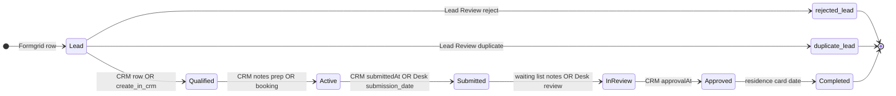
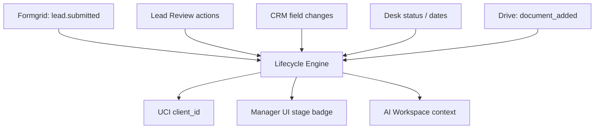
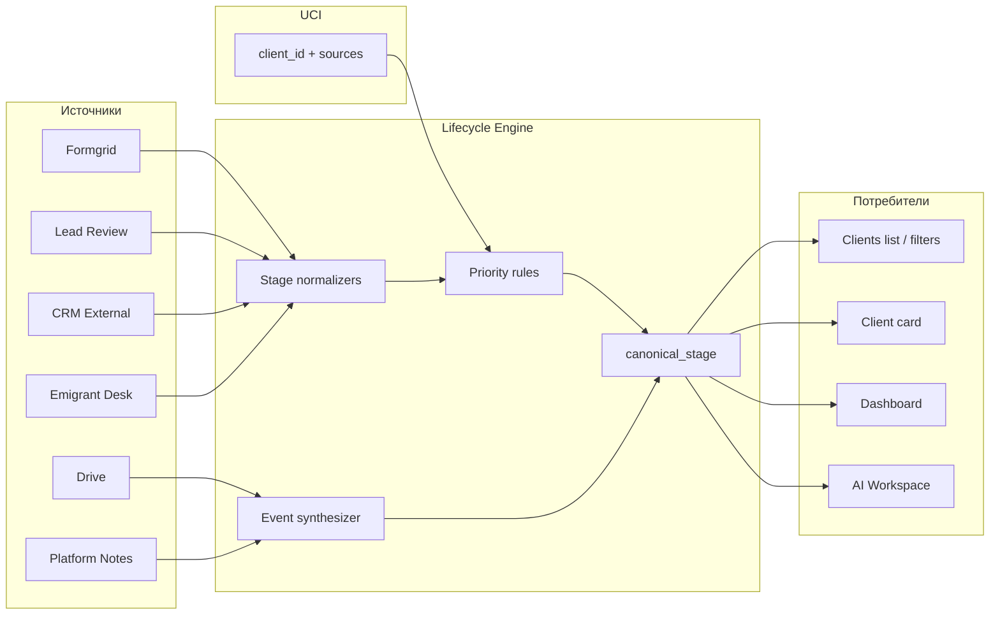

# Client Lifecycle Engine — проектирование

**Дата:** 9 июня 2026  
**Статус:** только проектирование. Код, миграции и таблицы **не создавались**.  
**Основа:** `CLIENT_DATA_SOURCE_OF_TRUTH_REPORT.md`, `UNIFIED_CLIENT_INDEX_DESIGN.md`, `deriveCroatiaExternalStatus`, Lead Review Queue, Emigrant Desk API.

---

## Executive summary

Сегодня **нет единого жизненного цикла**. Вместо одного engine работают **четыре параллельных контура**:

| Контур | Где живёт | Что означает |
|--------|-----------|--------------|
| **Lead** | Formgrid + `formgrid_lead_reviews` | Входящая анкета и решение менеджера |
| **Operations** | CRM External (derived) | Работа команды по делу в таблице |
| **Case** | Emigrant Desk `cases.current_status` | Статус дела в клиентском кабинете |
| **Documents** | Google Drive «ЭМИГРАНТ» | Файлы без стадий |

**Client Lifecycle Engine (CLE)** — будущий **read-слой платформы**, который:

1. Нормализует сигналы из всех источников в **канонические этапы**.
2. Хранит **историю событий** (кто/когда/из какого источника).
3. Отдаёт **одну стадию для UI** и **контекст для AI**.
4. Связан с **UCI** через `client_id` + `passport_norm`.

---

## 1. Какие этапы существуют сейчас

### 1.1. Целевая модель (канон платформы)

Для проектирования вводим **7 канонических этапов** — они покрывают реальный путь клиента Sharp & Spice по Хорватии:

| # | Канонический этап | Код | Смысл для менеджера |
|---|-------------------|-----|---------------------|
| 1 | **Lead** | `lead` | Анкета получена, клиент ещё не в CRM |
| 2 | **Qualified** | `qualified` | Лид проверен, принят в работу / есть строка CRM |
| 3 | **Active** | `active` | Дело ведётся: подготовка, букинг, дозапросы |
| 4 | **Submitted** | `submitted` | Подача в консульство / дело передано в обработку |
| 5 | **In Review** | `in_review` | Рассмотрение консульством / лист ожидания |
| 6 | **Approved** | `approved` | ВНЖ одобрено (дата одобрения есть) |
| 7 | **Completed** | `completed` | Дело закрыто: карточка выдана, кабинет завершён |

Дополнительные **терминальные ветки** (не прогресс, а исход):

| Код | Смысл |
|-----|--------|
| `rejected_lead` | Лид отклонён в Lead Review |
| `duplicate_lead` | Дубликат существующего CRM-клиента |
| `lost` | Отказ / прекращение (резерв, сейчас не формализован) |

### 1.2. Что реально есть в источниках сегодня

#### A. Formgrid (вход)

| Значение в коде | Источник | Эквивалент CLE |
|-----------------|----------|----------------|
| `Новая заявка` (`FORMGRID_LEAD_STATUS`) | `client-status.ts` | **Lead** |
| Новая строка в листе | `formgrid-watch.ts` | Событие → **Lead** |
| Анкета с типом «консультация» | колонка статус/тип в Formgrid | **Lead** + флаг `consultation_intent` |

#### B. Lead Review Queue (платформа)

| Статус (`LeadReviewStatus`) | UI-лейбл | Эквивалент CLE |
|----------------------------|----------|----------------|
| `new` | Новый | **Lead** |
| `reviewed` | Проверен | **Lead** → на пути к Qualified |
| `created_in_crm` | Создан в CRM | **Qualified** (если строка реально в CRM) |
| `duplicate` | Дубликат | `duplicate_lead` |
| `rejected` | Отклонён | `rejected_lead` |

> `create_in_crm` сегодня **не пишет** в Google Sheets — статус меняется, CRM-строка может отсутствовать. CLE должен проверять **факт** наличия CRM по `passport_norm`.

#### C. CRM External (операции)

Колонки «Статус» **нет**. Статус **выводится** из заметок и даты одобрения (`deriveCroatiaExternalStatus`):

| Derived status (RU) | `CroatiaStatusDerivation` | Эквивалент CLE |
|---------------------|---------------------------|----------------|
| `Завершён` | `approved` | **Approved** или **Completed**¹ |
| `Консультация` | `waiting_list` | **In Review** (лист ожидания) или ранняя **Active**² |
| `В работе` | `prep_docs` | **Active** |
| `—` / «Статус не указан» | `unspecified` | Не определён (часто **Qualified** если строка есть) |

¹ **Completed** если дополнительно заполнена «Дата выдачи карточки ВНЖ» или в заметках явное закрытие.  
² «Консультация» в CRM часто = лист ожидания, не первичная консультация лида — CLE разведёт через `consultation_intent`.

Дополнительные **сигналы этапа** из полей CRM (не статус, но события):

| Поле CRM | Сигнал |
|----------|--------|
| `submittedAt` заполнена | → **Submitted** |
| `bookingAddress` / `bookingRange` | → **Active** (подготовка) |
| `approvalAt` | → **Approved** |
| `residenceCardIssuedAt` | → **Completed** |
| `appPassword` | → **Approved** / **Completed** (доступ к приложению) |

#### D. Emigrant Desk (дело в кабинете)

| Поле | Тип | Роль в CLE |
|------|-----|------------|
| `cases.current_status` | free-text string | **Параллельная ось** `case_lifecycle` |
| `submission_date` | date | Событие → **Submitted** |
| `status_updated_at` | timestamp | Время перехода |
| `case_number` | string | Идентификатор дела (не этап) |

Значения `current_status` **не нормализованы в платформе** (приходят как есть из Desk). Для CLE нужна **таблица маппинга** Desk → канон (проектируется, не внедряется):

| Пример Desk status (гипотеза) | CLE case stage |
|-------------------------------|----------------|
| `registered` / `onboarding` | `qualified` |
| `documents_pending` | `active` |
| `documents_submitted` | `submitted` |
| `under_review` | `in_review` |
| `approved` / `visa_approved` | `approved` |
| `completed` / `card_issued` | `completed` |

> Перед внедрением — инвентаризация **фактических** значений `current_status` в production Desk.

#### E. Drive и Notes

| Источник | Lifecycle сегодня |
|----------|-------------------|
| **Drive** | Нет стадий; появление файла = событие `document_added` |
| **Supabase `client_notes`** | Хронология; не меняет этап напрямую |
| **CRM колонка «Заметки»** | Текст-триггер для `deriveCroatiaExternalStatus` |

### 1.3. Сводка: «сейчас» vs «канон»



**Важно:** сейчас этапы **не связаны в одном графе** — CRM, Desk и Lead Review обновляются независимо.

---

## 2. Какой источник отвечает за каждый этап

### 2.1. Главный источник по этапу (SoT для CLE)

| Канонический этап | Primary SoT | Secondary signals | Не использовать как SoT |
|-------------------|-------------|-------------------|-------------------------|
| **Lead** | **Formgrid** (наличие строки) | Lead Review `new`, notifications | CRM |
| **Qualified** | **CRM** (строка External) | Lead Review `created_in_crm` | Formgrid status label |
| **Active** | **CRM** (notes + booking) | Desk `documents_pending` | Formgrid |
| **Submitted** | **CRM** `submittedAt` | Desk `submission_date` | Formgrid `Submitted At`³ |
| **In Review** | **Desk** `current_status` | CRM notes «лист ожидания» | — |
| **Approved** | **CRM** `approvalAt` | Desk approved-like status | Derived «Завершён» alone |
| **Completed** | **CRM** `residenceCardIssuedAt` | Desk completed-like status | — |
| `rejected_lead` | **Lead Review store** | — | CRM |
| `duplicate_lead` | **Lead Review store** | Dedup engine | — |

³ Formgrid `Submitted At` = дата **анкеты**, не подачи в консульство.

### 2.2. Две оси lifecycle (рекомендация CLE)

Чтобы не смешивать «статус клиента» и «статус дела», UCI/CLE хранят **два поля**:

| Поле | SoT | Пример |
|------|-----|--------|
| `operations_stage` | CRM-derived + CRM dates | `active` |
| `case_stage` | Emigrant Desk | `documents_submitted` |
| `lead_stage` | Formgrid + Lead Review | `reviewed` |

**Витрина для менеджера** = `canonical_stage` = `max(operations_stage, case_stage)` по упорядоченной шкале + override rules (см. §4).

---

## 3. События, переводящие клиента между этапами

### 3.1. Каталог событий

| Событие | Источник | Триггер | Переход CLE |
|---------|----------|---------|-------------|
| `lead.submitted` | Formgrid | Новая строка / `formgrid-watch` | → **Lead** |
| `lead.consultation_requested` | Formgrid | Колонка «консультация» | **Lead** + flag |
| `lead.reviewed` | Platform | `mark_reviewed` | Lead (reviewed) |
| `lead.rejected` | Platform | `reject` | → `rejected_lead` |
| `lead.marked_duplicate` | Platform | `mark_duplicate` | → `duplicate_lead` |
| `crm.row_created` | CRM / Platform | `create_in_crm` (будущее) / ручная строка | → **Qualified** |
| `crm.notes_updated` | CRM | Изменение колонки «Заметки» | Пересчёт **Active** / **In Review** |
| `crm.booking_set` | CRM | Заполнены адрес/даты букинга | → **Active** |
| `crm.submission_date_set` | CRM | «Дата подачи» | → **Submitted** |
| `crm.approval_date_set` | CRM | «Дата одобрения ВНЖ» | → **Approved** |
| `crm.residence_card_issued` | CRM | «Дата выдачи карточки ВНЖ» | → **Completed** |
| `desk.case_opened` | Desk | Профиль + case | **Qualified** (case axis) |
| `desk.status_changed` | Desk | `current_status` update | Маппинг → case_stage |
| `desk.submission_recorded` | Desk | `submission_date` | → **Submitted** (case) |
| `drive.document_added` | Drive | Новый файл (будущий watcher) | Не меняет stage; событие в ленте |
| `platform.note_added` | Supabase | `client_notes` insert | Не меняет stage; контекст для AI |

### 3.2. Правила приоритета при конфликте этапов

```
1. Терминальные исходы lead (rejected, duplicate) — только пока нет CRM-строки.
2. Completed > Approved > In Review > Submitted > Active > Qualified > Lead.
3. Если CRM approvalAt есть → минимум Approved (даже если Desk отстаёт).
4. Если Desk = submitted, CRM submittedAt пуст → Submitted по case axis, flag conflict.
5. «Статус не указан» в CRM при наличии строки → Qualified (не Lead).
```

### 3.3. Диаграмма событий (упрощённо)



### 3.4. Что сегодня **не** генерирует события автоматически

- Изменения CRM **не пушатся** — только poll при чтении CSV.
- Desk **не webhook** в платформу.
- Drive **не индексируется** по клиенту.
- `create_in_crm` **не создаёт** CRM-строку.

CLE в первой версии = **вычисление при sync**, не real-time streaming.

---

## 4. Что показывать менеджеру на каждом этапе

### 4.1. Матрица UI (карточка клиента / список)

| Этап | Badge | Обязательные поля | Полезный контекст | Действия |
|------|-------|-------------------|-------------------|----------|
| **Lead** | Новая заявка | ФИО, телефон, паспорт, дата анкеты | Dedup: strong/possible match | Lead Review → проверить / отклонить / в CRM |
| **Qualified** | В базе CRM | Паспорт, фамилия, референт | Ссылка на Formgrid row, анкета | Назначить референта, открыть AI |
| **Active** | В работе | Букинг, заметки CRM, менеджер | Телефон/email из Formgrid, задачи | Редактировать CRM, заметки платформы |
| **Submitted** | Подано | Дата подачи CRM, № дела Desk | Консульство, город подачи (Desk) | Сверить CRM ↔ Desk dates |
| **In Review** | На рассмотрении | Статус Desk, дата обновления | CRM notes (лист ожидания) | AI: «когда обновлялся статус» |
| **Approved** | Одобрено | Дата одобрения ВНЖ, пароль приложения | Ожидаемая дата (если была) | Выдать доступ к приложению |
| **Completed** | Завершён | Дата карточки ВНЖ | История заметок | Архив / аналитика |
| **rejected_lead** | Отклонён | Причина из Lead Review | — | — |
| **duplicate_lead** | Дубликат | Ссылка на CRM client id | Match reasons | Открыть существующего |

### 4.2. Источники данных на карточке (сейчас vs CLE)

| Блок UI | Сейчас (`ClientDetailView`) | CLE добавит |
|---------|----------------------------|-------------|
| Шапка | `client.status` (CRM derived) | `canonical_stage` + `case_stage` |
| Контакты | CRM пусто | Formgrid phone/email через UCI |
| Дело Desk | Только в AI Workspace | Блок «Кабинет клиента» при link |
| Документы | CRM Documents tab (неактивен) | Drive matches + счётчик |
| Заметки | CRM + Supabase notes | Разделение с provenance |
| Анкета | surveys (часто пусто) | Formgrid survey fields |

### 4.3. Dashboard метрики (связь с lifecycle)

Существующие счётчики (`dashboard/stats.ts`):

| Метрика | Текущая логика | CLE-эквивалент |
|---------|----------------|----------------|
| `clientsTotal` | Все CRM | Qualified+ |
| `newFormgridLeads7Days` | Formgrid rows за 7 дней | Lead events |
| `activeConsultations` | CRM status + notes heuristic | Active + consultation flag |

CLE позволит заменить эвристики на **единые определения этапов**.

---

## 5. Использование в AI Workspace

### 5.1. Сегодня

| Механизм | Файл | Поведение |
|----------|------|-----------|
| CRM status в контексте | `formatStatusForAiContext` | «Статус не указан» / derived RU |
| Formgrid status | `FORMGRID_LEAD_STATUS` | «Новая заявка» |
| Desk status | `emigrantDeskClientToContextSlice` | Отдельное поле «статус дела» |
| Конфликты | `resolveClientContextAttribution` | CRM status ≠ Desk status → `conflicts[]` |
| Прямой ответ по Desk | `tryDirectEmigrantStatusAnswer` | Без полного lifecycle |
| Intent flags | `workspace-assistant` | `needsEmigrantDesk`, `needsFormgrid` |

**Проблема для AI:** три несогласованных «статуса» в одном промпте без единой шкалы.

### 5.2. Целевое поведение CLE в AI

#### Контекстный блок (добавка к промпту)

```
=== CLIENT LIFECYCLE ===
Канонический этап: Active (operations) / Submitted (case)
Последнее событие: crm.submission_date_set (2026-03-10)
Конфликт: operations=Active, case=documents_submitted — использовать case для вопросов о кабинете
Источники этапа: CRM (notes), Desk (current_status)
```

#### Правила для модели

| Тип вопроса | Какой этап использовать |
|-------------|-------------------------|
| «На каком этапе клиент?» | `canonical_stage` + краткое RU-описание |
| «Статус в кабинете» | `case_stage` (Desk) |
| «Что делает команда» | `operations_stage` (CRM) |
| «Новый лид?» | `lead_stage` (Formgrid) |
| Конфликт | Явно озвучить оба + SoT по типу вопроса |

#### Intent routing (расширение)

| Intent | Lifecycle filter |
|--------|------------------|
| «кто на рассмотрении» | `canonical_stage in (in_review, submitted)` |
| «новые заявки» | `lead_stage = lead` |
| «одобренные» | `>= approved` |
| «зависли в работе» | `active` + `last_event_at` > N дней |

#### Запреты

- Не смешивать `case_number` Desk с паспортом CRM в ответах о этапе.
- Не говорить «Новая заявка» для клиента с CRM-строкой (даже если Formgrid linked).

### 5.3. Structured output для AI (проект)

```json
{
  "lifecycle": {
    "canonical_stage": "submitted",
    "canonical_label_ru": "Подано",
    "operations_stage": "active",
    "case_stage": "documents_submitted",
    "lead_stage": null,
    "last_transition": {
      "at": "2026-03-10T00:00:00Z",
      "event": "desk.submission_recorded",
      "source": "desk"
    },
    "conflicts": [
      {
        "type": "stage_mismatch",
        "operations": "active",
        "case": "submitted"
      }
    ]
  }
}
```

---

## 6. Связь с Unified Client Index

### 6.1. Разделение ответственности

| Слой | Отвечает за |
|------|-------------|
| **UCI** | Кто этот человек (`client_id`, anchors, merge, field SoT) |
| **CLE** | На каком этапе жизненный путь (`canonical_stage`, events) |

CLE **не может** работать без UCI: один человек = один lifecycle timeline.

### 6.2. Поля UCI, расширяемые CLE

```json
{
  "client_id": "uci_…",
  "passport_norm": "763157608",

  "lifecycle": {
    "canonical_stage": "active",
    "operations_stage": "active",
    "case_stage": "documents_pending",
    "lead_stage": null,
    "stage_updated_at": "2026-06-01T12:00:00Z",
    "stage_source": "crm"
  },

  "sources": { "crm": {…}, "formgrid": {…}, "desk": {…} }
}
```

### 6.3. Привязка событий

| UCI link | CLE event scope |
|----------|-----------------|
| `sources.crm.linked` | CRM events |
| `sources.formgrid.linked` | Lead events |
| `sources.desk.linked` | Case events |
| `sources.drive.linked` | Document events |

При merge (passport): **объединить timelines** двух UCI-записей → один `client_id`, события сортируются по `at`.

### 6.4. Порядок внедрения (согласовано с UCI design)

```
Фаза 0: UCI read-model (identity only)
Фаза 1: CLE compute-on-read (без хранилища событий)
Фаза 2: Event log в app_state / будущее хранилище
Фаза 3: UI stage badges + AI lifecycle block
Фаза 4: Webhooks / polling Desk + CRM write-back
```

### 6.5. Golden clients для теста CLE

5 клиентов с CRM + Formgrid + Desk (из UCI coverage):  
Белкания, Давлятова, Куликова, Лысогорская, Смола — эталон для проверки согласованности трёх осей.

---

## 7. Архитектура Client Lifecycle Engine (логическая)



### 7.1. Модули (имена для будущей реализации)

| Модуль | Функция |
|--------|---------|
| `normalizeFormgridStage` | Lead / consultation flag |
| `normalizeLeadReviewStage` | Platform queue status |
| `normalizeCrmOperationsStage` | `deriveCroatiaExternalStatus` + date fields |
| `normalizeDeskCaseStage` | Mapping table Desk → case_stage |
| `resolveCanonicalStage` | Priority rules §3.2 |
| `synthesizeLifecycleEvents` | Diff между sync snapshots |
| `buildLifecycleContextForAi` | Промпт-блок для workspace |

---

## 8. Риски и пробелы

| Риск | Влияние | Митигация в дизайне |
|------|---------|---------------------|
| CRM status из regex заметок | Ложные Active/In Review | Явная колонка «Статус» после Sheets migration |
| Desk statuses не документированы | Неверный case_stage | Инвентаризация + mapping table |
| `create_in_crm` без записи | Ложный Qualified | CLE проверяет CRM row by passport |
| Три даты подачи | Путаница Submitted | Разные поля: `survey_at` / `crm_submitted_at` / `desk_submission_date` |
| ФИО-only Desk link | Неверный case на этапе | UCI review queue до CLE |
| Нет event history | Нельзя ответить «когда перешёл» | Фаза 2: event log |

---

## 9. Итоговая таблица: этап → источник → событие → UI → AI

| Этап | SoT | Ключевое событие | Менеджер видит | AI использует |
|------|-----|------------------|----------------|---------------|
| Lead | Formgrid | `lead.submitted` | Очередь лидов | «новая анкета» |
| Qualified | CRM | `crm.row_created` | Список клиентов | паспорт якорь |
| Active | CRM | `crm.booking_set` / notes | Букинг, заметки | операционный статус |
| Submitted | CRM + Desk | `crm.submission_date_set` | Даты подачи | case vs CRM conflict |
| In Review | Desk + CRM notes | `desk.status_changed` | Статус кабинета | Desk-first |
| Approved | CRM | `crm.approval_date_set` | Дата ВНЖ | approved |
| Completed | CRM | `crm.residence_card_issued` | Карточка ВНЖ | closed case |

---

## Связанные документы

- `CLIENT_DATA_SOURCE_OF_TRUTH_REPORT.md` — SoT по полям  
- `UNIFIED_CLIENT_INDEX_DESIGN.md` — identity merge и coverage  
- `FORMGRID_TO_CRM_DESIGN.md` — переход Lead → Qualified  
- `CLIENT_IDENTITY_AUDIT.md` — текущие правила merge  
- `src/lib/ai/client-status.ts` — derivation CRM status  

---

*Проектирование без изменений кода. Перед внедрением: инвентаризация Desk `current_status`, миграция CRM на native Sheets, включение записи `create_in_crm`.*
