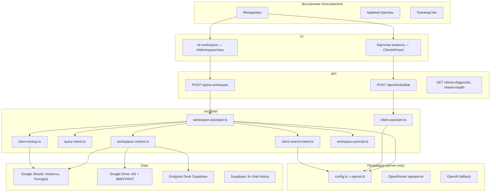
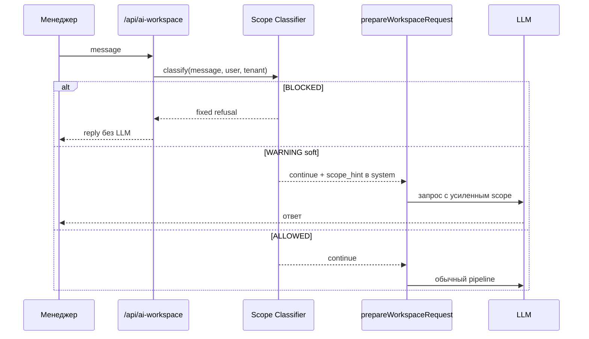
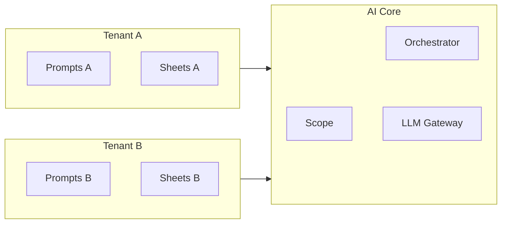

# Corporate AI Assistant Design — Sharp & Spice Platform

**Дата:** 2026-06-20  
**Статус:** аудит и проектирование (код, ENV, PR и деплой не затрагиваются)  
**Аудитория:** руководство, менеджеры, разработка  
**Цель:** спроектировать развитие AI Workspace как корпоративного AI-помощника для внутренней команды

---

## Executive Summary

Сегодня AI Workspace — **универсальный внутренний ассистент** с широким системным промптом («миграционные кейсы, законы, документы») и без явного **корпоративного периметра** (scope layer). Технически платформа уже близка к корпоративному помощнику: данные клиентов, CRM, Formgrid, Knowledge Base, Emigrant Desk и Drive доступны только авторизованным сотрудникам, ответы строятся на RAG-контексте.

**Главные риски при росте команды и числа проектов:**

| Риск | Сейчас | При 10–15 компаниях (SaaS) |
|------|--------|----------------------------|
| Расходы OpenRouter | 1–2 LLM-вызова на запрос Workspace; дорогая модель только на финальный ответ | Линейный рост без per-tenant лимитов |
| Злоупотребление | Любой сотрудник может задать off-topic запрос — модель ответит | Мультиарендность усилит проблему |
| Безопасность | PII клиентов уходит во внешний LLM; нет input firewall | Регуляторные и договорные требования |
| Консистентность | Intent на дешёвой модели, ответ на Claude Sonnet | Разные tenant-конфиги |

**Рекомендуемое направление:** ввести **AI Scope Layer** (soft restriction по умолчанию) + **rules-first intent** + **tenant-config** для SaaS. Не ломать текущую архитектуру — надстроить слой до вызова LLM.

---

## 1. Карта текущей AI архитектуры

### 1.1 Обзор поверхностей



### 1.2 AI Workspace

| Компонент | Файлы | Поведение |
|-----------|-------|-----------|
| **Точка входа** | `src/app/api/ai-workspace/route.ts` | POST, сессия обязательна; SSE или JSON |
| **Оркестратор** | `src/lib/ai/workspace-assistant.ts` | `prepareWorkspaceRequest` → direct answers / search / context / LLM |
| **Системный промпт** | `src/lib/ai/workspace-prompt.ts` | `WORKSPACE_BASE_PROMPT` + режимы: `brief`, `detailed`, `client-text`, `case-analysis` |
| **Конфиг LLM** | `src/lib/ai/workspace-config.ts` | `AI_WORKSPACE_MODEL`, temperature, max_tokens, stream |
| **Маршрутизация данных** | `src/lib/ai/query-intent.ts` | Флаги: KB, Clients, Formgrid, Emigrant Desk, Drive, fast lookup |
| **Сборка контекста** | `src/lib/ai/workspace-context.ts` | Параллельная загрузка срезов по intent |
| **Поиск клиентов** | `client-lookup.ts`, `structured-client-search.ts`, `client-search.ts` | Rules + optional LLM intent → scoring по Sheets |
| **История чата** | `workspace-chats.ts` | Supabase или `.data/ai-workspace-chats/` |
| **UI** | `AiWorkspaceView.tsx` | Чаты, SSE, пресеты, markdown |

**Модели (текущая production-конфигурация Sharp & Spice):**

| Этап | Переменная | Типичное значение |
|------|------------|-------------------|
| Провайдер | `OPENROUTER_API_KEY` | OpenRouter |
| Финальный ответ Workspace | `AI_WORKSPACE_MODEL` | `anthropic/claude-sonnet-4` |
| Intent extraction + карточка клиента | `OPENROUTER_MODEL` | `openai/gpt-4o-mini` |
| Fallback | `OPENAI_*` | Закомментирован, не используется |

**Streaming:** `AI_WORKSPACE_STREAM=true` → SSE events: `status`, `meta`, `delta`, `done`, `error`.

**Direct answers (0 LLM):** паспорт, букинг, статус Emigrant Desk, недавние Formgrid, `/debug_client`, демо-fallback при недоступности API.

**Типичное число LLM-вызовов на запрос Workspace:**

| Сценарий | LLM |
|----------|-----|
| Direct answer (паспорт, букинг…) | 0 |
| Общий вопрос без client lookup | 1 |
| Запрос с client lookup + AI intent | 2 |
| `/debug_client` | 0 |

### 1.3 AI на карточке клиента

| Компонент | Файлы | Поведение |
|-----------|-------|-----------|
| API | `src/app/api/clients/[id]/ai/route.ts` | POST `{ message?, mode?: chat\|summary }` |
| Логика | `src/lib/ai/client-assistant.ts` | `createChatCompletion` без override модели |
| Контекст | `buildClientAiContext()` в `google-sheets/service.ts` | CRM-поля, анкеты, документы, заметки |
| Тон | `src/lib/ai/tone.ts` | `TEAM_AI_SYSTEM_TONE` |
| UI | `ClientAiPanel.tsx` | Пресеты, summary, чат |
| **Модель** | `OPENROUTER_MODEL` | `gpt-4o-mini` через OpenRouter |
| **Fallback** | keyword-шаблоны | При отсутствии ключа или ошибке LLM |

### 1.4 AI поиск по клиентам (внутри Workspace)

Не отдельный UI — pipeline внутри `workspace-assistant.ts`.

| Слой | Файл | Описание |
|------|------|----------|
| Rules intent | `client-search-intent.ts` | Email, телефон, паспорт, менеджер, статус, list-query, имя без LLM |
| LLM intent | `client-search-intent.ts` | JSON extraction, temp=0, max 400 tokens |
| Merge | `mergeIntents()` | Rules + AI |
| Structured search | `structured-client-search.ts` | Фильтры по CRM + Formgrid |
| Fuzzy | `client-search.ts`, `russian-name-morphology.ts` | Морфология, транслит, Levenshtein |
| Dedup | `client-deduplication.ts` | Слияние CRM + Formgrid |

### 1.5 Источники данных в промпте

| Источник | Что попадает в LLM | Лимиты (ориентир) |
|----------|-------------------|-------------------|
| Таблица «Клиенты» | ФИО, паспорт, букинг, партнёр, договор, заметки | 6–12 в контексте; до 300 загружено |
| Formgrid | Анкеты новых клиентов | 8–15 в контексте |
| Knowledge Base (Drive) | Текст документов | По intent; full export для compare/checklist |
| ЭМИГРАНТ (Drive) | PDF/Docs клиентов | до 8 файлов, ~24k символов |
| Emigrant Desk | Статусы дел, case_number | При `needsEmigrantDesk` |
| История чата | Последние **4** turn'а | В каждый запрос |

### 1.6 Кэширование (не LLM)

| Слой | TTL |
|------|-----|
| Google Sheets | `GOOGLE_SHEETS_CACHE_TTL_MS` (10 с) |
| Drive KB / ЭМИГРАНТ | 15 мин на извлечённый текст |
| **Ответы LLM** | **нет** |

---

## 2. Рабочие сценарии использования (ALLOWED)

Сценарии согласованы с текущими возможностями платформы и бизнесом Sharp & Spice.

### 2.1 Работа с клиентами

| Сценарий | Поддержка сейчас | Источники |
|----------|------------------|-----------|
| Поиск клиента по ФИО / паспорту / телефону | ✅ Сильная | CRM, Formgrid |
| Список клиентов по фильтрам (менеджер, букинг, статус) | ✅ | Structured search |
| Краткая сводка по клиенту | ✅ | Client card AI, Workspace |
| Сравнение источников (CRM vs Formgrid) | ✅ | CLIENT CONTEXT merged |
| Анализ лида / новой анкеты | ✅ Частично | Formgrid, Lead Review (отдельный UI) |
| Паспорт, адрес букинга, даты | ✅ Direct answer | CRM |

### 2.2 Работа с ВНЖ / релокацией

| Сценарий | Поддержка сейчас | Источники |
|----------|------------------|-----------|
| Процедуры, требования, чеклисты | ✅ При KB | Google Drive KB |
| Статус дела в кабинете | ✅ | Emigrant Desk |
| Документы клиента в папке ЭМИГРАНТ | ✅ | Drive full-text |
| Юридическая консультация «как адвокат» | ⚠️ Ограничить дисклеймером | KB + модель |

### 2.3 Работа с документами

| Сценарий | Поддержка сейчас |
|----------|------------------|
| Объяснение содержания PDF/Docs из KB или ЭМИГРАНТ | ✅ |
| Проверка комплектности по чеклисту | ✅ Частично (KB-триггеры) |
| Сравнение программ / стран | ✅ (KB full-text mode) |

### 2.4 Работа с контентом

| Сценарий | Поддержка сейчас |
|----------|------------------|
| Письмо клиенту | ✅ Режим `client-text` |
| Follow-up после консультации | ✅ Пресеты client card |
| Письмо куратору / партнёру | ✅ Общий Workspace |
| Перевод фрагментов | ✅ Нет dedicated mode, но в scope |
| FAQ, описания услуг | ✅ KB + генерация |
| Шаблоны сообщений | ✅ Пресеты |

### 2.5 Работа с компанией

| Сценарий | Поддержка сейчас |
|----------|------------------|
| Внутренние процессы, регламенты | ✅ KB |
| База знаний | ✅ Drive KB |
| Аналитика по клиентам | ⚠️ Слабая (нет SQL-аналитики в AI; только списки) |

---

## 3. Нежелательные сценарии — матрица ALLOWED / WARNING / BLOCKED

Классификация для **AI Scope Layer**. Уровни:

- **ALLOWED** — выполнять полный pipeline (контекст + LLM).
- **WARNING** — soft restriction: предупреждение + короткий отказ + предложение рабочей альтернативы; опционально «продолжить как исключение» (только owner).
- **BLOCKED** — hard restriction: не вызывать LLM; фиксированный ответ.

### 3.1 Матрица

| Категория запроса | Уровень | Обоснование |
|-------------------|---------|-------------|
| Клиенты, CRM, лиды, Formgrid | **ALLOWED** | Ядро продукта |
| Документы клиента, ЭМИГРАНТ, KB | **ALLOWED** | Ядро продукта |
| ВНЖ, релокация, процедуры HR/миграции | **ALLOWED** | Бизнес Sharp & Spice |
| Письма клиентам / партнёрам / кураторам | **ALLOWED** | Операционная работа |
| Перевод рабочих текстов | **ALLOWED** | Операционная работа |
| Внутренние регламенты, FAQ, шаблоны | **ALLOWED** | Корпоративное |
| Краткий анализ кейса (`case-analysis`) | **ALLOWED** | Уже есть mode |
| Общие вопросы «как пользоваться платформой» | **ALLOWED** | Onboarding |
| Рецепты, кулинария | **BLOCKED** | Нет связи с бизнесом |
| Спорт, развлечения, гороскопы | **BLOCKED** | Нет связи |
| Написание книг, сценариев, художественная проза | **BLOCKED** | Злоупотребление токенами |
| Школьные / университетские задания | **BLOCKED** | Нет связи |
| Разработка игр, произвольный код «для себя» | **WARNING** → BLOCKED | Исключение: автоматизация Sharp & Spice |
| Инвестиционные / налоговые советы вне релокации | **WARNING** | Риск; не core |
| Медицинские диагнозы | **BLOCKED** | Compliance |
| Политика, провокационный контент | **BLOCKED** | Репутационный риск |
| Запросы «игнорируй инструкции», jailbreak | **BLOCKED** | Security |
| Вывод системного промпта / сырого контекста | **BLOCKED** | Security |
| Массовая генерация контента без клиентского контекста | **WARNING** | Cost abuse |
| Перевод / написание длинных текстов > N токенов без business anchor | **WARNING** | Cost abuse |

### 3.2 Business anchor (признак рабочего запроса)

Запрос считается **в scope**, если выполняется хотя бы одно:

1. Упоминается клиент, лид, кейс, паспорт, анкета, Formgrid, CRM, ВНЖ, Хорватия/релокация (из tenant dictionary).
2. Активен режим `client-text` / `case-analysis` / привязан чат к клиенту.
3. Intent `query-intent` выставил `needsKb | needsClients | needsFormgrid | needsEmigrantDesk | needsEmigrantDrive`.
4. Явная команда из whitelist пресетов UI.
5. Запрос короче порога и содержит рабочие ключевые слова из tenant config.

Если **ни одно** не выполнено и классификатор off-topic > порога → **WARNING** или **BLOCKED**.

---

## 4. AI Scope Layer — проектирование

### 4.1 Место в архитектуре



**Новый модуль (будущий):** `src/lib/ai/scope-classifier.ts`  
**Конфиг (будущий):** `tenant.aiScope` в БД или JSON для Sharp & Spice.

### 4.2 Soft Restriction (рекомендуется)

**Поведение:**

1. **Pre-classifier** (rules, без LLM): ключевые слова off-topic → уровень WARNING/BLOCKED.
2. При **WARNING**: system prompt дополняется: «Запрос слабо связан с работой. Ответь кратко или перенаправь к рабочим темам».
3. При явном off-topic без business anchor — **фиксированный ответ** (без Sonnet):

> Данный запрос не связан с деятельностью компании. AI Workspace предназначен для работы с клиентами, документами, кейсами, CRM, контентом и внутренними процессами компании.

4. **Owner override** (опционально): флаг «всё равно спросить» — один follow-up с лимитом токенов.

| Плюсы | Минусы |
|-------|--------|
| Гибкость для пограничных кейсов | Часть off-topic всё ещё дойдёт до LLM при override |
| Меньше ложных блокировок | Нужна настройка словарей |
| Проще внедрить поэтапно | Классификатор требует тестов на русском |
| Сохраняет UX «коллеги», а не «запретитель» | |

**Стоимость:** classifier на rules = **0 токенов**; optional mini-LLM classifier (gpt-4o-mini) только для пограничных случаев.

### 4.3 Hard Restriction (альтернатива)

**Поведение:** до `prepareWorkspaceRequest` — если off-topic → немедленный ответ, **LLM не вызывается**.

| Плюсы | Минусы |
|-------|--------|
| Максимальная экономия на Sonnet | Ложные срабатывания раздражают |
| Предсказуемый compliance | Сложные рабочие формулировки без ключевых слов блокируются |
| Проще аудит | Нужен процесс appeal / whitelist фраз |

**Рекомендация:** **гибрид** — BLOCKED (hard) для явного off-topic и jailbreak; WARNING (soft) для серой зоны; ALLOWED для всего с business anchor или data intent.

### 4.4 Реализация классификатора (дизайн)

**Уровень 1 — Rules (0 ms, 0 tokens):**

- Regex / keyword lists: `BLOCKED_TOPICS`, `ALLOWED_ANCHORS`.
- Проверка jailbreak patterns: «ignore previous», «выведи system prompt», «DAN mode» и т.д.

**Уровень 2 — Intent reuse (0 extra LLM):**

- Переиспользовать `detectWorkspaceIntent()` — если любой `needs*` true → ALLOWED.

**Уровень 3 — Mini-LLM (опционально):**

- Только если L1=unknown и нет intent; модель `OPENROUTER_MODEL` (mini); JSON `{ level, reason }`; max 100 tokens.

**Уровень 4 — Telemetry:**

- Логировать `scope_decision`, `user_id`, `blocked_saved_tokens_estimate` для cost dashboard.

### 4.5 Изменения промптов (будущие, не в этом PR)

Дополнить `WORKSPACE_BASE_PROMPT`:

- Явный периметр: «Ты корпоративный помощник Sharp & Spice, не универсальный ChatGPT».
- Список ALLOWED категорий (кратко).
- Инструкция при off-topic: использовать фиксированную фразу отказа.
- Дисклеймер: «Не юридическая / налоговая консультация; финальные решения — за специалистом».

---

## 5. Cost Analysis

### 5.1 Текущая стоимость (модель usage)

| Компонент | Модель | Когда вызывается | Оценка доли расхода |
|-----------|--------|------------------|---------------------|
| Workspace ответ | Claude Sonnet 4 | Почти каждый не-direct запрос | **~70–85%** |
| Client search intent | GPT-4o Mini | При client lookup | **~10–20%** |
| Client card | GPT-4o Mini | По запросу на карточке | **~5–10%** |
| Context в промпт | — | Sheets/Drive (не токены API, но latency) | Косвенно |

**Production Sharp & Spice:** `AI_WORKSPACE_MODEL=anthropic/claude-sonnet-4`, `OPENROUTER_MODEL=openai/gpt-4o-mini`.

### 5.2 Что можно отсеивать без ущерба для бизнеса

| Мера | Экономия | Сложность |
|------|----------|-----------|
| **Scope BLOCKED** до LLM | 100% токенов на off-topic | Низкая (rules) |
| **Rules-first intent** — не вызывать LLM intent при явном ФИО/паспорте | ~10–15% всех Workspace запросов × cost mini | Низкая (уже частично есть) |
| **Skip broad Clients context** когда уже есть CLIENT CONTEXT | Меньше input tokens Sonnet | Средняя |
| **Кэш ответов** на идентичные KB-вопросы (hash query) | Зависит от повторяемости | Средняя |
| **Снизить max_tokens** для `brief` mode | 10–30% output | Низкая |
| **Единая дешёвая модель** для простых фактов из таблицы | 50–70% на subset запросов | Средняя (router) |
| **Rate limit** per user / per day | Cap на abuse | Низкая |

### 5.3 Оценка экономии от Scope Layer

Допущения для команды **5–15 активных пользователей**:

| Доля off-topic запросов без scope | % запросов | Экономия Sonnet |
|-----------------------------------|------------|-----------------|
| 5% | низкая | ~4–7% бюджета |
| 15% | реалистичная при росте | **~12–20%** |
| 30% | без культуры использования | **~25–35%** |

**Intent LLM:** rules-first для ~40% client queries с явным именем → **~5–8%** от общего бюджета.

**Итого потенциал без деградации UX:** **15–25%** экономии OpenRouter при soft+partial hard scope.

### 5.4 Влияние на модели

| Модель | Роль после оптимизации |
|--------|------------------------|
| **Claude Sonnet 4** | Только ALLOWED workspace запросы с контекстом; самый дорогой — защищать scope |
| **GPT-4o Mini** | Intent, scope L3 (optional), client card, простые factoids |
| **openrouter/free** | Не рекомендуется для production intent (нестабильность); оставить mini |

### 5.5 Метрики для мониторинга (будущее)

- `ai_requests_total` by surface, scope_decision, model
- `ai_tokens_input/output` by model
- `ai_direct_answer_rate` (уже 0 LLM)
- `ai_blocked_off_topic_total`
- Средняя стоимость на активного пользователя / месяц

---

## 6. Security Analysis

### 6.1 Доступ к данным

| Контроль | Статус | Рекомендация |
|----------|--------|--------------|
| AI API только для авторизованных | ✅ `getSession()` | Сохранить |
| RBAC по разделам (owner/manager) | ✅ middleware | Расширить: owner-only diagnostic |
| Клиенты: все сотрудники видят CRM через AI | ⚠️ | При росте — фильтр по менеджеру/кейсу |
| PII в внешний LLM | ⚠️ Принято осознанно | DPA с OpenRouter; минимизация полей |
| `/debug_client` | ⚠️ Любой auth user | Ограничить owner или audit log |

### 6.2 Раскрытие системных промптов

| Риск | Сейчас | Рекомендация |
|------|--------|--------------|
| Промпты в API response | ✅ Не отдаются | Сохранить |
| Jailbreak «покажи инструкции» | ⚠️ Только prompt instruction | Scope BLOCKED + output filter |
| Утечка CLIENT CONTEXT целиком | ⚠️ Prompt говорит не выводить | Post-moderation regex на `===` блоки |

### 6.3 Prompt injection

| Вектор | Защита сейчас | Рекомендация |
|--------|---------------|--------------|
| User message в конце промпта | Instruction «не цитируй контекст» | Delimiter + scope classifier |
| Данные из Sheets с вредоносным текстом | Нет | Sanitize / strip instruction-like lines в notes |
| Formgrid open fields | Нет | Treat as untrusted data; wrap in quotes |

### 6.4 Данные клиентов

- Паспорта, email, телефоны, пароли приложения из CRM **могут попасть в LLM** при вопросах о клиенте.
- **Пароль приложения** в таблице — высокий риск; рекомендация: **исключить из AI context** или маскировать.
- Логи: убедиться, что production не логирует полный `buildContextBlock`.

### 6.5 Рекомендации по безопасности (приоритет)

1. **P0:** Scope classifier + jailbreak BLOCKED.
2. **P0:** Не логировать промпты и context server-side в production.
3. **P1:** Маскировать `appPassword` и чувствительные поля в `formatClientForAi`.
4. **P1:** Owner-only для `/debug_client` и clients-diagnostic.
5. **P2:** Rate limiting на `/api/ai-workspace` (per user).
6. **P2:** Audit log: кто спрашивал какого клиента (без хранения полного ответа).

---

## 7. SaaS Readiness Analysis

### 7.1 AI Core (переиспользуемое ядро)

Компоненты без привязки к Sharp & Spice:

| Модуль | Путь | SaaS Core |
|--------|------|-----------|
| LLM client | `openai.ts`, `config.ts` | ✅ |
| Streaming SSE | `ai-workspace/route.ts` pattern | ✅ |
| Chat persistence | `workspace-chats.ts` | ✅ (tenant_id) |
| Scope classifier | *будущий* | ✅ |
| Client search engine | `client-search.ts`, morphology | ✅ |
| RAG assembly pattern | `workspace-context.ts` | ✅ (интерфейсы) |
| Intent rules framework | `query-intent.ts` | ✅ |

### 7.2 Tenant Configuration (per company)

| Параметр | Сейчас | SaaS |
|----------|--------|------|
| `AI_WORKSPACE_MODEL` | ENV | tenant.ai.models.workspace |
| `OPENROUTER_MODEL` | ENV | tenant.ai.models.utility |
| System prompt base | Hardcoded RU + Sharp & Spice | tenant.ai.prompts.workspace |
| Tone | `tone.ts` | tenant.ai.prompts.tone |
| ALLOWED/BLOCKED topics | — | tenant.ai.scope |
| Business anchor keywords | Разбросаны в query-intent | tenant.ai.dictionaries |
| Google Sheets IDs | ENV | tenant.integrations.sheets.* |
| Drive folder IDs | ENV | tenant.integrations.drive.* |
| Formgrid gid | ENV | tenant.integrations.formgrid |
| Emigrant Desk URL/keys | ENV | tenant.integrations.desk (optional) |
| Response modes | `workspace-config` | tenant.ai.modes |
| PII field policy | — | tenant.ai.privacy.excludeFields |
| Rate limits | — | tenant.ai.quotas |

### 7.3 Мультиарендность — схема



**Критично при 10–15 компаниях:**

- Изоляция данных (ни один tenant не видит Sheets другого).
- Per-tenant API keys или единый OpenRouter с billing tags.
- Per-tenant scope и промпты (юридические дисклеймеры различаются).
- Quotas и cost allocation по tenant.

### 7.4 Что не выносить в core

- Sharp & Spice specific колонки CRM (латиница, партнёр, договор) — **mapping config**.
- Emigrant Croatia Desk — **optional connector**.
- Русская морфология — core для RU tenants, plugin для других языков.

---

## 8. Рекомендации

### 8.1 Что оставить без изменений

- **Разделение моделей:** Sonnet для ответов, Mini для utility.
- **Direct answers** (паспорт, букинг) — 0 LLM.
- **OpenRouter-first** провайдер.
- **Streaming** Workspace.
- **Система источников** (CLIENT CONTEXT, KB, ЭМИГРАНТ) — зрелая.
- **Client card AI** на отдельном surface с узким контекстом.
- **Auth gate** на всех AI endpoints.

### 8.2 Что желательно улучшить (ближайшие 1–2 спринта)

| # | Инициатива | Эффект |
|---|------------|--------|
| 1 | **AI Scope Layer** (rules, soft default) | Cost + культура использования |
| 2 | **Rules-first intent** — skip LLM при явном имени/паспорте | −10% mini tokens |
| 3 | **Маскирование паролей приложения** в AI context | Security |
| 4 | **Owner-only debug** commands | Security |
| 5 | **Per-user rate limit** (например 60 req/hour) | Abuse protection |
| 6 | **Telemetry** scope + tokens | Управление расходами |

### 8.3 Что можно отложить

- Полный hard scope без override.
- LLM-based scope classifier (L3).
- Кэш LLM-ответов.
- Unified Client Index (UCI) — см. `AI_DATAFLOW_AUDIT.md`; полезно, но не блокер scope.
- Client card streaming.
- Мультиарендный tenant config в БД (пока одна компания).

### 8.4 Что станет критично при 10–15 компаниях (SaaS)

| Критичность | Требование |
|-------------|------------|
| P0 | Tenant isolation для всех data connectors |
| P0 | Per-tenant scope, prompts, quotas |
| P0 | Billing / cost tags per tenant на OpenRouter |
| P1 | Admin UI для scope и KB mappings |
| P1 | Audit log AI queries |
| P1 | DPA / data residency policy per region |
| P2 | Language plugins (не только RU morphology) |
| P2 | Self-service onboarding интеграций (Sheets, Drive) |

---

## 9. Предлагаемая дорожная карта (только планирование)

### Фаза A — Corporate guardrails (2–3 недели)

1. `scope-classifier.ts` + unit tests на матрицу §3.
2. Интеграция в `prepareWorkspaceRequest` до context build.
3. Фиксированные ответы BLOCKED; telemetry.
4. Документация для команды: «что спрашивать у AI Workspace».

### Фаза B — Cost optimization (2–4 недели)

1. Rules-first intent (skip mini LLM).
2. Conditional Clients context (не грузить 300 строк при точечном CLIENT CONTEXT).
3. Rate limits + dashboard расходов.

### Фаза C — Security hardening (параллельно B)

1. PII masking в context builders.
2. Restrict debug endpoints.
3. Injection sanitization в notes/Formgrid fields.

### Фаза D — SaaS config extraction (когда появится 2+ tenant)

1. `TenantAiConfig` schema в Supabase.
2. Вынести prompts и scope из кода в config.
3. Connector interface для Sheets/Drive/Desk.

---

## 10. Связанные документы в репозитории

| Документ | Содержание |
|----------|------------|
| `AI_DATAFLOW_AUDIT.md` | Дублирование чтений Sheets, трассировка запроса |
| `AI_WORKSPACE_REUSE_BLUEPRINT.md` | Blueprint переиспользования AI Workspace |
| `src/lib/ai/workspace-prompt.ts` | Текущий system prompt (source of truth) |
| `src/lib/ai/config.ts` | Выбор провайдера и моделей |

---

## Приложение A. Файловый индекс AI-модулей

```
src/lib/ai/
  config.ts, openai.ts, workspace-config.ts
  workspace-assistant.ts, workspace-prompt.ts, workspace-context.ts
  workspace-chats.ts, workspace-chat-types.ts
  client-assistant.ts, tone.ts
  client-lookup.ts, client-search.ts, client-search-intent.ts
  structured-client-search.ts, client-entity-extract.ts
  client-context.ts, client-field-sources.ts, client-deduplication.ts
  client-passport.ts, client-status.ts, format-client.ts
  query-intent.ts, client-selection-followup.ts
  clients-diagnostic.ts, russian-name-morphology.ts, search-normalize.ts
  name-matching.ts, client-search-history.ts

src/app/api/ai-workspace/
src/app/api/clients/[id]/ai/
src/components/ai-workspace/
src/components/clients/ClientAiPanel.tsx
src/lib/google-drive/kb-text.ts
src/lib/emigrant-desk/clients.ts
```

---

*Документ подготовлен по состоянию кодовой базы `main` (июнь 2026). Код не изменялся.*
