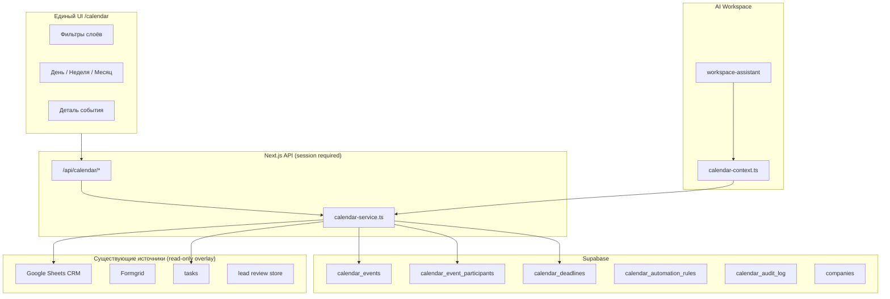
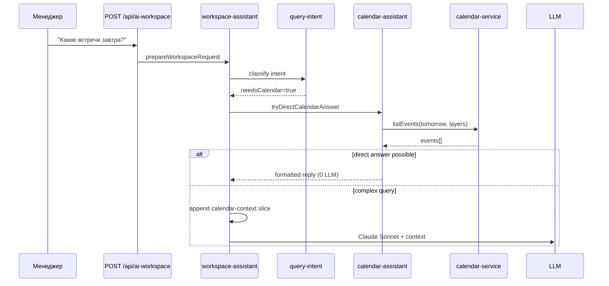
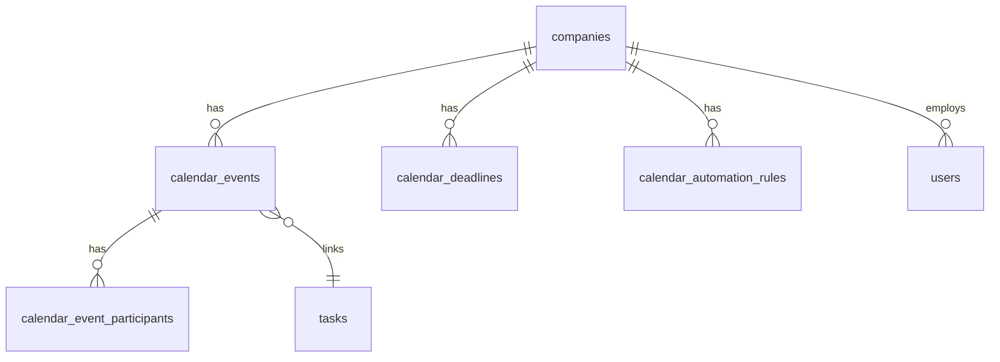
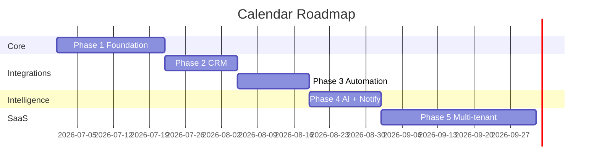

# Internal Calendar System Design

**Дата:** 2026-06-20  
**Статус:** только аудит и проектирование — код, PR, merge, деплой и ENV не затрагиваются  
**Платформа:** Sharp & Spice Team Platform  
**Связанные документы:** `CORPORATE_AI_ASSISTANT_DESIGN.md`, `PLATFORM_SECURITY_AUDIT.md`, `AI_DATA_CLASSIFICATION.md`

---

## Executive Summary

Встроенный календарь — **единый временной слой** поверх CRM (Google Sheets), задач, лидов и AI Workspace. Данные живут **только в Supabase**; Google Calendar не используется.

**Рекомендуемая модель:** **гибрид «Persisted + Virtual»**

| Слой | Хранение | Цвет UI | Примеры |
|------|----------|---------|---------|
| **Личный календарь** | Supabase `calendar_events` (`scope = personal`) | Синий `#3B82F6` | консультации, встречи, отпуск, напоминания |
| **Календарь компании** | Supabase `calendar_events` (`scope = company`) | Зелёный `#22C55E` | подачи, командные встречи, праздники |
| **CRM overlay** | Виртуальные события из Sheets + опционально persisted при подтверждении | Оранжевый `#F97316` | `bookingRange`, `expectedApprovalAt`, `submittedAt` |
| **Задачи (опционально)** | Ссылка на `tasks.due_date` без дублирования | Серый `#94A3B8` | дедлайны задач на календаре |

Пользователь видит **один интерфейс** с чекбоксами слоёв. Создание и редактирование — через API платформы с RBAC на уровне приложения (и RLS в Supabase на этапе внедрения).

**Текущее состояние кодовой базы (аудит):**

- Маршрута `/calendar` **нет** (`permissions.ts`, `middleware.ts`)
- Таблицы календаря в миграциях **нет**
- Единственный нормализованный дедлайн сегодня — `Task.dueDate` (`tasks.due_date`)
- Даты клиентов — строки в Google Sheets (`bookingRange`, `submittedAt`, `expectedApprovalAt`, `approvalAt`, `residenceCardIssuedAt`)
- Уведомление `consultation_assigned` уже есть, но ведёт на `/new-formgrid-clients`, не в календарь
- AI Workspace уже понимает букинг и даты клиентов (`structured-client-search.ts`, `tryDirectBookingAnswer()`)

---

## 1. Архитектура календаря

### 1.1. Два уровня доступа



### 1.2. Личный календарь сотрудника

| Правило | Описание |
|---------|----------|
| Владелец | `owner_user_id = session.id` |
| Просмотр | Только владелец (+ owner компании в audit mode — опционально, Phase 3) |
| Редактирование | Только владелец |
| Типы | `consultation`, `meeting`, `personal_reminder`, `vacation`, `personal_task`, `blocked_time` |

Событие может ссылаться на `client_id` — тогда оно **личное у менеджера**, но отображается и в карточке клиента (read-only для других).

### 1.3. Календарь компании

| Правило | Описание |
|---------|----------|
| Scope | `scope = company`, `company_id` обязателен |
| Просмотр | Все сотрудники компании (`owner` + `manager`) |
| Создание | По матрице ролей (см. §6) |
| Редактирование | Создатель, назначенный организатор, `owner` |
| Типы | `document_submission`, `team_meeting`, `company_event`, `holiday`, `client_deadline`, `internal_deadline` |

### 1.4. CRM overlay (виртуальный слой)

Даты из CRM **не дублируются** в Supabase, пока пользователь или automation не «промотирует» их в событие.

| Поле CRM (`Client`) | Виртуальное событие | `event_type` |
|---------------------|---------------------|--------------|
| `bookingRange` | Букинг клиента | `crm_booking` |
| `submittedAt` | Дата подачи | `crm_submission` |
| `expectedApprovalAt` | Ожидаемое одобрение | `crm_deadline` |
| `approvalAt` | Одобрение ВНЖ | `crm_milestone` |
| `residenceCardIssuedAt` | Выдача карты | `crm_milestone` |

Парсинг: переиспользовать `parseFlexibleDate()` / логику из `src/lib/analytics/dates.ts` и `structured-client-search.ts` (диапазоны `bookingRange` → `start_at` / `end_at`).

**Идемпотентность:** ключ виртуального события `virtual:{client_id}:{field}:{normalized_date}` — при promotion в persisted сохраняется в `source_ref`.

### 1.5. Модульная структура кода (целевая)

```
src/lib/calendar/
  types.ts                 # Event, Deadline, CalendarLayer, filters
  permissions.ts           # canViewEvent, canEditEvent, canCreateCompanyEvent
  parse-crm-dates.ts       # Client → virtual events
  service.ts               # listEventsInRange, create, update, promoteVirtual
  automation.ts            # rule engine (Phase 3)
  availability.ts          # free/busy, findSlots
  calendar-context.ts    # slice for AI Workspace
  calendar-assistant.ts    # direct answers + LLM prep
  reminders.ts             # schedule computation (Phase 4)

src/lib/supabase/
  calendar-events-repo.ts
  calendar-deadlines-repo.ts
  calendar-audit-repo.ts

src/app/(app)/calendar/
  page.tsx
src/components/calendar/
  CalendarView.tsx
  CalendarWeekGrid.tsx
  CalendarMonthGrid.tsx
  CalendarDayAgenda.tsx
  CalendarEventForm.tsx
  CalendarFilters.tsx
  CalendarEventChip.tsx

src/app/api/calendar/
  events/route.ts          # GET (range), POST
  events/[id]/route.ts     # GET, PATCH, DELETE
  availability/route.ts
  promote/route.ts         # virtual → persisted
```

Паттерн хранения: **Supabase primary + `.data/calendar-events.json` fallback** — как `tasks/store.ts` и `notifications/store.ts`.

### 1.6. Часовой пояс

- Компания: `companies.timezone` (default `Europe/Zagreb` для Sharp & Spice)
- События: `start_at` / `end_at` в `timestamptz` (UTC в БД)
- UI: отображение в TZ компании; личные события — в TZ сотрудника (Phase 2+, пока единый TZ)

---

## 2. UX-сценарии

### 2.1. Навигация

**Новый пункт меню** (после «Задачи», перед «Командный чат»):

| Поле | Значение |
|------|----------|
| href | `/calendar` |
| label | Календарь |
| icon | `fa-solid fa-calendar-days` |
| Доступ | `owner` + `manager` (все текущие сотрудники) |

Изменения: `src/lib/auth/permissions.ts` (`MANAGER_NAV`, `OWNER_NAV`), `middleware.ts` matcher.

### 2.2. Главный экран `/calendar`

```
┌─────────────────────────────────────────────────────────────────┐
│  Календарь                    [◀ Июнь 2026 ▶]  [День|Неделя|Месяц] │
├─────────────────────────────────────────────────────────────────┤
│  ☑ Мой календарь   ☑ Компания   ☑ CRM   ☐ Задачи                │
│  Фильтр типа: [Все ▼]  Менеджер: [Все ▼]  Клиент: [поиск...]    │
│                                              [+ Создать событие] │
├─────────────────────────────────────────────────────────────────┤
│                     (сетка недели / месяца)                      │
│  Пн 16   Вт 17   Ср 18   Чт 19   Пт 20   Сб 21   Вс 22         │
│  ● синяя консультация 10:00                                      │
│  ● зелёная подача 14:00                                          │
│  ● оранжевый букинг (CRM)                                        │
└─────────────────────────────────────────────────────────────────┘
```

### 2.3. Режимы просмотра

| Режим | Описание | MVP |
|-------|----------|-----|
| **Месяц** | Обзор, точки/чипы на днях | ✅ Phase 1 |
| **Неделя** | Почасовая сетка 07:00–20:00 | ✅ Phase 1 |
| **День** | Agenda-список по времени | ✅ Phase 1 |

Рекомендация UI: кастомная сетка на CSS Grid (как Tasks), без тяжёлой библиотеки на MVP. Опционально `@fullcalendar/react` в Phase 2, если нужен drag-and-drop.

### 2.4. Фильтры

| Фильтр | Действие |
|--------|----------|
| Мои события | `scope=personal` + `owner_user_id=me` |
| События компании | `scope=company` |
| Консультации | `event_type in (consultation, ...)` |
| Подачи документов | `event_type = document_submission` |
| Дедлайны | `calendar_deadlines` + `event_type = client_deadline` |
| CRM overlay | virtual layer from Sheets |
| По менеджеру | personal events where `owner_user_id` or client.manager match |
| По клиенту | `client_id` |

Состояние фильтров — `localStorage` + URL query (`?view=week&layers=personal,company,crm`).

### 2.5. Сценарии пользователя

#### S1 — Менеджер: консультация из карточки клиента

1. `/clients/[id]` → кнопка **«Создать консультацию»**
2. Модалка: дата, время, длительность (30/60 мин), заметка
3. POST → событие `scope=personal`, `event_type=consultation`, `client_id`, `owner_user_id=session.id`
4. Календарь менеджера + блок «События» в карточке клиента
5. Уведомление менеджеру за 1 день / 1 час (Phase 4)

#### S2 — Администратор: корпоративная подача

1. Статус клиента «Готов к подаче» (вручную или derived)
2. Кнопка **«Запланировать подачу»** или automation
3. Событие `scope=company`, `event_type=document_submission`, видно всем
4. Оранжевая CRM-метка остаётся, если `submittedAt` ещё в Sheets

#### S3 — Руководитель: обзор недели компании

1. `/calendar?view=week`
2. Включены слои «Компания» + «CRM»
3. Фильтр «Подачи» → только `document_submission` + `crm_submission`

#### S4 — Менеджер: свободное окно

1. В календаре: **«Найти окно»** → 30/60 мин в текущей неделе
2. Или в AI Workspace: «Найди свободное окно на этой неделе» (§4)

#### S5 — Lead → CRM → календарь

1. `create_in_crm` в Lead Review
2. Automation: personal `consultation` черновик менеджеру + task «Связаться с клиентом»
3. Менеджер подтверждает дату в календаре

#### S6 — Задача с высоким приоритетом

1. При создании задачи с `dueDate` — чекбокс **«Напоминание в календаре»**
2. Создаётся `personal_reminder` на 09:00 дня `dueDate` с `task_id`

### 2.6. Карточка клиента — блок «Календарь»

```
┌─ Календарь клиента ────────────────────────┐
│ 20.06  Консультация (Иванова З.)  10:00   │  ← persisted, синий
│ 22–25.06  Букинг (CRM)                    │  ← virtual, оранжевый
│ 01.07  Ожидаемое одобрение (CRM)          │  ← virtual deadline
│ [+ Консультация]  [+ Подача]  [Открыть в календаре] │
└────────────────────────────────────────────┘
```

### 2.7. Dashboard widget (Phase 2)

На `/dashboard`: «Сегодня» — 3 ближайших события (личные + компания) + счётчик дедлайнов недели.

---

## 3. Интеграция с CRM

### 3.1. Текущая модель CRM (аудит)

| Источник | Файлы | Идентификатор клиента |
|----------|-------|----------------------|
| Croatia External sheet | `parseCroatiaExternalClientsRows` | `passportNumber` или row-based id |
| Generic Clients tab | `parseClientRows` | sheet row / generated id |
| Formgrid | `formgrid-leads.ts` | row index |
| Lead review | `app_state.formgrid_lead_reviews` | `rowKey` / `sheetRow` |

**Статусы CRM:** `Новый`, `В работе`, `Консультация`, `Подготовка документов`, `Завершён` + derived для Croatia External (`deriveCroatiaExternalStatus`).

**Важно:** CRM остаётся в Google Sheets; календарь **не пишет** в Sheets на MVP (кроме будущей синхронизации `submittedAt` при фактической подаче — отдельный проект).

### 3.2. Связь `client_id`

```
calendar_events.client_id  →  Client.id (тот же id, что в /clients и API)
```

Дополнительные поля для трассировки:

- `client_name_snapshot` — на момент создания (если имя в Sheets изменится)
- `client_source` — `clients` | `new_clients` | `merged`
- `lead_row_key` — для событий из Lead Review до появления CRM id

### 3.3. Маппинг статус → событие (automation design)

| Триггер | Условие | Действие | Scope |
|---------|---------|----------|-------|
| Статус → Консультация | manual или derived `waiting_list` | Предложить создать `consultation` (draft) | personal, assignee = manager |
| Статус → Подготовка документов | `prep_docs` | Company event «Подготовка документов: {client}» | company |
| Готов к подаче | manual flag / note pattern «готов к подаче» | `document_submission` company event | company |
| `bookingRange` заполнен | CRM field change (poll/cache) | Virtual `crm_booking` | overlay |
| `expectedApprovalAt` | field populated | Virtual deadline | overlay |
| Lead `create_in_crm` | `lead-review-service` | Task + draft consultation | personal |

**Phase 1:** ручные кнопки в UI.  
**Phase 3:** `calendar_automation_rules` + webhook/poll при обновлении Sheets cache (`GOOGLE_SHEETS_CACHE_TTL_MS`).

### 3.4. Дедлайны по клиентам

Отдельная сущность `calendar_deadlines` для явных дедлайнов, не привязанных к событию с временем:

| `deadline_type` | Пример |
|-----------------|--------|
| `visa_expiry` | Окончание визы |
| `submission_due` | Крайняя дата подачи |
| `extension_due` | Продление |
| `consultation_followup` | Перезвонить до даты |
| `custom` | Произвольный |

Дедлайн отображается в календаре как **all-day marker** (оранжевый если из CRM, зелёный если company).

### 3.5. API расширения CRM UI

| Endpoint | Назначение |
|----------|------------|
| `GET /api/clients/[id]/calendar` | События + virtual + deadlines по клиенту |
| `POST /api/clients/[id]/calendar/consultation` | Shortcut create consultation |

Страница: `src/app/(app)/clients/[id]/page.tsx` + компонент `ClientCalendarPanel.tsx`.

---

## 4. Интеграция с AI Workspace

### 4.1. AI Calendar Assistant — архитектура



### 4.2. Новый intent

Расширить `WorkspaceQueryIntent` в `query-intent.ts`:

```typescript
needsCalendar: boolean;
calendarQueryKind?: 
  | "my_schedule"
  | "company_schedule"
  | "deadlines"
  | "submissions"
  | "free_slot"
  | "client_appointments";
```

**Триггеры (rules-first, без LLM):**

| Паттерн | Kind |
|---------|------|
| встреч, консультац, расписан, график, завтра, сегодня, пятниц | `my_schedule` |
| подач, документов завтра, дедлайн, крайн | `submissions` / `deadlines` |
| свободн, окно, слот | `free_slot` |
| компани, корпоратив, праздник, июл | `company_schedule` |

### 4.3. Примеры запросов → поведение

| Запрос | Путь | LLM |
|--------|------|-----|
| Какие у меня встречи завтра? | `listPersonalEvents(tomorrow)` | 0 |
| Когда следующая консультация? | `findNextEvent(type=consultation)` | 0 |
| Найди свободное окно на этой неделе | `findFreeSlots(week, 60min)` | 0 |
| Покажи график на пятницу | `listPersonalEvents(friday)` | 0 |
| Какие подачи документов завтра? | `listCompanyEvents(type=document_submission)` | 0 |
| Какие дедлайны на этой неделе? | `listDeadlines(week)` + virtual CRM | 0 |
| События компании на июль | `listCompanyEvents(month)` | 0 |
| Перенеси консультацию с Ивановым на четверг | Требует confirm → **не auto-write** | 1 (предложение действия) |

**Принцип:** AI **читает** календарь; **запись** только через explicit UI confirm или structured action с подтверждением (как `pendingClientCandidates`).

### 4.4. Calendar context slice

`calendar-context.ts` формирует markdown для LLM:

```
## Календарь (2026-06-20 — 2026-06-27)
### Личные события
- 21.06 10:00–11:00 Консультация: Петров (client_id=…)
### Компания
- 22.06 14:00 Подача документов: Сидоров
### Дедлайны
- 23.06 Ожидаемое одобрение: Козлов (CRM)
```

Redaction: не включать `description` с PII сверх необходимого; следовать `AI_DATA_CLASSIFICATION.md`.

### 4.5. Пресеты AI Workspace (Phase 2)

Добавить в `AiWorkspaceView.tsx`:

| Пресет | Запрос |
|--------|--------|
| 📅 Мой день | «Что у меня запланировано сегодня?» |
| 📅 Подачи недели | «Какие подачи документов на этой неделе?» |
| 📅 Дедлайны | «Какие дедлайны клиентов на этой неделе?» |

### 4.6. Интеграция с задачами в AI

Запрос «Что горит на этой неделе?» → объединить `tasks` (overdue + due this week) + calendar deadlines в одном direct answer.

---

## 5. Архитектура данных Supabase

### 5.1. Миграция `009_calendar.sql` (рекомендуемая)

#### `companies`

| Колонка | Тип | Описание |
|---------|-----|----------|
| `id` | `text` PK | `sharp-spice` на MVP |
| `name` | `text` NOT NULL | Sharp & Spice |
| `timezone` | `text` NOT NULL DEFAULT `Europe/Zagreb` | |
| `settings` | `jsonb` DEFAULT `{}` | automation flags, default durations |
| `created_at` | `timestamptz` | |

```sql
insert into companies (id, name) values ('sharp-spice', 'Sharp & Spice')
on conflict do nothing;
```

#### `calendar_events`

| Колонка | Тип | Описание |
|---------|-----|----------|
| `id` | `text` PK | UUID v4 |
| `company_id` | `text` NOT NULL FK → companies | multi-tenant |
| `scope` | `text` NOT NULL | `personal` \| `company` |
| `owner_user_id` | `text` | обязателен при `personal` |
| `title` | `text` NOT NULL | |
| `description` | `text` DEFAULT `''` | |
| `event_type` | `text` NOT NULL | см. enum ниже |
| `status` | `text` NOT NULL DEFAULT `scheduled` | `scheduled` \| `cancelled` \| `completed` |
| `start_at` | `timestamptz` NOT NULL | |
| `end_at` | `timestamptz` NOT NULL | |
| `all_day` | `boolean` DEFAULT false | |
| `timezone` | `text` | override TZ |
| `location` | `text` | офис / Zoom |
| `color` | `text` | UI override; иначе по слою |
| `client_id` | `text` | CRM id |
| `client_name_snapshot` | `text` | |
| `task_id` | `text` FK → tasks | опционально |
| `lead_row_key` | `text` | Formgrid lead |
| `source` | `text` NOT NULL DEFAULT `manual` | `manual` \| `automation` \| `promoted_virtual` \| `task_sync` |
| `source_ref` | `jsonb` | idempotency key, rule id |
| `reminder_minutes` | `int[]` DEFAULT `{1440, 60}` | за 1 день и 1 час |
| `created_by_user_id` | `text` NOT NULL | |
| `updated_by_user_id` | `text` | |
| `created_at` | `timestamptz` | |
| `updated_at` | `timestamptz` | |

**`event_type` enum (check constraint):**

`consultation`, `meeting`, `personal_reminder`, `vacation`, `personal_task`, `blocked_time`, `document_submission`, `team_meeting`, `company_event`, `holiday`, `client_deadline`, `internal_deadline`

**Индексы:**

```sql
create index calendar_events_company_start_idx 
  on calendar_events (company_id, start_at);
create index calendar_events_owner_start_idx 
  on calendar_events (owner_user_id, start_at) where scope = 'personal';
create index calendar_events_client_idx 
  on calendar_events (client_id) where client_id is not null;
create index calendar_events_task_idx 
  on calendar_events (task_id) where task_id is not null;
create unique index calendar_events_source_ref_uidx 
  on calendar_events (company_id, (source_ref->>'key')) 
  where source_ref is not null;
```

#### `calendar_event_participants`

| Колонка | Тип | Описание |
|---------|-----|----------|
| `event_id` | `text` FK | |
| `user_id` | `text` | |
| `role` | `text` | `organizer` \| `attendee` \| `optional` |
| PK | `(event_id, user_id)` | |

Для командных встреч и консультаций с несколькими участниками.

#### `calendar_deadlines`

| Колонка | Тип | Описание |
|---------|-----|----------|
| `id` | `text` PK | |
| `company_id` | `text` NOT NULL | |
| `scope` | `text` NOT NULL | `personal` \| `company` |
| `owner_user_id` | `text` | |
| `client_id` | `text` | |
| `title` | `text` NOT NULL | |
| `deadline_type` | `text` NOT NULL | см. §3.4 |
| `due_on` | `date` NOT NULL | |
| `status` | `text` DEFAULT `open` | `open` \| `met` \| `missed` \| `cancelled` |
| `source` | `text` | `manual` \| `crm_virtual` \| `automation` |
| `source_ref` | `jsonb` | |
| `created_by_user_id` | `text` | |
| `created_at` | `timestamptz` | |
| `updated_at` | `timestamptz` | |

#### `calendar_automation_rules` (Phase 3)

| Колонка | Тип | Описание |
|---------|-----|----------|
| `id` | `text` PK | |
| `company_id` | `text` | |
| `name` | `text` | |
| `enabled` | `boolean` | |
| `trigger` | `text` | `crm_status_change`, `lead_created_in_crm`, `task_high_priority` |
| `conditions` | `jsonb` | `{ "status": "Консультация" }` |
| `action` | `jsonb` | шаблон события |
| `created_at` | `timestamptz` | |

#### `calendar_audit_log`

| Колонка | Тип | Описание |
|---------|-----|----------|
| `id` | `text` PK | |
| `company_id` | `text` | |
| `event_id` | `text` | nullable для bulk |
| `actor_user_id` | `text` | |
| `action` | `text` | `create`, `update`, `delete`, `cancel`, `promote` |
| `before` | `jsonb` | |
| `after` | `jsonb` | |
| `created_at` | `timestamptz` | |

### 5.2. Сравнение с исходным черновиком

| Исходное поле | Рекомендация |
|---------------|--------------|
| `company_id` | ✅ Оставить — multi-tenant |
| `user_id` | Переименовать в `owner_user_id` (личные) + `created_by_user_id` |
| `visibility` | Заменить на `scope` (`personal` \| `company`) — проще для RBAC |
| `event_type` | ✅ Расширить enum |
| — | Добавить `source`, `source_ref`, `task_id`, `lead_row_key`, `status` |
| — | Отдельная `calendar_deadlines` для all-day дедлайнов |
| — | `calendar_audit_log` для compliance |

### 5.3. Объём данных (оценка)

| Сущность | Sharp & Spice (4 users, 1 год) |
|----------|-------------------------------|
| `calendar_events` | ~2 000–5 000 строк |
| `calendar_deadlines` | ~500–1 000 |
| `calendar_audit_log` | ~10 000 (с ростом) |

Нагрузка низкая; индексы по `start_at` достаточны без партиционирования до SaaS-масштаба.

---

## 6. Security Analysis

Опирается на `PLATFORM_SECURITY_AUDIT.md`. Календарь должен **не повторять** слабые места (no RLS, no API RBAC).

### 6.1. Угрозы и контроли

| Угроза | Риск | Контроль |
|--------|------|----------|
| Менеджер читает чужой личный календарь | **HIGH** | API: `scope=personal` → filter `owner_user_id = session.id`; RLS policy |
| Менеджер редактирует company event | **MEDIUM** | `canEditCompanyEvent(actor, event)` |
| Утечка PII клиента в company event | **MEDIUM** | Минимум полей в title; description access audit |
| Подмена `owner_user_id` в POST | **HIGH** | Server ignores client-supplied owner; set from session |
| IDOR на `GET /api/calendar/events/[id]` | **HIGH** | `canViewEvent(session, event)` before return |
| AI раскрывает чужой календарь | **HIGH** | Calendar context только для `session.id` + company scope |
| Service role bypass | **HIGH** | Application-level checks + future RLS |

### 6.2. Матрица RBAC

| Действие | manager | owner |
|----------|---------|-------|
| Просмотр личного (своего) | ✅ | ✅ |
| Просмотр личного (чужого) | ❌ | ❌ (default) / optional read Phase 3 |
| Создание личного | ✅ | ✅ |
| Просмотр company | ✅ | ✅ |
| Создание company event | ✅ (ограниченные типы) | ✅ (все типы) |
| Праздники / automation rules | ❌ | ✅ |
| Удаление company event | только creator / organizer | ✅ |
| Просмотр CRM virtual | ✅ | ✅ |
| Promote virtual → persisted | ✅ (assignee/manager client) | ✅ |
| Audit log | ❌ | ✅ |

**Ограничение manager на company create (рекомендация):**  
разрешены `document_submission`, `team_meeting`, `consultation` (company-wide);  
`holiday`, `internal_deadline` — только owner.

### 6.3. RLS policies (рекомендуется с миграции 009)

```sql
alter table calendar_events enable row level security;

-- Deny all for anon/authenticated direct access
-- Service role used from server with explicit filters (transition)
-- Future: JWT custom claims with company_id + user_id
```

На MVP (как остальная платформа): **service role + строгие проверки в `calendar/permissions.ts`**.  
На Phase 2: включить RLS policies как подготовку к SaaS.

### 6.4. Аудит изменений

Каждая мутация → запись в `calendar_audit_log`:

- кто (`actor_user_id`)
- что (`action`, `before`, `after`)
- когда (`created_at`)

Owner UI: `/settings` → вкладка «Журнал календаря» (Phase 3) или фильтр в `/calendar` для owner.

### 6.5. Классификация данных (`AI_DATA_CLASSIFICATION.md`)

| Поле | Класс | В AI context |
|------|-------|--------------|
| `title` с ФИО клиента | Internal | Да, scoped |
| `description` | Internal/Sensitive | Redact при необходимости |
| `location` | Internal | Да |
| Virtual CRM dates | Internal | Да (уже в workspace) |

---

## 7. Multi-Tenant Readiness

### 7.1. Текущее состояние

- Одна компания Sharp & Spice
- Пользователи hardcoded в `users.ts`
- Google Sheets / Drive IDs в ENV (в SaaS → `tenant.integrations`)

### 7.2. Целевая модель



| Принцип | Реализация |
|---------|------------|
| Изоляция данных | Все запросы с `WHERE company_id = session.company_id` |
| Единый календарь компании | Один `scope=company` per tenant |
| Сотрудники | `users.company_id` (Phase SaaS; сейчас default `sharp-spice`) |
| Роли | `owner` / `manager` per company (расширяемо) |
| CRM | Per-tenant Sheets IDs (уже в CORPORATE_AI_ASSISTANT_DESIGN) |
| TZ | `companies.timezone` |

### 7.3. Миграционный путь

1. **MVP:** `company_id = 'sharp-spice'` константа в service layer
2. **SaaS Phase:** таблица `users` в Supabase, `session.company_id` в JWT
3. **Без breaking changes:** все calendar queries уже фильтруют по `company_id`

### 7.4. Что не смешивать между tenant

- `calendar_events`, `deadlines`, `audit_log`
- Automation rules
- Notification fan-out (только users своей company)

---

## 8. Уведомления (дизайн)

### 8.1. Новые типы

Расширить `NOTIFICATION_TYPES` в `notifications/types.ts`:

| Type | Когда |
|------|-------|
| `calendar_reminder` | За N минут до `start_at` |
| `calendar_deadline` | За 1 день до `due_on` |
| `calendar_deadline_overdue` | `due_on` < today && status=open |
| `calendar_event_assigned` | Участник добавлен в company event |
| `calendar_event_changed` | Изменение времени события участника |

### 8.2. Каналы (roadmap)

| Канал | Phase |
|-------|-------|
| In-app (`NotificationBell`) | 4 |
| Browser push | 5+ |
| Email | 5+ (не в scope MVP) |

### 8.3. Scheduler

```
cron (Vercel Cron / external worker)
  every 15 min:
    - find events where start_at - reminder_minutes ≈ now
    - find deadlines where due_on = tomorrow
    - emit notifications (dedupe via source_ref)
```

**Dedup key:** `calendar_reminder:{event_id}:{offset}` в `app_state` или колонка `notifications.source_ref`.

### 8.4. Navigation

Обновить `getNotificationHref()`:

```typescript
case "calendar_reminder":
case "calendar_deadline":
  return `/calendar?event=${eventId}`;
```

### 8.5. Связь с существующими типами

| Существующий | Календарь |
|--------------|-----------|
| `consultation_assigned` | + создать draft calendar event |
| `task_new` / `task_status` | optional calendar reminder if dueDate |

---

## 9. Автоматизация (дизайн)

### 9.1. Движок правил

```
Trigger → Conditions → Actions (idempotent)
```

| Trigger | Source | Action |
|---------|--------|--------|
| `crm_status_change` | Sheets cache refresh / manual | create draft event |
| `lead_created_in_crm` | `lead-review-service` | consultation draft + notify |
| `task_created_high_priority` | `tasks/store` | reminder event |
| `booking_range_detected` | CRM virtual layer | virtual only (no notify) |
| `deadline_approaching` | cron | notification only |

### 9.2. Idempotency

`source_ref.key` = `{trigger}:{entity_id}:{event_type}` — повторный trigger не создаёт дубликат.

### 9.3. Draft vs confirmed

Automation создаёт события со `status = scheduled` и флагом `source = automation`, опционально `needs_confirmation = true` (UI badge «Подтвердить»).

### 9.4. Feature flags (ENV, будущее)

```
CALENDAR_AUTOMATION_ENABLED=false   # default off
CALENDAR_CRM_VIRTUAL_LAYER=true     # default on
CALENDAR_TASK_SYNC=false
```

Не менять ENV в рамках этого документа — только фиксация дизайна.

---

## 10. Roadmap внедрения

### Phase 1 — Foundation (2–3 недели)

| # | Deliverable |
|---|-------------|
| 1 | Migration `009_calendar.sql` (`companies`, `calendar_events`, indexes) |
| 2 | `calendar-events-repo.ts` + `calendar/service.ts` |
| 3 | API: `GET/POST /api/calendar/events`, `PATCH/DELETE [id]` |
| 4 | `calendar/permissions.ts` |
| 5 | UI: `/calendar` month + week + day, filters, create form |
| 6 | Nav + middleware |
| 7 | Unit tests: permissions, date range queries |

**Exit criteria:** менеджер создаёт личную консультацию и видит company event.

### Phase 2 — CRM & Client integration (2 недели)

| # | Deliverable |
|---|-------------|
| 1 | `parse-crm-dates.ts` → virtual orange layer |
| 2 | `GET /api/clients/[id]/calendar` |
| 3 | `ClientCalendarPanel` + «Создать консультацию» |
| 4 | `calendar_deadlines` table + UI markers |
| 5 | Dashboard widget «Сегодня» |
| 6 | Task checkbox «Напоминание в календаре» |

### Phase 3 — Automation & Audit (2 недели)

| # | Deliverable |
|---|-------------|
| 1 | `calendar_automation_rules` + engine |
| 2 | Hook в `lead-review-service` (create_in_crm) |
| 3 | `calendar_audit_log` + owner view |
| 4 | Promote virtual → persisted API |
| 5 | CRM status → suggested events (manual confirm) |

### Phase 4 — AI & Notifications (2 недели)

| # | Deliverable |
|---|-------------|
| 1 | `calendar-assistant.ts` + `needsCalendar` intent |
| 2 | Direct answers (0 LLM) для типовых запросов |
| 3 | AI presets в Workspace |
| 4 | Notification types + cron scheduler |
| 5 | Deep links в NotificationBell |

### Phase 5 — Multi-tenant & Hardening (по мере SaaS)

| # | Deliverable |
|---|-------------|
| 1 | `users` table + `company_id` in session |
| 2 | RLS policies на calendar tables |
| 3 | Per-tenant automation + TZ |
| 4 | Rate limits на calendar API |
| 5 | Recurrence rules (RRULE) |



---

## 11. Рекомендованный вариант реализации

### Выбор: **Hybrid Persisted + Virtual CRM Overlay**

| Альтернатива | Плюсы | Минусы | Вердикт |
|--------------|-------|--------|---------|
| A. Всё в Supabase, sync из CRM | Единый источник | Дублирование, drift с Sheets | ❌ |
| B. Только virtual из CRM | Нет дублирования | Нет консультаций/встреч с временем | ❌ |
| **C. Hybrid (рекомендуется)** | Встречи в platform, даты CRM как overlay | Два слоя в UI | ✅ |
| D. Google Calendar sync | Привычный UX | Противоречит требованию | ❌ |

### Технический стек (согласован с платформой)

| Слой | Выбор |
|------|-------|
| DB | Supabase Postgres (migration 009) |
| API | Next.js App Router route handlers + `getSession()` |
| Auth | Существующий JWT cookie `ss_session` |
| UI | React, CSS Modules (как Tasks), без Google Calendar |
| Dates | `timestamptz` в БД; `date-fns` или `Temporal` (polyfill) в UI |
| AI | Расширение `workspace-assistant`, rules-first |
| Notifications | Существующий `notifications/store` + cron |

### Ключевые принципы

1. **Календарь — source of truth для встреч и консультаций с временем.**
2. **CRM Sheets — source of truth для миграционных дат клиента** (virtual layer).
3. **Никакого Google Calendar API.**
4. **RBAC в application layer с первого дня; RLS — до SaaS.**
5. **AI читает, не пишет** без explicit user confirm.
6. **`company_id` на всех строках** — multi-tenant ready.
7. **Audit log** для company и automation events.

### Зависимости от других инициатив

| Инициатива | Влияние на календарь |
|------------|---------------------|
| Platform Security P0 (RLS, RBAC) | Календарь сразу проектировать с `permissions.ts` |
| Corporate AI Scope Layer | Calendar queries = in-scope business data |
| SaaS tenant config | `company_id`, per-tenant Sheets |
| CRM write enablement | Automation `create_in_crm` → calendar hook |

---

## Приложение A — Цвета и легенда UI

| Слой | CSS token | Hex |
|------|-----------|-----|
| Личный | `--calendar-personal` | `#3B82F6` |
| Компания | `--calendar-company` | `#22C55E` |
| CRM virtual | `--calendar-crm` | `#F97316` |
| Задачи | `--calendar-task` | `#94A3B8` |
| Отменено | `--calendar-cancelled` | `#6B7280` strikethrough |

## Приложение B — API контракт (черновик)

### `GET /api/calendar/events`

Query: `from`, `to` (ISO), `layers` (comma-separated), `types`, `clientId`, `userId` (owner only for own)

Response:

```json
{
  "events": [/* CalendarEvent[] */],
  "virtual": [/* VirtualCrmEvent[] */],
  "deadlines": [/* CalendarDeadline[] */]
}
```

### `POST /api/calendar/events`

Body: `{ scope, eventType, title, startAt, endAt, allDay?, clientId?, ... }`

Server sets: `company_id`, `created_by_user_id`, `owner_user_id` (if personal).

---

## Приложение C — Файлы для изменения (при реализации)

| Файл | Изменение |
|------|-----------|
| `supabase/migrations/009_calendar.sql` | новый |
| `src/lib/auth/permissions.ts` | NAV_CALENDAR |
| `middleware.ts` | `/calendar` matcher |
| `src/lib/notifications/types.ts` | новые типы |
| `src/lib/notifications/navigation.ts` | hrefs |
| `src/lib/ai/query-intent.ts` | needsCalendar |
| `src/lib/ai/workspace-assistant.ts` | calendar branch |
| `src/lib/leads/lead-review-service.ts` | hook post create_in_crm |
| `src/components/clients/*` | ClientCalendarPanel |

---

**Документ подготовлен без изменений кода, PR, merge, деплоя и ENV.**
