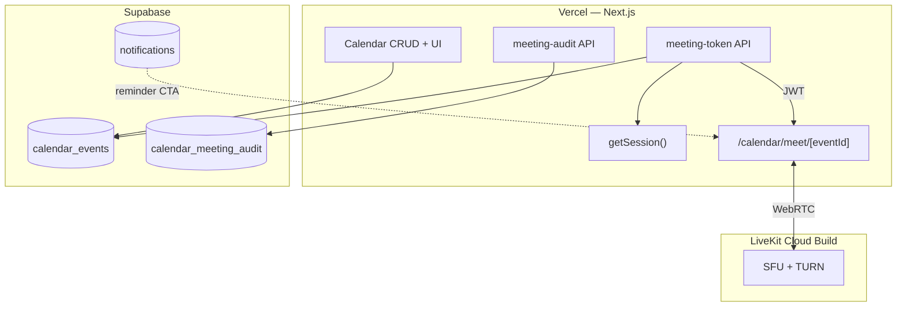
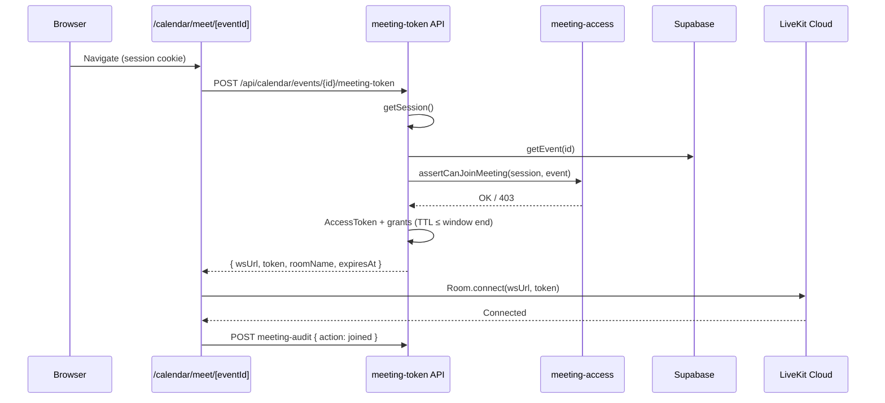
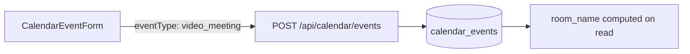

# Internal Video Meetings — Architecture

**Дата:** 2026-06-17  
**Статус:** проектирование — код, PR, commit, push, deploy **не выполняются**  
**Основа:** `INTERNAL_VIDEO_MEETINGS_MVP_SPEC` (утверждён), `INTERNAL_VIDEO_MEETINGS_FEASIBILITY_STUDY.md`  
**Платформа:** Sharp & Spice Team Platform (Next.js 15, Vercel, Supabase, JWT session)

---

## Executive Summary

Встроенные видеовстречи **только для сотрудников** (роли `owner` и `manager`) через **LiveKit Cloud (Build plan)**. Платформа отвечает за auth, ACL, календарь и UI; медиа — в LiveKit.

| Решение | Выбор |
|---------|--------|
| Media SFU | LiveKit Cloud (Build) |
| Auth | `getSession()` — cookie `ss_session`, JWT 7d |
| RBAC событий | `canViewEvent()` из `src/lib/calendar/permissions.ts` |
| Room naming | `sharp-spice-cal-{eventId}` — вычисляется, **не хранится** |
| LiveKit tokens | **Не в БД**; mint on demand через API |
| Audit | Supabase `calendar_meeting_audit` |

**Не используется:** Zoom, Google Meet, Jitsi, guest links, публичные комнаты, запись, in-call chat.

---

## 1. Контекст существующей платформы

### 1.1. Что уже есть и переиспользуется

| Модуль | Файлы / артефакты | Роль в видео |
|--------|-------------------|--------------|
| Auth | `src/lib/auth/session.ts`, `middleware.ts` | Session gate на page + API |
| Роли | `UserRole = "owner" \| "manager"` | Все team users — сотрудники; гостей нет |
| Календарь | `calendar_events`, CRUD handlers, UI modal/form | Тип события, Join CTA, deep link |
| Permissions | `permissions.ts`, `permissions-client.ts` | ACL на просмотр/редактирование |
| Напоминания | `reminders-cron.ts`, GitHub Actions cron | CTA «Присоединиться» в bell |
| Notifications | `calendar-reminder-copy.ts`, `navigation.ts`, `NotificationBell.tsx` | Href → `/calendar/meet/{eventId}` |
| Middleware | `PROTECTED_PREFIXES` includes `/calendar` | `/calendar/meet/*` уже под `/calendar/:path*` |

### 1.2. Границы ответственности



| Компонент | Делает | Не делает |
|-----------|--------|-----------|
| Vercel | Token mint, ACL, UI, audit API | WebRTC media relay |
| LiveKit | Audio/video/screen, TURN | Platform auth |
| Supabase | Events, audit, notifications | LiveKit tokens |

---

## 2. Schema changes

### 2.1. Расширение `calendar_events`

**Текущее состояние** (`009_calendar.sql`): `event_type text not null default 'general'` без CHECK constraint в migration.

**Migration `012_calendar_video_meetings.sql`:**

```sql
-- Расширить допустимые значения event_type
alter table calendar_events
  drop constraint if exists calendar_events_event_type_check;

alter table calendar_events
  add constraint calendar_events_event_type_check
  check (event_type in ('general', 'video_meeting'));
```

| `event_type` | UI (RU) | Видеокомната |
|--------------|---------|--------------|
| `general` | Обычное событие | Нет |
| `video_meeting` | Видеовстреча | Да |

**Не добавляем колонки:**

- `room_name` — вычисляется: `sharp-spice-cal-${eventId}`
- `livekit_token` — запрещено spec

**Бизнес-правило MVP:** `eventType` **immutable** после create (смена типа → риск «orphan room»).

**All-day events:** MVP допускает, но UI формы рекомендует отключать all-day для видеовстреч (Phase 2 — validation reject).

### 2.2. Новая таблица: `calendar_meeting_audit`

```sql
create table if not exists calendar_meeting_audit (
  id text primary key,
  event_id text not null references calendar_events(id) on delete cascade,
  user_id text not null,
  user_name text not null,
  room_name text not null,
  action text not null check (action in ('joined', 'left')),
  occurred_at timestamptz not null default now()
);

create index if not exists calendar_meeting_audit_event_idx
  on calendar_meeting_audit (event_id, occurred_at desc);

create index if not exists calendar_meeting_audit_user_idx
  on calendar_meeting_audit (user_id, occurred_at desc);
```

| Поле | Источник | Назначение |
|------|----------|------------|
| `event_id` | URL / token request | Связь с событием |
| `user_id` | `session.id` | Сотрудник |
| `user_name` | `session.name` | Читаемый audit |
| `room_name` | `getMeetingRoomName(eventId)` | Для сверки с LiveKit dashboard |
| `action` | `'joined'` \| `'left'` | Spec audit trail |
| `occurred_at` | server `now()` | Timestamp |

**Не логируем:** JWT token, SDP, media payloads, API secrets.

### 2.3. TypeScript layer

**`src/lib/calendar/types.ts`:**

```typescript
export const CALENDAR_EVENT_TYPES = ["general", "video_meeting"] as const;
export type CalendarEventType = (typeof CALENDAR_EVENT_TYPES)[number];
```

**Новый `src/lib/calendar/meeting.ts`:**

```typescript
export function isVideoMeeting(event: CalendarEvent): boolean {
  return event.eventType === "video_meeting";
}

export function getMeetingRoomName(eventId: string): string {
  return `sharp-spice-cal-${eventId}`;
}
```

**Затронутые файлы row-map / validation / form** — см. Implementation Plan PR #1.

---

## 3. Новые API routes

### 3.1. `POST /api/calendar/events/[id]/meeting-token`

| | |
|--|--|
| **Auth** | Cookie `ss_session` → `getSession()` |
| **Body** | Пустой или `{}` |
| **Response 200** | `{ wsUrl, token, roomName, expiresAt }` |
| **Errors** | 401, 403, 404, 503 (no LiveKit ENV) |

**Handler location:** `src/app/api/calendar/events/[id]/meeting-token/route.ts`

**Reuse:** `getEvent()` из calendar store/handlers pattern.

### 3.2. `POST /api/calendar/events/[id]/meeting-audit`

| | |
|--|--|
| **Auth** | Session required |
| **Body** | `{ action: "joined" \| "left" }` |
| **Response 201** | `{ ok: true }` |
| **Errors** | 401, 403, 404 |

**Handler location:** `src/app/api/calendar/events/[id]/meeting-audit/route.ts`

**ACL:** те же проверки, что для token (кроме time window — audit `left` разрешён shortly after disconnect даже если окно закрылось; `joined` только in-window).

### 3.3. Изменения существующих routes

| Route | Изменение |
|-------|-----------|
| `POST /api/calendar/events` | Принимает `eventType: "general" \| "video_meeting"` |
| `PATCH /api/calendar/events/[id]` | `eventType` **не** в `UpdateCalendarEventInput` (immutable) |
| `GET /api/calendar/events` | Возвращает `eventType` as-is |

### 3.4. Page route

| Path | Тип | Защита |
|------|-----|--------|
| `/calendar/meet/[eventId]` | Server page + client LiveKit | `middleware.ts` — `/calendar/:path*` + `getSession()` на page |

---

## 4. ACL модель

### 4.1. Матрица доступа

| Проверка | Условие | HTTP |
|----------|---------|------|
| Session | `getSession()` !== null | 401 |
| Event exists | `getEvent(id)` | 404 |
| Role | `session.role ∈ { owner, manager }` | 403* |
| Event visibility | `canViewEvent(session, event)` | 403 |
| Event type | `event.eventType === "video_meeting"` | 403 |
| Time window | `isWithinMeetingWindow(event, now)` | 403 |

\*На практике все пользователи платформы уже owner/manager; проверка — defense in depth на случай расширения ролей.

### 4.2. `canViewEvent` (без изменений)

```typescript
// src/lib/calendar/permissions.ts — существующая логика
// company scope → все сотрудники
// personal scope → только ownerUserId === user.id
```

| `scope` | Кто видит событие | Кто может Join |
|---------|-------------------|----------------|
| `company` | owner + все managers | owner + все managers |
| `personal` | только `ownerUserId` | только владелец события |

### 4.3. Временное окно доступа

```typescript
// src/lib/calendar/meeting-access.ts

const MEETING_EARLY_MINUTES = 15;
const MEETING_LATE_MINUTES = 15;

export function getMeetingAccessWindow(event: CalendarEvent) {
  const startMs = Date.parse(event.startAt);
  const endMs = Date.parse(event.endAt);
  return {
    opensAt: new Date(startMs - MEETING_EARLY_MINUTES * 60_000),
    closesAt: new Date(endMs + MEETING_LATE_MINUTES * 60_000),
  };
}
```

| Фаза | Условие | UI label |
|------|---------|----------|
| До окна | `now < opensAt` | Ожидание — Join disabled |
| Активно | `opensAt ≤ now ≤ closesAt` | Открыта — Join enabled |
| После | `now > closesAt` | Завершена — Join disabled |

### 4.4. Запрещено (spec)

- Guest / anonymous LiveKit grants
- Публичные комнаты без platform auth
- Token без session
- Deep link bypass ACL (page всё равно запрашивает token)

---

## 5. Token flow



### 5.1. Token minting (server-only)

**ENV:**

| Variable | Scope | Назначение |
|----------|-------|------------|
| `LIVEKIT_URL` | Server → client via API response | `wss://*.livekit.cloud` |
| `LIVEKIT_API_KEY` | Server only | Signing |
| `LIVEKIT_API_SECRET` | Server only | Signing |

**Новых ENV не добавляем.** `NEXT_PUBLIC_LIVEKIT_*` не нужен — `wsUrl` в ответе API.

**Grant policy:**

| Grant | Value | Причина |
|-------|-------|---------|
| `roomJoin` | true | Join room |
| `room` | `sharp-spice-cal-{eventId}` | Exact room |
| `canPublish` | true | mic, cam, screen |
| `canSubscribe` | true | receive tracks |
| `canPublishData` | false | no in-call chat |
| `roomCreate` | false | auto on first join |
| `roomAdmin` | false | no kick/recording |

**TTL:**

```typescript
ttlSeconds = min(3600, ceil((closesAt - now) / 1000))
```

Token **не persist** — только in-memory на клиенте на время сессии meet.

### 5.2. Room lifecycle

- Room создаётся LiveKit при первом participant
- Empty room → auto cleanup (Cloud default)
- `room_name` стабилен на весь lifecycle события
- Pre-create webhook — не в MVP

### 5.3. Screen share

LiveKit SDK `Track.Source.ScreenShare` → browser `getDisplayMedia` (entire screen / window / tab — **native picker**). Server config не требуется.

---

## 6. Audit logging

### 6.1. События

| Event | Trigger | API |
|-------|---------|-----|
| `joined` | LiveKit `RoomEvent.Connected` | POST meeting-audit |
| `left` | Leave button / `Disconnected` / `beforeunload` | POST meeting-audit |

### 6.2. Server log (Vercel)

```
[meeting-token] eventId=evt_xxx userId=owner-1 ok
[meeting-token] eventId=evt_xxx userId=... forbidden outside_window
```

**Redact:** token value, `LIVEKIT_API_SECRET`.

### 6.3. Query examples (ops)

```sql
-- Кто был на встрече
select user_name, action, occurred_at
from calendar_meeting_audit
where event_id = 'evt_abc123'
order by occurred_at;

-- Активность пользователя
select event_id, action, occurred_at
from calendar_meeting_audit
where user_id = 'manager-1'
order by occurred_at desc
limit 20;
```

---

## 7. Интеграция с календарём

### 7.1. Create flow



**UI:** radio «Обычное событие» / «Видеовстреча» — только при create.

**Manager flow (spec):** менеджер создаёт событие → выбирает «Видеовстреча» → система при save получает `eventId` → room name = `sharp-spice-cal-{eventId}`.

### 7.2. Event modal (`CalendarEventModal.tsx`)

Для `video_meeting` добавить блок:

| Element | Data |
|---------|------|
| Badge | «Видеовстреча» |
| Комната | `getMeetingRoomName(event.id)` read-only |
| Статус | по `getMeetingAccessWindow` |
| CTA | `MeetingJoinButton` → `/calendar/meet/{id}` |

### 7.3. Calendar grid (optional MVP+)

`CalendarEventChip` — optional video icon для `video_meeting` events (не блокер MVP).

### 7.4. Reminders integration

**Текущий encoding** (`calendar-reminder-copy.ts`):

```
{displayMessage}\u2063{eventId}
```

**Расширение (backward compatible):**

```
{displayMessage}\u2063{eventId}\u2063{isVideoMeeting}
// isVideoMeeting: "1" | "0"
```

**`buildCalendarReminderNotificationContent`** — передаёт `event.eventType`.

**`getNotificationHref`** (`navigation.ts`):

```typescript
if (isVideoMeeting && eventId) {
  return `/calendar/meet/${encodeURIComponent(eventId)}`;
}
return `/calendar?event=${encodeURIComponent(eventId)}`;
```

**Cron path unchanged:** GitHub Actions → `POST /api/cron/calendar-reminders` → `reminders-cron.ts` → `emit.ts`.

**NotificationBell:** label «Присоединиться» для video reminders.

---

## 8. Meeting page architecture

```
src/app/(app)/calendar/meet/[eventId]/page.tsx   — server session + event load
src/components/meet/CalendarMeetRoom.tsx          — "use client" LiveKitRoom
src/components/meet/MeetingControlBar.tsx
src/components/meet/MeetingParticipantPanel.tsx
src/components/meet/MeetingJoinButton.tsx         — shared with modal
```

**Layout:** immersive — без AppShell sidebar (как full-screen focus mode).

**Leave flow:** disconnect LiveKit → audit `left` → `router.push(/calendar?event={id})`.

---

## 9. Security

| Threat | Mitigation |
|--------|------------|
| Token theft | Short TTL; HTTPS; no localStorage |
| Room enumeration | Opaque event IDs; auth before token |
| IDOR | `canViewEvent` + video type |
| Guest join | No anonymous grants |
| Token in logs | Redact |
| Replay after event | TTL bounded by `closesAt` |

**LiveKit Cloud (manual setup):**

- EU region if available
- No public ingress
- No recording egress (MVP)

---

## 10. Dependencies (planned)

| Package | Where |
|---------|-------|
| `livekit-server-sdk` | API route only |
| `livekit-client` | Meet page client |
| `@livekit/components-react` | Controls, grid, participants |

---

## 11. Связь с модулями (file map)

| Concern | Files |
|---------|-------|
| Calendar CRUD | `handlers.ts`, `store.ts`, `validation.ts`, API routes |
| Permissions | `permissions.ts`, `permissions-client.ts` |
| Notifications | `calendar-reminder-copy.ts`, `navigation.ts`, `emit.ts`, `NotificationBell.tsx`, `NotificationProvider.tsx` |
| Auth | `session.ts`, `middleware.ts`, `permissions.ts` (nav) |
| Migrations | `009_calendar.sql` → `012_calendar_video_meetings.sql` |

---

## 12. Non-goals (MVP)

- Recording, external guests, in-call chat, AI notes, breakout rooms
- `calendar_event_participants` table
- Zoom/Meet links promotion in UI
- Email/WhatsApp reminders with meet link

---

*Реализация — см. `INTERNAL_VIDEO_MEETINGS_IMPLEMENTATION_PLAN.md`. UI — см. `INTERNAL_VIDEO_MEETINGS_UI_WIREFRAMES.md`.*
