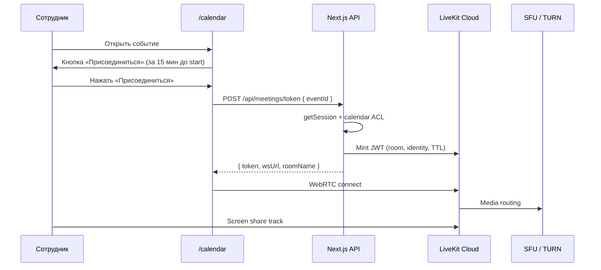
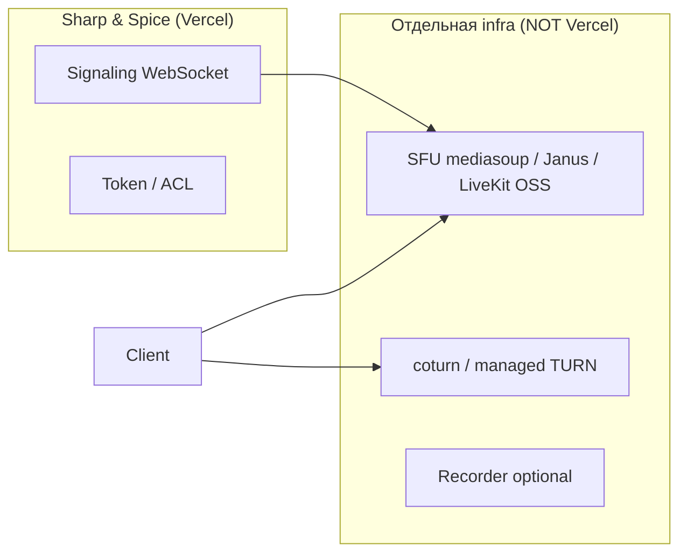

# Internal Video Meetings — Feasibility Study

**Дата:** 2026-06-23  
**Статус:** исследование и рекомендация — код, PR, деплой и ENV **не затрагиваются**  
**Платформа:** Sharp & Spice Team Platform  
**Цель:** оценить возможность **встроенных видеозвонков только для сотрудников** (owner + managers), сценарий «Календарь → событие → Присоединиться → видео + демонстрация экрана».

**Связанные документы:** `INTERNAL_CALENDAR_SYSTEM_DESIGN.md`, `CALENDAR_MVP_SPEC.md`, `CALENDAR_NOTIFICATIONS_DESIGN.md`, `PLATFORM_SECURITY_AUDIT.md`

---

## Executive Summary

| Вопрос | Ответ |
|--------|--------|
| Реально ли встроить видео в текущую платформу? | **Да**, но медиа-сервер (SFU) **нельзя** размещать на Vercel — нужен managed-сервис или отдельный VPS. |
| Рекомендуемый путь для Sharp & Spice | **LiveKit Cloud (Build → Ship)** + тонкая интеграция с календарём через Next.js API tokens. |
| Jitsi | Хорош как **self-host** при требовании полного контроля данных; для MVP на Vercel — только **JaaS (embed)**, не meet.jit.si. |
| Собственный WebRTC | **Не рекомендуется** для команды из ~4 человек: 3–6+ месяцев, постоянный DevOps, высокий риск. |
| MVP без записи | **2–3 недели** (1 разработчик): room на событие, JWT-доступ, экран, UI «Присоединиться». |
| MVP с записью | **+2–4 недели** и **+$** на egress/storage. |

**Рекомендация:** Phase 1 — **LiveKit Cloud + calendar-linked rooms**, без записи; Phase 2 — запись и напоминание «ссылка на встречу» в уведомлениях календаря.

---

## 1. Контекст платформы (ограничения интеграции)

Аудит текущего стека (релевантно для видео):

| Компонент | Сейчас | Влияние на видео |
|-----------|--------|------------------|
| Frontend | Next.js 15, React 19, PWA | Подходит: WebRTC в браузере, `@livekit/components-react` или Jitsi iframe/React SDK. |
| Backend | Next.js API Routes на **Vercel** (serverless) | Подходит для **выдачи токенов** и проверки session; **не подходит** для SFU/TURN/media relay. |
| Auth | JWT session, ~4 сотрудника (`users.ts`) | Достаточно для «только сотрудники»: проверка `getSession()` перед выдачей room token. |
| Календарь | Supabase `calendar_events`, CRUD, modal, напоминания | Точка интеграции: `eventId` → `roomName`, кнопка в modal/toolbar. |
| Уведомления | In-app bell + cron | Можно добавить deep link «Присоединиться» (Phase 2). |
| Деплой | Vercel Hobby + GitHub Actions cron | Нет long-running процессов; медиа — **вне** Vercel. |

**Вывод:** архитектура «платформа на Vercel + внешний медиа-провайдер» — естественная и ожидаемая. Self-hosted SFU на том же Vercel **невозможен**.

---

## 2. Целевой сценарий (Sharp & Spice)

**MVP-границы:**

- Участники: **только** owner/manager с активной session.
- Комната: **1 room = 1 calendar event** (stable `roomName` от `eventId`).
- Окно входа: например **−15 мин … +duration+15 мин** от `startAt`/`endAt`.
- Экран: **обязательно** в MVP.
- Запись: **не обязательна** в MVP (Phase 2).
- Гости без аккаунта платформы: **нет** (internal-only).

---

## 3. Сравнение вариантов

### 3.1. Сводная таблица

| Критерий | LiveKit Cloud | Jitsi (JaaS / embed) | Jitsi self-host | Собственный WebRTC |
|----------|---------------|----------------------|-----------------|---------------------|
| **Стоимость (Sharp & Spice, ~4 чел.)** | **$0–50/мес** (Build free или Ship) | **$99/мес** минимум (Basic 300 MAU) или free tier 25 MAU | **$40–150/мес** VPS + DevOps время | **$80–300/мес** infra + **высокая** стоимость разработки |
| **Сложность MVP** | **Низкая–средняя** (2–3 нед.) | **Средняя** (iframe 1–2 нед., брендинг/JWT дольше) | **Высокая** (2–4 нед. setup + ops) | **Очень высокая** (3–6+ мес.) |
| **Демонстрация экрана** | ✅ Native, `@livekit/components-react` | ✅ Встроено в Jitsi Meet UI | ✅ | ✅ (сами реализуете getDisplayMedia + simulcast) |
| **Запись** | ✅ Cloud egress (~$0.005/min записи + storage export) | ✅ $0.01/min (JaaS); self-host — **Jibri** (отдельный сервер) | ✅ Jibri (1 запись = 1 Jibri instance) | ❌ С нуля (compositor, storage, legal) |
| **Лимит участников** | Build: 100 concurrent; для 4 чел. — запас огромный | JaaS масштабируется; meet.jit.si ~35–75 soft cap (**не для prod**) | Зависит от CPU Videobridge (~50–100 на типичный VPS) | Зависит от SFU sizing |
| **Нагрузка на ваш сервер** | **Минимальная** (только token API) | **Минимальная** (JaaS) / **высокая** (self-host) | **Высокая** (CPU/RAM/bandwidth на VPS) | **Максимальная** (SFU + TURN + signaling + monitoring) |
| **Интеграция с календарём** | **Отличная** (custom UI, deep link, metadata в token) | **Хорошая** (JWT room name, iframe URL params) | **Хорошая** (полный контроль) | **Полная**, но дорого |
| **Vercel-совместимость** | ✅ | ✅ (JaaS) / ❌ (self-host media на Vercel) | ❌ media off-Vercel | ❌ |
| **Internal-only / RBAC** | ✅ JWT от вашего API | ✅ JaaS JWT | ✅ Prosody/JWT modules | ✅ полностью кастом |
| **PWA / мобильный** | ✅ Web + SDK | ✅ | ✅ | ⚠️ нужно тестировать TURN на iOS |
| **Зрелость экосystem** | Высокая (SFU OSS + Cloud) | Очень высокая (10+ лет) | Очень высокая | Зависит от команды |

---

## 3.2. LiveKit — детально

### Что это

Open-source SFU (`livekit-server`) + managed **LiveKit Cloud**. Клиент подключается по WebRTC; платформа выдаёт **краткоживущий access token** (JWT) с правами на room.

### Стоимость (ориентир, 2026)

Источник: [livekit.io/pricing](https://livekit.com/pricing) — проверять перед запуском.

| План | Цена | Релевантно для Sharp & Spice |
|------|------|------------------------------|
| **Build** | $0 | 5 000 WebRTC participant-minutes/mo, 100 concurrent — **достаточно для MVP** |
| **Ship** | $50/mo | 150 000 participant-minutes, recording 5 000 min — запас на рост |
| **Scale** | $500/mo | Не нужен при ~4 пользователях |

**Пример расчёта (консервативно):**

- 20 встреч/мес × 30 мин × 3 участника в среднем = **1 800 participant-minutes/mo** → **Build (free)**.
- Screen share **не тарифицируется отдельно** — идёт в те же WebRTC minutes.
- Запись: ~$0.005/min + egress storage; 10 записей × 30 мин = 300 min → ~**$1.50/mo** + storage.

### Сложность

| Задача | Оценка |
|--------|--------|
| LiveKit Cloud project + API keys | 0.5 дня |
| `POST /api/meetings/[eventId]/token` + ACL | 1–2 дня |
| Страница `/calendar/meet/[eventId]` или modal embed | 2–3 дня |
| Screen share (prebuilt `@livekit/components-react`) | 0.5–1 день |
| Кнопка «Присоединиться» в `CalendarEventModal` | 0.5 дня |
| Тесты iOS Safari / PWA | 1–2 дня |
| **Итого MVP** | **~2–3 недели** |

### Демонстрация экрана

- Browser API `getDisplayMedia` через LiveKit SDK.
- Готовые UI-компоненты: screen share toggle, layout grid/speaker.
- Simulcast/SVC на стороне SFU — не ваша забота.

### Запись

- **Room composite egress** или participant egress в S3/Supabase Storage (через LiveKit).
- Retention в Cloud ~30 дней на included recording minutes; долгосрочно — export.
- Для compliance Sharp & Spice: Phase 2, не блокер MVP.

### Ограничения участников

- Build: до **100 concurrent connections** на проект — для 4 сотрудников irrelevant limit.
- Практический лимит комнаты: качество при >10–15 видео — для internal meetings OK.

### Нагрузка на сервер

- **Vercel:** только stateless token mint (~50–200 ms/request), negligible.
- **LiveKit Cloud:** весь media traffic, TURN, bandwidth.

### Интеграция с календарём

Предлагаемая модель данных (концептуально, без реализации):

| Поле / артефакт | Назначение |
|-----------------|------------|
| `room_name = ss-cal-{eventId}` | Стабильная комната на событие |
| ACL | personal → owner + creator; company → все `listTeamUsers()` |
| UI | «Присоединиться» в modal; disabled вне окна времени |
| Deep link | `/calendar/meet/{eventId}` или `?event=` + join action |
| Напоминания (Phase 2) | В payload notification добавить `joinUrl` |

---

## 3.3. Jitsi — детально

### Три режима (важно не перепутать)

| Режим | Internal Sharp & Spice? | Комментарий |
|-------|-------------------------|-------------|
| **meet.jit.si** | ❌ **Нет** | Публичный, без вашего auth, лимиты ~35–75, данные у третьих лиц |
| **JaaS (8x8)** | ✅ Да | Managed, embed iframe/React SDK, JWT |
| **Self-hosted** | ✅ Да | Полный контроль, отдельный сервер |

### Стоимость

**JaaS (managed):**

| План | Цена | MAU |
|------|------|-----|
| Developer | Free | до 25 MAU |
| Basic | $99/mo | 300 MAU |
| Recording overage | +$0.01/min | |
| RTMP stream | +$0.01/min | |

Для **4 сотрудников** Developer tier **теоретически достаточен**, но:

- нужно embed в продукт (не просто ссылка на 8x8.vc);
- recording/storage — **сами** забираете с 8x8 (нет долгого хранения по умолчанию, ~24h window на стороне провайдера для некоторых конфигураций).

**Self-hosted:**

- Software: **$0** (Apache 2.0).
- Infra: VPS **$40–120/mo** (4 vCPU, 8 GB RAM) для малой команды.
- **Jibri** (запись): **отдельная** VM, ~2–4 vCPU на одновременную запись; 1 Jibri = 1 запись.
- DevOps: updates, TLS, monitoring, Prosody, Videobridge tuning — **ongoing cost**.

### Сложность

| Режим | MVP с screen share | + Recording |
|-------|---------------------|-------------|
| JaaS embed | 1–2 нед. | +1 нед. (webhook + storage) |
| Self-host | 2–4 нед. setup | +2–3 нед. Jibri + S3 |

JWT + custom domain + скрытие «лишнего» UI Jitsi — типичная доработка.

### Демонстрация экрана

Полноценная в Jitsi Meet out of the box (desktop + tab). Качество зависит от uplink участника.

### Запись

- **JaaS:** paid add-on, $0.01/min.
- **Self-host:** Jibri — тяжёлый компонент (headless Chrome + FFmpeg), **не** ставится на тот же micro-VPS что Videobridge.

### Ограничения участников

- Self-host Videobridge: горизонтальное масштабирование через несколько bridges.
- Для 4–10 internal users — один bridge на VPS достаточно.

### Нагрузка на сервер

- **JaaS:** как LiveKit — media off your infra.
- **Self-host:** постоянная нагрузка CPU (encode/decode routing), bandwidth **~1–2 Mbps × участники**.

### Интеграция с календарём

- Iframe: `https://{domain}/{room}?jwt=...`
- Room name = hash от `eventId`
- Минус: **меньше контроля UI**, чем LiveKit React components; брендинг JaaS — paid tiers.

---

## 3.4. Собственный WebRTC — детально

### Что пришлось бы построить

| Компонент | Зачем | Сложность |
|-----------|-------|-----------|
| Signaling | SDP offer/answer, ICE candidates | Средняя (WS server, state) |
| SFU | Group calls >2 участников | Высокая |
| TURN | NAT traversal (~10–20% users) | Средняя, **обязателен** в corp networks |
| STUN | Public IP discovery | Низкая |
| Screen share | Separate track, bandwidth policy | Средняя |
| Recording | Compositor, storage, playback UI | Очень высокая |
| Monitoring | Quality, reconnect, analytics | Высокая |

### Стоимость

- **Разработка:** 3–6+ человеко-месяцев для MVP quality ≈ Zoom-lite.
- **Infra:** $80–300/mo minimum (SFU + TURN + monitoring).
- **Сопровождение:** постоянное (WebRTC browser changes, ICE failures).

### Сравнение с «купить SFU»

По сути **LiveKit OSS self-hosted** = «свой WebRTC» но **без** написания SFU с нуля. Даже тогда нужен VPS + TURN + ops — **хуже** LiveKit Cloud для команды из 4 человек.

### Рекомендация

**Не выбирать** custom WebRTC from scratch для Sharp & Spice. Если когда-либо понадобится self-host — **LiveKit OSS на VPS** или **Jitsi self-host**, не mediasoup «голым».

---

## 4. Безопасность (internal-only)

Общие требования для всех вариантов:

| Контроль | Реализация |
|----------|------------|
| Только сотрудники | Token API проверяет `getSession()` + role ∈ {owner, manager} |
| Привязка к событию | Token valid only for `roomName(eventId)` + TTL = окно встречи |
| Company events | Все team users или явный список participants (Phase 2) |
| Audit | Log `userId`, `eventId`, `joinedAt` в Supabase |
| Data residency | LiveKit/JaaS: EU region if available; self-host: VPS в EU (Hetzner/Fly) |
| meet.jit.si | **Запрещён** для internal Sharp & Spice |

---

## 5. MVP для Sharp & Spice (рекомендуемый scope)

### Phase 1 — «Присоединиться» (P0, 2–3 недели)

**Стек:** LiveKit Cloud **Build** (free).

| # | Deliverable |
|---|-------------|
| 1 | ENV: `LIVEKIT_URL`, `LIVEKIT_API_KEY`, `LIVEKIT_API_SECRET` |
| 2 | API `GET/POST /api/calendar/events/[id]/meeting-token` — session + calendar read ACL |
| 3 | Room naming: `sharp-spice-cal-{eventId}` |
| 4 | UI: кнопка **«Присоединиться»** в `CalendarEventModal` (+ optional в week grid popover) |
| 5 | Route `/calendar/meet/[eventId]` — full-screen meeting UI |
| 6 | Features: camera on/off, mic, **screen share**, leave, participant names из session |
| 7 | Time gate: кнопка active за 15 мин до `startAt` до `endAt + 15min` |
| 8 | Mobile/PWA smoke test (iOS Safari критичен) |

**Не входит в Phase 1:** запись, waiting room, чат в звонке, external guests, AI notes.

### Phase 2 — «Production polish» (+2–3 недели)

| # | Deliverable |
|---|-------------|
| 1 | Запись встречи → Supabase Storage или S3 (LiveKit egress) |
| 2 | Ссылка «Присоединиться» в calendar reminder notifications |
| 3 | Поле `location` / badge «Видеовстреча на платформе» при создании события |
| 4 | Company event: notify all participants |
| 5 | Upgrade LiveKit Ship ($50) если превышаем free tier |

### Phase 3 — опционально

- Self-host LiveKit OSS (если compliance / cost at scale).
- Breakout rooms, hand raise, virtual backgrounds.
- Интеграция с AI Workspace («конспект встречи») — отдельный PRD.

---

## 6. Альтернативный MVP (если не LiveKit)

| Приоритет | Вариант | Когда выбирать |
|-----------|---------|----------------|
| B | **JaaS Developer embed** | Нужен fastest time-to-demo без LiveKit account; OK с iframe UI |
| C | **Jitsi self-host на Hetzner** | Жёсткое требование «данные только на нашем VPS»; есть DevOps |
| D | Custom WebRTC | **Не выбирать** |

---

## 7. Риски и mitigations

| Риск | Вероятность | Mitigation |
|------|-------------|------------|
| iOS/Safari screen share quirks | Средняя | Test matrix; fallback «откройте в Chrome» |
| NAT/firewall без TURN | Низкая с Cloud | LiveKit/JaaS включают TURN |
| Превышение free tier LiveKit | Низкая при 4 users | Dashboard alerts; Ship plan |
| JaaS iframe UX не совпадает с Sharp & Spice | Средняя | Custom CSS limits; prefer LiveKit components |
| Self-host Jibri overload при записи | Высокая при self-host | Отложить запись; отдельный Jibri VM |
| Vercel function timeout при egress webhook | Низкая | Async webhook + queue (Phase 2) |
| Юридическое хранение записей | Средняя | Policy + retention 90 days + consent banner |

---

## 8. Оценка трудозатрат (без кода, planning only)

| Вариант | MVP (join + screen) | + Recording | Ongoing ops/mo |
|---------|---------------------|-------------|----------------|
| **LiveKit Cloud** | 10–15 dev-days | +8–12 dev-days | **<1 hr** (monitoring dashboard) |
| **JaaS embed** | 8–12 dev-days | +6–10 dev-days | **<1 hr** |
| **Jitsi self-host** | 15–25 dev-days | +10–15 dev-days | **4–8 hr** |
| **Custom WebRTC** | 60–120 dev-days | +20–40 dev-days | **16+ hr** |

---

## 9. Итоговая рекомендация

### Для Sharp & Spice выбрать: **LiveKit Cloud (Build → при росте Ship)**

**Почему:**

1. **Vercel-native integration** — только token API на Next.js; media off-platform.
2. **$0 на старте** при ~4 сотрудниках и умеренном числе встреч.
3. **Лучший UX** для сценария «кнопка в modal календаря» — native React, не iframe.
4. **Screen share** — day-one с prebuilt components.
5. **Запись** — включается позже без смены стека.
6. **Календарь уже есть** — минимальная модель: `eventId` → room + ACL.

**Не использовать:**

- **meet.jit.si** для internal meetings.
- **Custom WebRTC from scratch** — ROI отрицательный для размера команды.
- **Jitsi self-host** — только если появится жёсткое требование data sovereignty до Phase 2.

### Следующий шаг (когда будет решение «делаем»)

1. Утвердить Phase 1 scope (без записи).
2. Создать LiveKit Cloud project (EU region).
3. PRD: `INTERNAL_VIDEO_MEETINGS_MVP_SPEC.md` (API, ACL, UI wireframes, ENV).
4. Пилот на 2–3 real calendar events с командой.

---

## 10. Источники и проверка цен

| Источник | URL | Дата проверки |
|----------|-----|---------------|
| LiveKit Pricing | https://livekit.io/pricing | 2026-06-23 |
| Jitsi / JaaS | https://jaas.8x8.vc / https://jitsi.org/jaas/ | 2026-06-23 |
| webrtcHacks Jitsi guide | https://webrtchacks.com/the-ultimate-guide-to-jitsi-meet-and-jaas/ | 2026-06-23 |
| Sharp & Spice calendar codebase | `src/lib/calendar/*`, `CalendarEventModal.tsx` | 2026-06-23 |

> Цены SaaS меняются — перепроверить перед бюджетным commit.

---

*Документ подготовлен как internal feasibility study. Код не создавался, PR не открывался.*
