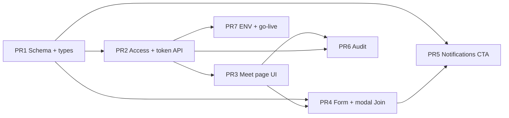

# Internal Video Meetings — Implementation Plan

**Дата:** 2026-06-17  
**Статус:** план внедрения — код, PR, commit, push, deploy **не выполняются**  
**Основа:** `INTERNAL_VIDEO_MEETINGS_MVP_SPEC`, `INTERNAL_VIDEO_MEETINGS_ARCHITECTURE.md`, `INTERNAL_VIDEO_MEETINGS_UI_WIREFRAMES.md`  
**Предусловие:** Calendar MVP + notifications в production (`009_calendar.sql`, `010_011`)

---

## Executive Summary

| Метрика | Значение |
|---------|----------|
| PR count | **7** |
| Новых migrations | **1** (`012_calendar_video_meetings.sql`) |
| Новых ENV | **3** (`LIVEKIT_URL`, `LIVEKIT_API_KEY`, `LIVEKIT_API_SECRET`) |
| Новых npm deps | **3** |
| Оценка | **~12–15 dev-days** (1 dev, unit tests + manual QA) |
| LiveKit plan (старт) | **Build — $0/mo** |

**Принцип:** каждый PR оставляет `main` рабочим (`npm test`, `npm run build`). LiveKit keys не обязательны до PR #3 smoke — token route возвращает **503**.

---

## Scope checklist (MVP spec)

| Требование | PR |
|------------|-----|
| Тип «Обычное / Видеовстреча» | #1, #4 |
| `room_name = sharp-spice-cal-{eventId}` | #1, #2 |
| Token API + ACL + time window | #2 |
| `/calendar/meet/[eventId]` | #3 |
| Camera / mic / screen / participants / leave | #3 |
| Join в event modal | #4 |
| Join в calendar notifications | #5 |
| Audit join/leave | #6 |
| ENV + go-live docs | #7 |

**Excluded:** recording, guests, chat, AI, breakout rooms.

---

## Граф зависимостей PR



**Merge order:** PR1 → PR2 → PR3 → PR4 → PR5 → PR6 → PR7

---

## Сводка по PR

| PR | Название | Schema | API | UI | Unit tests | LiveKit keys |
|----|----------|:------:|:---:|:--:|:----------:|:------------:|
| 1 | Schema + `video_meeting` | ✅ | — | — | ✅ | No |
| 2 | Access + token route | — | ✅ | — | ✅ | Optional |
| 3 | Meet page + LiveKit | — | — | ✅ | manual | **Yes** |
| 4 | Form + modal Join | — | — | ✅ | ✅ | No |
| 5 | Notification Join href | — | hook | ✅ | ✅ | No |
| 6 | Audit join/leave | — | ✅ | hook | ✅ | No |
| 7 | ENV + go-live doc | — | — | — | — | Doc |

---

## PR #1 — Schema, types, `video_meeting`

### Цель

Data layer: расширить `event_type`, audit table schema, TS types — **без UI и LiveKit**.

### Новые файлы

| Файл | Назначение |
|------|------------|
| `supabase/migrations/012_calendar_video_meetings.sql` | CHECK constraint + `calendar_meeting_audit` table |
| `src/lib/calendar/meeting.ts` | `getMeetingRoomName`, `isVideoMeeting` |
| `src/lib/calendar/meeting.test.ts` | Unit tests |

### Изменяемые файлы

| Файл | Изменение |
|------|-----------|
| `src/lib/calendar/types.ts` | `CALENDAR_EVENT_TYPES` += `video_meeting` |
| `src/lib/calendar/calendar-event-row-map.ts` | map `event_type` both ways |
| `src/lib/calendar/validation.ts` | accept `video_meeting` on create |
| `src/lib/calendar/form.ts` | `eventType` in form defaults |
| `src/lib/calendar/constants.ts` | optional RU labels |
| `src/lib/calendar/calendar-event-row-map.test.ts` | round-trip case |
| `src/lib/calendar/validation.test.ts` | type validation |
| `src/lib/calendar/form.test.ts` | default `general` |

### Риски

| Риск | Mitigation |
|------|------------|
| Migration not applied on staging | Checklist in PR description; SQL in Supabase before PR #3 |
| Existing rows violate CHECK | All rows `general` — safe |

### Тесты

- `meeting.test.ts` — room name format `sharp-spice-cal-{id}`
- `validation.test.ts` — reject unknown `eventType`
- `calendar-event-row-map.test.ts` — `video_meeting` round-trip

### Критерии приёмки

- [ ] `npm test` green
- [ ] `npm run build` green
- [ ] `CALENDAR_EVENT_TYPES` includes `video_meeting`
- [ ] Migration SQL reviewed (no token columns)

---

## PR #2 — Meeting access + token API

### Цель

Server ACL, time window, LiveKit JWT minting.

### Новые файлы

| Файл | Назначение |
|------|------------|
| `src/lib/calendar/meeting-access.ts` | window helpers, `assertCanJoinMeeting()` |
| `src/lib/calendar/meeting-access.test.ts` | window + ACL unit tests |
| `src/lib/calendar/meeting-token.ts` | `AccessToken` builder |
| `src/lib/calendar/meeting-token.test.ts` | grants, TTL mock |
| `src/app/api/calendar/events/[id]/meeting-token/route.ts` | POST handler |
| `src/app/api/calendar/events/[id]/meeting-token/route.test.ts` | handler tests (optional co-located) |

### Изменяемые файлы

| Файл | Изменение |
|------|-----------|
| `package.json` | + `livekit-server-sdk` |
| `package-lock.json` | lockfile |

### Риски

| Риск | Mitigation |
|------|------------|
| Secrets in logs | Never log token; redact in errors |
| Missing ENV breaks CI | 503 branch tested; build doesn't require keys |
| TTL > window | `min(3600, closesAt - now)` |
| Personal event IDOR | `canViewEvent` test cases |

### Тесты

- 401 without session cookie
- 404 unknown eventId
- 403 `general` event type
- 403 personal event — wrong user
- 403 before `opensAt` / after `closesAt`
- 200 in window — mock `AccessToken.toJwt()`
- 503 when `LIVEKIT_API_KEY` missing

### Критерии приёмки

- [ ] `assertCanJoinMeeting` covers all ACL checks from Architecture §4
- [ ] Response never includes API secret
- [ ] Token TTL ≤ meeting window end
- [ ] `npm test` green

---

## PR #3 — Meet page + LiveKit UI

### Цель

Страница `/calendar/meet/[eventId]` с mic/cam/screen/participants/leave.

### Новые файлы

| Файл | Назначение |
|------|------------|
| `src/app/(app)/calendar/meet/[eventId]/page.tsx` | Server: session + load event |
| `src/app/(app)/calendar/meet/[eventId]/loading.tsx` | Loading skeleton (optional) |
| `src/components/meet/CalendarMeetRoom.tsx` | Client LiveKit room |
| `src/components/meet/CalendarMeetRoom.module.css` | Layout |
| `src/components/meet/MeetingControlBar.tsx` | Controls |
| `src/components/meet/MeetingParticipantPanel.tsx` | Participants drawer |
| `src/components/meet/MeetingAccessGate.tsx` | Before/after window UI (§7, §8 wireframes) |
| `src/lib/calendar/meeting-client.ts` | Client-safe window helpers (no server imports) |

### Изменяемые файлы

| Файл | Изменение |
|------|-----------|
| `package.json` | + `livekit-client`, `@livekit/components-react` |
| `middleware.ts` | Verify `/calendar/meet/*` covered (already under `/calendar/:path*`) |

### Риски

| Рisk | Mitigation |
|------|------------|
| Bundle size | Dynamic import LiveKit on meet page only |
| iOS Safari WebRTC | Manual QA matrix (see Mobile section) |
| Screen share permission denied | Inline hint + retry |
| Token fetch race on fast navigation | AbortController on unmount |

### Тесты

- **Manual only** for WebRTC (no SFU mock in CI)
- Unit: `meeting-client.ts` window labels if extracted

### Критерии приёмки

- [ ] 2+ employees connect to same room on staging
- [ ] Mic/cam toggle works
- [ ] Screen share: entire screen / window / tab (Chrome)
- [ ] Participants list shows names from session
- [ ] Leave → redirect `/calendar?event={id}`
- [ ] Before window → §7 wireframe
- [ ] After window → §8 wireframe
- [ ] `npm run build` green

---

## PR #4 — Calendar form + event modal Join

### Цель

Create UX + Join CTA in event modal.

### Новые файлы

| Файл | Назначение |
|------|------------|
| `src/components/meet/MeetingJoinButton.tsx` | Shared Join with disabled states |
| `src/components/meet/MeetingJoinButton.module.css` | Styles |

### Изменяемые файлы

| Файл | Изменение |
|------|-----------|
| `src/components/calendar/CalendarEventForm.tsx` | Radio «Обычное / Видеовстреча» |
| `src/components/calendar/CalendarEventForm.module.css` | Format switch |
| `src/components/calendar/CalendarEventModal.tsx` | Room, status, Join |
| `src/components/calendar/CalendarEventModal.module.css` | Video badge, CTA block |
| `src/lib/calendar/handlers.ts` | Pass `eventType` on create |
| `src/lib/calendar/permissions-client.test.ts` | Join visibility (optional) |

### Риски

| Риск | Mitigation |
|------|------------|
| Edit changes eventType | UI read-only badge; API rejects patch |
| Join enabled outside window | Reuse `isWithinMeetingWindow` client-side |
| All-day + video | Disable all-day when video selected |

### Тесты

- `form.test.ts` — payload includes `eventType: video_meeting`
- `handlers.test.ts` — create with video type
- Snapshot/manual — modal states §2, §7, §8

### Критерии приёмки

- [ ] Manager creates «Видеовстреча» → modal shows room name + status
- [ ] Join navigates to `/calendar/meet/{id}` when in window
- [ ] Join disabled with hint before/after window
- [ ] Ordinary events unchanged
- [ ] `npm test` green

---

## PR #5 — Notifications «Присоединиться»

### Цель

Video meeting reminders link to meet page with CTA label.

### Новые файлы

| Файл | Назначение |
|------|------------|
| — | (no new files if extending existing) |

### Изменяемые файлы

| Файл | Изменение |
|------|-----------|
| `src/lib/notifications/calendar-reminder-copy.ts` | Encode/decode `isVideoMeeting` flag |
| `src/lib/notifications/calendar-reminder-copy.test.ts` | Video encoding cases |
| `src/lib/notifications/navigation.ts` | `getNotificationHref` → `/calendar/meet/` |
| `src/lib/notifications/navigation.test.ts` | Updated href assertions |
| `src/lib/calendar/reminders-cron.ts` | Pass event to copy builder (if not already) |
| `src/lib/notifications/emit.ts` | Verify eventType in pipeline |
| `src/components/notifications/NotificationBell.tsx` | Label «Присоединиться» for video |
| `src/components/notifications/NotificationProvider.tsx` | Toast CTA label (optional) |

### Риски

| Риск | Mitigation |
|------|------------|
| Old notifications break | Backward compatible decode (missing flag → calendar link) |
| Reminder fires outside meet window | OK — user sees §7b gate on meet page |
| Double separator in message | Unit test encode/decode round-trip |

### Тесты

- `calendar-reminder-copy.test.ts` — `video_meeting` → flag `1`
- `navigation.test.ts` — href `/calendar/meet/evt_x`
- Legacy message without flag → `/calendar?event=`

### Критерии приёмки

- [ ] New reminder for video event → bell shows «Присоединиться»
- [ ] Click → `/calendar/meet/{eventId}`
- [ ] General event reminders unchanged
- [ ] `npm test` green

---

## PR #6 — Audit trail join/leave

### Цель

Persist audit rows per spec.

### Новые файлы

| Файл | Назначение |
|------|------------|
| `src/lib/supabase/calendar-meeting-audit-repo.ts` | Insert audit rows |
| `src/app/api/calendar/events/[id]/meeting-audit/route.ts` | POST handler |
| `src/app/api/calendar/events/[id]/meeting-audit/route.test.ts` | Handler tests |

### Изменяемые файлы

| Файл | Изменение |
|------|-----------|
| `src/components/meet/CalendarMeetRoom.tsx` | POST joined on connect, left on leave |
| `src/lib/calendar/meeting-access.ts` | `assertCanAudit` variant (joined in-window; left always if was in room) |

### Риски

| Риск | Mitigation |
|------|------------|
| Duplicate `joined` on reconnect | Accept multiple rows (audit truth) or debounce client-side |
| `beforeunload` drops `left` | `navigator.sendBeacon` fallback |
| Audit without token permission | Same ACL as token except time for `left` |

### Тесты

- Handler 401/403/404
- Handler 201 inserts row (mock repo)
- Repo insert shape matches schema

### Критерии приёмки

- [ ] After test call: rows in `calendar_meeting_audit` with correct `user_id`, `action`
- [ ] No token values in audit table
- [ ] `npm test` green

---

## PR #7 — ENV, go-live documentation

### Цель

Operational readiness for production.

### Новые файлы

| Файл | Назначение |
|------|------------|
| `INTERNAL_VIDEO_MEETINGS_GO_LIVE.md` | LiveKit project setup, Vercel env, smoke test |

### Изменяемые файлы

| Файл | Изменение |
|------|------------|
| `.env.example` | `LIVEKIT_*` block with comments |
| `README.md` | Link to go-live doc |

### Риски

| Риск | Mitigation |
|------|------------|
| Keys only in dev, not prod | Checklist: Vercel Production env |
| Wrong LiveKit region | Document EU selection |
| Keys committed | `.env.example` placeholders only |

### Тесты

- Documentation review (no automated tests)

### Критерии приёмки

- [ ] Owner can configure LiveKit + Vercel without developer
- [ ] Smoke test checklist: 2-user call + screen share
- [ ] `.env.example` documents all 3 vars

---

## ENV summary

```bash
# LiveKit Cloud — server only (Vercel Production)
LIVEKIT_URL=wss://your-project.livekit.cloud
LIVEKIT_API_KEY=
LIVEKIT_API_SECRET=
```

**Не добавлять:** `NEXT_PUBLIC_LIVEKIT_*`, recording keys, webhook secrets.

---

## Migration apply order

| Order | File | Status |
|-------|------|--------|
| 1 | `009_calendar.sql` | Applied |
| 2 | `010_011_calendar_notifications_apply.sql` | Applied |
| 3 | **`012_calendar_video_meetings.sql`** | Before PR #3 staging smoke |

---

## Стоимость LiveKit Build (команда Sharp & Spice)

**Источник:** [livekit.io/pricing](https://livekit.com/pricing) — проверять перед go-live.

### Текущая команда

| Параметр | Значение |
|----------|----------|
| Сотрудники | ~4 (1 owner + 3 managers) |
| Concurrent calls | 1–2 комнаты, ≤4 участника |
| Типичная встреча | 30–60 мин |

### Build plan (free) — лимиты

| Лимит | Build | Достаточно? |
|-------|-------|-------------|
| WebRTC participant-minutes/mo | **5 000** | ✅ при умеренном использовании |
| Concurrent connections | **100** | ✅ (используем ≤4) |
| Recording | Нет included | N/A (MVP без записи) |

### Расчёт participant-minutes

**Формула:** `встречи × длительность_мин × среднее_число_участников`

| Сценарий | Расчёт | Минут/мес |
|----------|--------|-----------|
| **Базовый** | 16 встреч × 30 мин × 3 чел. | **1 440** |
| **Активный** | 40 встреч × 45 мин × 4 чел. | **7 200** ⚠️ |
| **Пиковый** | 60 встреч × 60 мин × 4 чел. | **14 400** ⚠️ |

Screen share **не тарифицируется отдельно** — входит в WebRTC minutes.

### Когда переходить на платный тариф

| Триггер | План | Цена | Действие |
|---------|------|------|----------|
| **> ~5 000 participant-min/mo** стабильно | **Ship** | **$50/mo** | 150 000 min included |
| Нужна **запись** в Phase 2 | Ship | $50/mo | 5 000 recording min included |
| **> 150 000 min/mo** | Scale | $500/mo | Нереалистично для 4 чел. |

**Рекомендация для MVP:** остаться на **Build ($0)** минимум 3–6 месяцев. Мониторить dashboard LiveKit еженедельно первый месяц.

**Ориентир перехода на Ship:** sustained **> 80–100 video-часов/мес** (participant-minutes > 5 000) **или** запуск recording.

### Итоговая стоимость MVP (месяц)

| Статья | Стоимость |
|--------|-----------|
| LiveKit Build | **$0** |
| Vercel (existing) | $0 (Hobby) / existing plan |
| Supabase (existing) | $0 / existing plan |
| **Итого incremental** | **$0/mo** на MVP |

---

## Риски Vercel + LiveKit

| Риск | Вероятность | Impact | Mitigation |
|------|-------------|--------|------------|
| **Vercel serverless cold start** на token API | Средняя | +200–800 ms первый join | Acceptable для internal; optional warm ping post-go-live |
| **Vercel execution timeout** (10s Hobby) | Низкая | Token mint <1s | OK |
| **LiveKit Cloud outage** | Низкая | Meet unavailable | Status page; fallback «перенести встречу» manual |
| **Missing ENV on Production** | Средняя | 503 on join | PR #7 go-live checklist |
| **Token mint error misconfigured secret** | Средняя | Connect fail | Staging smoke before prod |
| **CORS / cookie** on API | Низкая | Same-origin Next.js | No cross-origin |
| **Build plan quota exceeded** | Низкая–средняя | Hard stop mid-month | Monitor dashboard; upgrade to Ship |
| **EU data residency** | Low for internal | Compliance | Select EU region in LiveKit project |
| **No long-running on Vercel** | N/A | By design | All media on LiveKit |

**Архитектурный вывод:** связка Vercel + LiveKit **корректна** — Vercel только stateless token/audit; media never hits Vercel.

---

## Мобильная поддержка (iOS / Android)

### Подход MVP

Web-first через PWA / mobile browser — **без native apps**.

| Платформа | Бrowser | Video/audio | Screen share | Рекомендация |
|-----------|---------|:-----------:|:------------:|--------------|
| **iOS** | Safari 17+ | ✅ | ⚠️ Ограничено | Primary test target |
| **iOS** | Chrome iOS | ✅ (WebKit) | ⚠️ Same as Safari | Test |
| **Android** | Chrome | ✅ | ✅ | Good |
| **Android** | Samsung Internet | ✅ | ✅ | Spot check |
| **Desktop** | Chrome / Edge | ✅ | ✅ | Primary |

### iOS Safari — известные ограничения

| Feature | Ограничение | MVP handling |
|---------|-------------|--------------|
| Screen share | iOS 16.4+ only; tab share limited | Show hint if unsupported |
| Background tab | Audio may pause | «Не сворачивайте вкладку» |
| Autoplay | Requires user gesture for mic/cam | Connect after explicit Join click |
| PWA standalone | Works; permissions per session | Test add-to-home-screen |

### Android

Generally **better** screen share support than iOS. Chrome `getDisplayMedia` supports screen/window/tab.

### Test matrix (manual, PR #3 exit)

| # | Device | Case | Pass criteria |
|---|--------|------|---------------|
| 1 | iPhone Safari | Join + mic + cam | 2-way audio/video |
| 2 | iPhone Safari | Screen share | Works or graceful «не поддерживается» |
| 3 | Android Chrome | Join + screen share | Share visible to desktop |
| 4 | Desktop Chrome | 3 participants + share | Layout OK |
| 5 | PWA installed | Join from notification | Opens meet page |

**MVP bar:** desktop Chrome **must pass**; iOS **best-effort** (join + A/V required; screen share nice-to-have with fallback message).

---

## Timeline (1 developer)

| Week | PRs | Milestone |
|------|-----|-----------|
| 1 | #1, #2 | Token API returns JWT on staging |
| 2 | #3, #4 | First internal call from calendar modal |
| 3 | #5, #6, #7 | Notifications + audit + production go-live |

---

## Definition of Done (MVP release)

- [ ] Migration `012` applied on production Supabase
- [ ] LiveKit Build project + ENV on Vercel Production
- [ ] Manager creates «Видеовстреча» → Join → 2+ employees connect
- [ ] Screen share works on desktop Chrome
- [ ] iOS Safari: join + A/V verified (manual)
- [ ] Reminder → «Присоединиться» → meet page
- [ ] Audit rows for join/leave
- [ ] 403 for unauthenticated / wrong user / outside window
- [ ] No guest access
- [ ] `npm test` + `npm run build` green on `main`

---

## Post-MVP backlog

| Item | Phase |
|------|-------|
| Recording → Supabase Storage | 2 |
| LiveKit Ship upgrade | When > 5k min/mo |
| Waiting room | 2 |
| `calendar_event_participants` | 2 |
| Video icon on calendar chips | polish |
| 15-min reminder offset | calendar backlog |

---

*План согласован с `INTERNAL_VIDEO_MEETINGS_MVP_SPEC`. Код и PR — только после явного запроса.*
