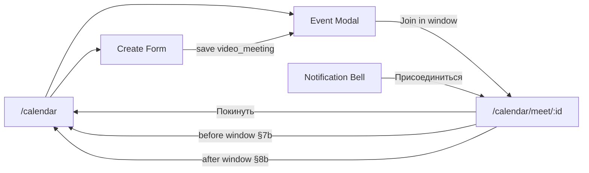

# Internal Video Meetings — UI Wireframes

**Дата:** 2026-06-17  
**Статус:** wireframes для MVP — код не создаётся  
**Основа:** `INTERNAL_VIDEO_MEETINGS_MVP_SPEC`, `INTERNAL_VIDEO_MEETINGS_ARCHITECTURE.md`  
**Стиль:** dark UI календаря (Sora/Inter, card `#2d3748`, accent rose primary)

---

## Общие принципы

| Принцип | Реализация |
|---------|------------|
| Язык | Русский |
| Роли | owner и manager — одинаковый UI meet |
| Mobile | Bottom control bar, stacked tiles |
| PWA | Meet page без sidebar (immersive) |
| a11y | `aria-label` на mic/cam/share/leave |

---

## 1. Создание видеовстречи

**Context:** modal «Новое событие» — менеджер выбирает формат до save.

```
┌─────────────────────────────────────────────────────────────┐
│  Новое событие                                         [×]  │
├─────────────────────────────────────────────────────────────┤
│  Область                                                    │
│  ( ● Личное )  ( ○ Компания )                               │
├─────────────────────────────────────────────────────────────┤
│  Формат встречи                                             │
│  ┌─────────────────────┐  ┌─────────────────────┐          │
│  │ ○ Обычное событие   │  │ ◉ Видеовстреча      │          │
│  └─────────────────────┘  └─────────────────────┘          │
│                                                             │
│  ℹ  Комната создаётся на платформе Sharp & Spice.           │
│     Ссылка для клиентов не генерируется.                    │
├─────────────────────────────────────────────────────────────┤
│  Название *     [ Синк команды________________ ]            │
│  Дата / время   [ 25 июн 2026 ] [ 10:00 ] – [ 10:30 ]      │
│  Место          [ Онлайн_______________________ ]  optional │
│  Описание       [ _____________________________ ]          │
│  ☑ Напоминания (24 ч и за 1 ч)                              │
├─────────────────────────────────────────────────────────────┤
│                          [ Отмена ]  [ Создать ]            │
└─────────────────────────────────────────────────────────────┘
```

**После save (toast / redirect):**

```
✓  Событие создано. Комната: sharp-spice-cal-evt_abc123
```

**Правила UX:**

- `eventType` — **только при create**; при edit — read-only badge «Видеовстреча»
- All-day toggle **disabled** когда выбрана «Видеовстреча» (рекомендация MVP)
- Нет поля «ссылка Zoom/Meet»

---

## 2. Карточка события (modal просмотра)

**Context:** видеовстреча «Синк команды» — in-window (статус «Открыта»).

```
┌─────────────────────────────────────────────────────────────┐
│  [×]                                                        │
│  ┌──────────────┐  ┌─────────┐                              │
│  │ Видеовстреча │  │ Компания│                              │
│  └──────────────┘  └─────────┘                              │
│  Синк команды                                               │
├─────────────────────────────────────────────────────────────┤
│  ВРЕМЯ         среда, 25 июня 2026 · 10:00 – 10:30         │
│  КОМНАТА       sharp-spice-cal-evt_abc123                   │
│  СТАТУС        ● Открыта                                    │
│  МЕСТО         Онлайн                                       │
│  АВТОР         Злата                                        │
│  НАПОМИНАНИЯ   Включены                                     │
├─────────────────────────────────────────────────────────────┤
│  ┌─────────────────────────────────────────────────────┐    │
│  │  ▶  Присоединиться к видеовстрече                   │    │
│  └─────────────────────────────────────────────────────┘    │
│  Обсудим статус по клиентам.                                │
├─────────────────────────────────────────────────────────────┤
│  [ Редактировать ]  [ Удалить ]           [ Закрыть ]       │
└─────────────────────────────────────────────────────────────┘
```

**Обычное событие (сравнение):** нет строк КОМНАТА / СТАТУС / кнопки Join.

| Badge | Цвет |
|-------|------|
| Видеовстреча | `#6366F1` (indigo) |
| Статус «Открыта» | `#22C55E` |
| Статус «Ожидание» | `#94A3B8` |
| Статус «Завершена» | `#64748B` |

---

## 3. Кнопка «Присоединиться»

### 3a. Primary (modal) — active

Full-width rose button с иконкой `fa-video` — см. §2.

### 3b. Notification bell

```
┌──────────────────────────────────────────┐
│ 📅  Напоминание: через 1 час              │
│     10:00 – 10:30 — Синк команды          │
│     ┌──────────────────────────────┐      │
│     │      Присоединиться          │      │
│     └──────────────────────────────┘      │
│                                      [×] │
└──────────────────────────────────────────┘
```

**Href:** `/calendar/meet/evt_abc123`

### 3c. Toast (optional)

На страницах кроме `/calendar` — toast с тем же CTA «Присоединиться».

---

## 4. Экран видеозвонка

**Route:** `/calendar/meet/[eventId]` — active call, 3 участника, screen share off.

```
┌─────────────────────────────────────────────────────────────┐
│ ← Выйти          Синк команды · 10:00–10:30        [👥 3]   │
├─────────────────────────────────────────────────────────────┤
│                                                             │
│   ┌─────────────────────┐  ┌─────────────────────┐          │
│   │                     │  │                     │          │
│   │   Злата             │  │   Вероника          │          │
│   │   🎤 📷             │  │   🎤 📷             │          │
│   └─────────────────────┘  └─────────────────────┘          │
│                                                             │
│   ┌─────────────────────┐                                   │
│   │   Юля               │                                   │
│   │   🎤 📷             │                                   │
│   └─────────────────────┘                                   │
│                                                             │
├─────────────────────────────────────────────────────────────┤
│  [ 🎤 ]  [ 📷 ]  [ 🖥 ]  [ 👥 ]              [ Покинуть ]    │
└─────────────────────────────────────────────────────────────┘
```

**Loading:**

```
        ◌  Подключение к видеовстрече…
```

**Mobile:**

```
┌──────────────────────┐
│ ←  Синк · 👥 3       │
├──────────────────────┤
│  [ active speaker    ]│
│  [ tile ] [ tile ]   │
├──────────────────────┤
│ 🎤 📷 🖥 👥 Покинуть │
└──────────────────────┘
```

---

## 5. Screen sharing

### 5a. Control bar — idle

```
[ 🖥 ]   outline, tooltip: «Поделиться экраном»
```

### 5b. Browser picker (native — не custom UI)

```
┌ Chrome — Выберите, чем поделиться ─────────┐
│  ○ Весь экран                              │
│  ◉ Окно — Excel                            │
│  ○ Вкладка — Sharp & Spice                 │
│              [ Поделиться ]  [ Отмена ]    │
└────────────────────────────────────────────┘
```

### 5c. Active share — local user

```
┌─────────────────────────────────────────────────────────────┐
│ ← Выйти          Синк команды                    [👥 3]     │
├─────────────────────────────────────────────────────────────┤
│  ┌───────────────────────────────────────────────┐          │
│  │  🖥  Вы — демонстрация экрана                │          │
│  │         (large 16:9 dominant tile)            │          │
│  └───────────────────────────────────────────────┘          │
│  [Злата] [Вероника] [Юля]  ← filmstrip cameras              │
├─────────────────────────────────────────────────────────────┤
│  [ 🎤 ]  [ 📷 ]  [ 🖥● ]  [ 👥 ]              [ Покинуть ]  │
└─────────────────────────────────────────────────────────────┘
```

### 5d. Remote share

```
Subtle top banner:
  «Вероника демонстрирует экран»
```

Tooltip (first use): «Выберите экран, окно или вкладку в диалоге браузера».

---

## 6. Список участников

**Trigger:** кнопка `👥` или count в top bar.

```
                    ┌─────────────────────────┐
                    │  Участники (3)     [×]  │
                    ├─────────────────────────┤
                    │  🟢 Злата      (Вы)     │
                    │     🎤 вкл · 📷 вкл     │
                    ├─────────────────────────┤
                    │  🟢 Вероника            │
                    │     🎤 вкл · 📷 вкл     │
                    ├─────────────────────────┤
                    │  🟢 Юля                 │
                    │     🎤 выкл · 📷 вкл    │
                    ├─────────────────────────┤
                    │  ℹ Только сотрудники    │
                    │    платформы            │
                    └─────────────────────────┘
```

| Поведение | MVP |
|-----------|-----|
| Desktop | Drawer справа |
| Mobile | Bottom sheet |
| Kick / mute others | **Нет** |
| Guest indicator | **Нет** (все authenticated) |

---

## 7. Состояние до начала встречи

**Context:** событие 10:00, сейчас 09:30 — окно откроется в 09:45.

### 7a. Event modal

```
┌─────────────────────────────────────────────────────────────┐
│  ...                                                        │
│  СТАТУС        ○ Ожидание                                   │
├─────────────────────────────────────────────────────────────┤
│  ┌─────────────────────────────────────────────────────┐    │
│  │  ▶  Присоединиться к видеовстрече    [ DISABLED ]  │    │
│  └─────────────────────────────────────────────────────┘    │
│  Откроется за 15 мин до начала (09:45)                      │
└─────────────────────────────────────────────────────────────┘
```

### 7b. Direct URL `/calendar/meet/evt_abc123` (до окна)

```
┌─────────────────────────────────────────────────────────────┐
│                                                             │
│   ⏳  Встреча ещё не открыта                                │
│                                                             │
│   Вход возможен за 15 минут до начала.                      │
│   Начало: 25 июня 2026, 10:00                               │
│   Откроется: 09:45                                          │
│                                                             │
│   [ Вернуться к событию ]                                   │
│                                                             │
└─────────────────────────────────────────────────────────────┘
```

### 7c. Notification до окна

Bell item ведёт на meet page → показывается §7b (не silent fail).

---

## 8. Состояние после завершения встречи

**Context:** событие ended 10:30, grace до 10:45 прошёл — сейчас 11:00.

### 8a. Event modal

```
┌─────────────────────────────────────────────────────────────┐
│  ...                                                        │
│  СТАТУС        ✓ Завершена                                   │
├─────────────────────────────────────────────────────────────┤
│  ┌─────────────────────────────────────────────────────┐    │
│  │  ▶  Присоединиться к видеовстрече    [ DISABLED ]  │    │
│  └─────────────────────────────────────────────────────┘    │
│  Встреча завершена                                          │
└─────────────────────────────────────────────────────────────┘
```

### 8b. Direct URL после окна

```
┌─────────────────────────────────────────────────────────────┐
│                                                             │
│   ✓  Встреча завершена                                      │
│                                                             │
│   Окно доступа закрыто (окончание + 15 мин).                │
│                                                             │
│   [ Открыть событие в календаре ]                           │
│                                                             │
└─────────────────────────────────────────────────────────────┘
```

### 8c. API

`POST meeting-token` → **403** `{ error: "Meeting window closed" }`

---

## Navigation map



---

## Component inventory

| Wireframe | Component |
|-----------|-----------|
| §1 Create | `CalendarEventForm.tsx` |
| §2–3, §7–8 Modal | `CalendarEventModal.tsx`, `MeetingJoinButton.tsx` |
| §4 Meet | `CalendarMeetRoom.tsx`, `MeetingControlBar.tsx` |
| §5 Screen | LiveKit `TrackToggle` ScreenShare |
| §6 Participants | `MeetingParticipantPanel.tsx` |
| §7–8 Gates | `MeetingAccessGate.tsx` (optional wrapper) |

---

*Wireframes — ориентир для PR #3–#5. Pixel polish — после MVP smoke.*
