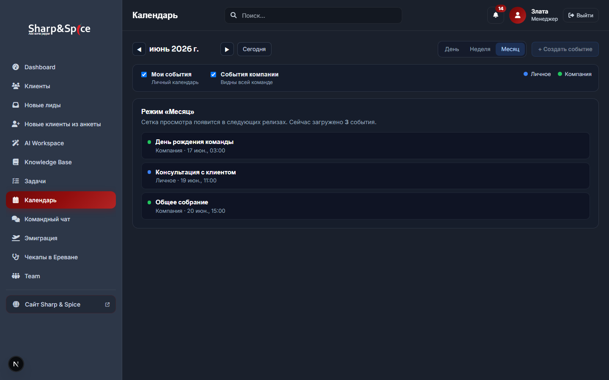
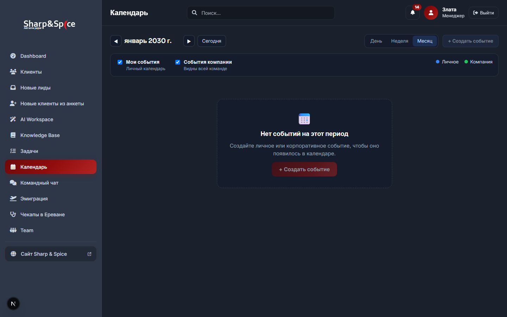
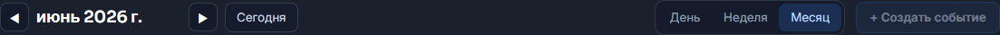
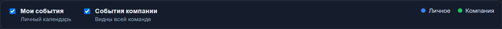
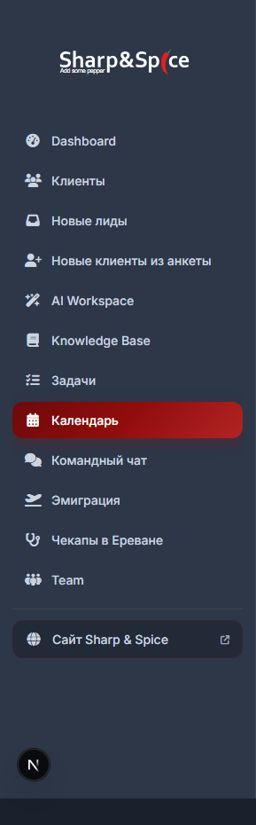

# Report — Calendar PR #4 UI Preview

**Дата:** 2026-06-22  
**PR:** #4 (`c813f45`) — navigation, page shell, toolbar, filters, data fetch  
**Среда:** `npm run dev` локально, `http://localhost:3000`  
**Пользователь в превью:** Злата (`manager-1`, role `manager`)  
**Статус:** визуальная проверка UI — **не коммитилось**

---

## Executive Summary

| Экран | Статус | Скриншот |
|-------|--------|----------|
| Страница `/calendar` (с mock events) | ✅ | `reports/pr4-ui-preview/01-calendar-page.png` |
| Empty state | ✅ | `reports/pr4-ui-preview/05-empty-state.png` |
| Toolbar | ✅ | `reports/pr4-ui-preview/02-toolbar.png` |
| Фильтры + легенда | ✅ | `reports/pr4-ui-preview/03-filters.png` |
| Меню с пунктом «Календарь» | ✅ | `reports/pr4-ui-preview/04-sidebar-calendar-nav.png` |

**Вердикт:** PR #4 shell соответствует wireframes. Month/Week/Day grid **намеренно отсутствует** — вместо сетки показывается placeholder со списком загруженных событий.

---

## Как запускалось превью

```text
1. npm run dev  →  http://localhost:3000
2. Mock data    →  .data/calendar-events.json (3 события, gitignored)
3. JSON fallback →  временный .env.development.local с пустыми SUPABASE_* 
                     (миграция 009 не применена; иначе API возвращает [])
4. Скриншоты    →  scripts/capture-pr4-ui-preview.mjs (Playwright, headless)
```

### Mock events (локально, не в git)

| # | Title | Scope | Даты |
|---|-------|-------|------|
| 1 | День рождения команды | company | 17.06.2026, all-day |
| 2 | Консультация с клиентом | personal (manager-1) | 19.06.2026 10:00–11:00 |
| 3 | Общее собрание | company | 20.06.2026 14:00–15:00 |

---

## 1. Страница `/calendar`



**Что видно:**

- `AppShell`: sidebar + topbar «Календарь»
- Toolbar: навигация **июнь 2026**, переключатель **Месяц** active
- Фильтры: оба слоя включены
- Placeholder: «Режим «Месяц»» + «Сейчас загружено 3 события»
- Список событий с цветовыми точками: синий (личное), зелёный (компания)
- Кнопка **+ Создать событие** — disabled (CRUD UI в PR #8)

**API запрос (Network):**

```http
GET /api/calendar/events?from=2026-05-24T22:00:00.000Z&to=2026-07-07T22:00:00.000Z
→ 200 { events: [3 items] }
```

---

## 2. Empty state



**Условие:** `?view=month&date=2030-01-01` — диапазон без событий.

**Что видно:**

- Заголовок: «Нет событий на этот период»
- Подзаголовок + CTA «+ Создать событие» (disabled)
- Toolbar и фильтры остаются на месте

---

## 3. Toolbar



| Элемент | Поведение в PR #4 |
|---------|-------------------|
| ◀ / ▶ | Сдвиг anchor (месяц / неделя / день) |
| Период | «июнь 2026 г.» (RU locale, TZ Zagreb) |
| Сегодня | Сброс на текущую дату |
| День / Неделя / Месяц | Переключение `view` + URL `?view=` |
| + Создать событие | Rendered, disabled до PR #8 |

---

## 4. Фильтры



| Фильтр | Query `scopes` | Default |
|--------|----------------|---------|
| ☑ Мои события | `personal` | on |
| ☑ События компании | `company` | on |

- Легенда справа: **● Личное** (синий), **● Компания** (зелёный)
- Состояние сохраняется в `localStorage` key `calendar:layers`
- При снятии обоих чекбоксов — предупреждение, fetch не выполняется

---

## 5. Меню после добавления Calendar



| Параметр | Значение |
|----------|----------|
| Label | Календарь |
| Icon | `fa-calendar-days` |
| href | `/calendar` |
| Позиция | После «Задачи», перед «Командный чат» |
| Роли | `owner`, `manager` |
| Active state | Красный highlight (как у других разделов) |

---

## Соответствие wireframes (`CALENDAR_UI_WIREFRAMES.md`)

| Wireframe элемент | PR #4 |
|-------------------|-------|
| Toolbar: ◀ ▶ Сегодня, view switch | ✅ |
| Filters: Мои / Компания | ✅ |
| Legend синий/зелёный | ✅ |
| Month grid | ⏳ PR #6 |
| Week grid | ⏳ PR #7 |
| Day agenda | ⏳ PR #5 |
| Event modal / CRUD | ⏳ PR #8 |
| CRM linkage block | ⏳ Phase 2 (зарезервировано в wireframes) |

---

## Известные ограничения превью

| # | Ограничение | Примечание |
|---|-------------|------------|
| 1 | Supabase без миграции `009_calendar.sql` | API через Supabase возвращает `[]`; для демо использован JSON fallback |
| 2 | Placeholder вместо grid | Ожидаемо для PR #4 |
| 3 | «+ Создать событие» disabled | CRUD UI — PR #8 |
| 4 | Скриншоты headless Chromium 1440×900 | Desktop viewport |

---

## Файлы превью (не в git)

```text
reports/pr4-ui-preview/
  01-calendar-page.png
  02-toolbar.png
  03-filters.png
  04-sidebar-calendar-nav.png
  05-empty-state.png
  05-empty-state-card.png

.data/calendar-events.json          ← mock data (gitignored)
scripts/capture-pr4-ui-preview.mjs  ← capture script (untracked)
.env.development.local              ← удалён после capture (gitignored)
```

---

## Следующий шаг

**PR #5:** Day view (`CalendarDayAgenda`, `CalendarEventChip`, URL sync для day mode).
