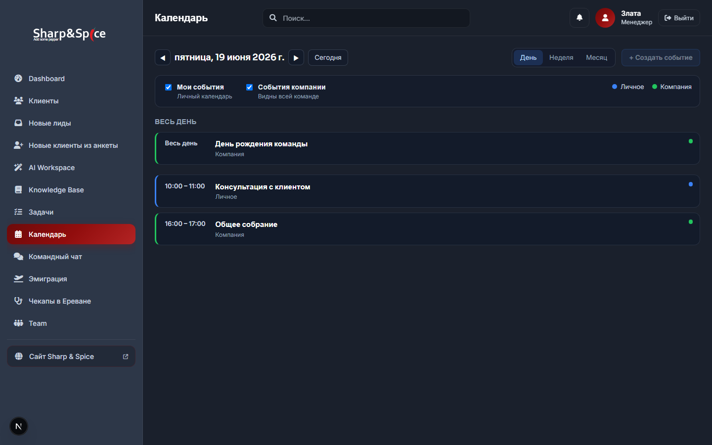
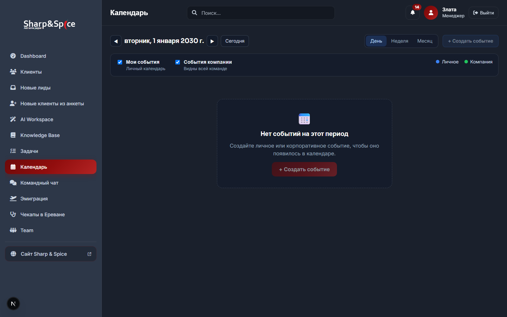

# Report — Calendar PR #5 (Day View)

**Дата:** 2026-06-22  
**PR:** #5 из `CALENDAR_IMPLEMENTATION_PLAN.md`  
**Scope:** Day view (agenda) — read-only  
**Зависит от:** PR #3 (API), PR #4 (shell)

---

## Результат

| Критерий | Статус |
|----------|--------|
| Agenda выбранного дня | ✅ |
| Сортировка по `startAt` | ✅ |
| Время + название + scope | ✅ |
| Цвета personal/company | ✅ синий `#3B82F6` / зелёный `#22C55E` |
| Пустой день | ✅ `CalendarEmptyState` |
| Навигация ◀ ▶ / Сегодня | ✅ через toolbar + URL |
| All-day секция сверху | ✅ |
| Unit tests | ✅ 7 новых |
| `npm run build` | ✅ |
| `npm test` | ✅ 109/109 |

**Не в scope:** week/month grid, CRUD, AI, CRM, notifications.

---

## Новые файлы (7)

| Файл | Назначение |
|------|------------|
| `src/lib/calendar/format.ts` | Форматирование времени, scope, partition/sort |
| `src/lib/calendar/format.test.ts` | Unit tests |
| `src/components/calendar/CalendarDayAgenda.tsx` | Agenda-список дня |
| `src/components/calendar/CalendarDayAgenda.module.css` | Стили agenda |
| `src/components/calendar/CalendarEventChip.tsx` | Карточка события |
| `src/components/calendar/CalendarEventChip.module.css` | Стили chip (цвет по scope) |
| `REPORT_PR5_DAY_VIEW.md` | Этот отчёт |

---

## Изменённые файлы (2)

| Файл | Изменение |
|------|-----------|
| `src/components/calendar/CalendarView.tsx` | `view === "day"` → `CalendarDayAgenda` |
| `package.json` | +`format.test.ts` в `npm test` |

---

## Архитектура

```
CalendarView (view === "day")
  └── CalendarDayAgenda
        ├── section "Весь день" → CalendarEventChip (allDay)
        └── section "Расписание дня" → CalendarEventChip (timed, sorted)
              format.ts: partitionDayAgenda, formatEventTimeRange, formatScopeLabel
```

### Отображение события (`CalendarEventChip`)

| Поле | Источник |
|------|----------|
| Время | `formatEventTimeRange` → `10:00 – 11:00` или `Весь день` |
| Название | `event.title` |
| Scope | `formatScopeLabel` → «Личное» / «Компания» |
| Цвет | `scope === personal` → синяя полоска; `company` → зелёная |

### URL и fetch

| View | URL | API range |
|------|-----|-----------|
| Day | `?view=day&date=YYYY-MM-DD` | `getRangeForView("day")` → 00:00–23:59 TZ Zagreb |

◀ / ▶ в day mode сдвигают `anchorDate` на ±1 день и перезапрашивают API.

### Пустой день

`events.length === 0` после fetch → `CalendarEmptyState` (как в PR #4).

---

## UI Preview

### Day view с событиями (19.06.2026)



- Секция **Весь день**: «День рождения команды» (зелёный, company)
- **10:00 – 11:00**: «Консультация с клиентом» (синий, personal)
- **16:00 – 17:00**: «Общее собрание» (зелёный, company)
- Toolbar: **День** active, label «пятница, 19 июня 2026 г.»

### Пустой день (01.01.2030)



---

## Тесты

```
npm test → 109/109 passed (+7 format tests)
npm run build → success
```

### Новые тесты (`format.test.ts`)

| Suite | Cases |
|-------|-------|
| `formatScopeLabel` | personal / company |
| `formatEventTimeRange` | all-day, timed range |
| `sortEventsByStartAt` | ascending by `startAt` |
| `partitionDayAgenda` | allDay vs timed groups |
| `eventsForDay` | overlap filter by date key |

---

## Diff summary

```
 package.json                                      |   2 +-
 src/components/calendar/CalendarView.tsx           |   3 +++
 src/lib/calendar/format.ts                         |  68 +++
 src/lib/calendar/format.test.ts                    |  98 +++
 src/components/calendar/CalendarDayAgenda.tsx      |  44 +++
 src/components/calendar/CalendarDayAgenda.module.css |  28 ++
 src/components/calendar/CalendarEventChip.tsx       |  37 +++
 src/components/calendar/CalendarEventChip.module.css |  58 +++
 REPORT_PR5_DAY_VIEW.md                            | (this file)
```

**~338 строк** нового кода (без отчёта).

---

## SAFE TO COMMIT

| Проверка | Статус |
|----------|--------|
| Scope = Day view only | ✅ |
| Build green | ✅ |
| Tests 109/109 | ✅ |
| Нет секретов | ✅ |
| CRUD / week / month не затронуты | ✅ |
| Chip click — no-op (modal PR #8) | ✅ |

**Вердикт: SAFE TO COMMIT**

---

## Следующий шаг

**PR #6:** Month view grid (`CalendarMonthGrid`, `month.ts`).
