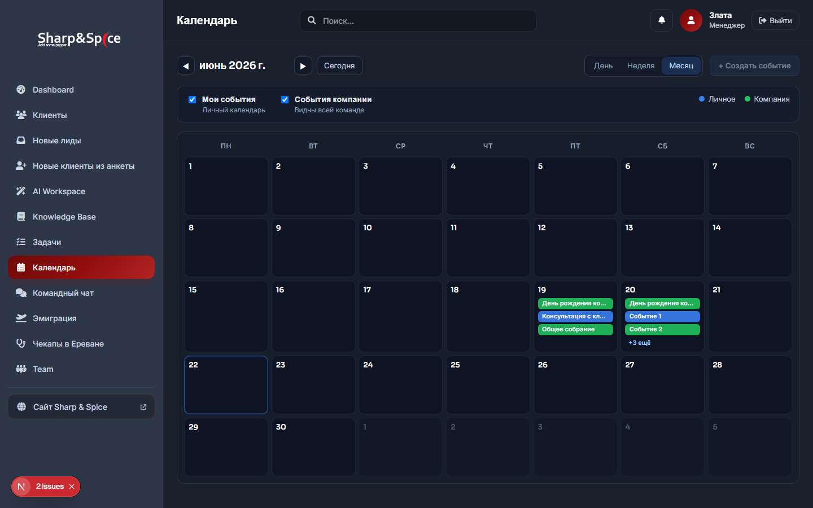
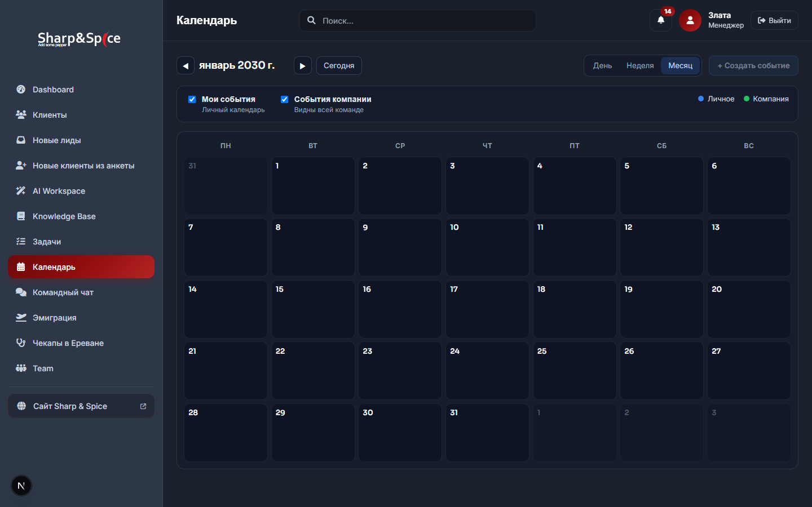
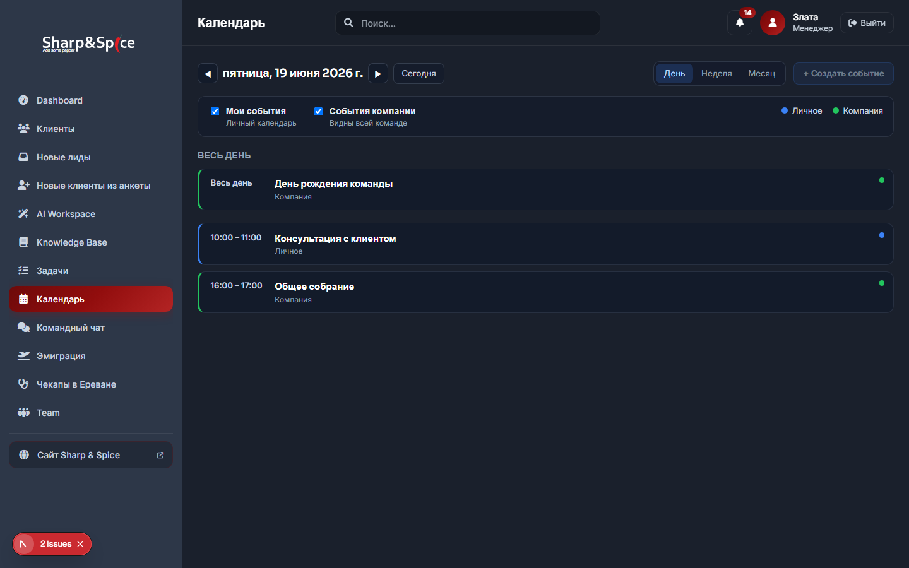

# Report — Calendar PR #6 (Month View)

**Дата:** 2026-06-22  
**PR:** #6 из `CALENDAR_IMPLEMENTATION_PLAN.md`  
**Scope:** Month view — grid, navigation, read-only  
**Зависит от:** PR #3 (API), PR #4 (shell), PR #5 (`CalendarEventChip`)

---

## Результат

| Критерий | Статус |
|----------|--------|
| Полноценная сетка месяца (Пн–Вс) | ✅ |
| События внутри дней (`CalendarEventChip` variant `month`) | ✅ |
| Цвета personal / company | ✅ синий `#3B82F6` / зелёный `#22C55E` |
| Дни без событий | ✅ |
| Overflow «+N ещё» (max 3 chips) | ✅ |
| Клик по дню → Day View | ✅ |
| Today highlight | ✅ |
| Навигация ◀ / ▶ / Сегодня | ✅ через toolbar (PR #4) |
| Unit tests | ✅ 5 новых |
| `npm run build` | ✅ |
| `npm test` | ✅ 114/114 |

**Не в scope:** Week view, CRUD, drag & drop, AI, CRM, notifications.

---

## Новые файлы (7)

| Файл | Назначение |
|------|------------|
| `src/lib/calendar/month.ts` | `buildMonthMatrix`, `partitionMonthDayEvents`, weekday labels |
| `src/lib/calendar/month.test.ts` | Unit tests для matrix и overflow |
| `src/components/calendar/CalendarMonthGrid.tsx` | Сетка месяца + клик по дню |
| `src/components/calendar/CalendarMonthGrid.module.css` | Стили grid / today / overflow |
| `scripts/capture-pr6-month-view.mjs` | Playwright-скриншоты (локально, не в git) |
| `REPORT_PR6_MONTH_VIEW.md` | Этот отчёт |
| `reports/pr6-month-view/*.png` | UI preview (локально, не в git) |

---

## Изменённые файлы (4)

| Файл | Изменение |
|------|-----------|
| `src/components/calendar/CalendarView.tsx` | `view === "month"` → `CalendarMonthGrid`; empty state только для day |
| `src/components/calendar/CalendarEventChip.tsx` | Добавлен `variant="month"` (компактный chip) |
| `src/components/calendar/CalendarEventChip.module.css` | Стили `.monthChip` |
| `package.json` | +`month.test.ts` в `npm test` |

---

## Архитектура

```
CalendarView (view === "month")
  └── CalendarMonthGrid
        ├── buildMonthMatrix(anchorDate) → 4–6 недель × 7 дней
        ├── partitionMonthDayEvents → max 3 chips + overflow
        └── CalendarEventChip (variant="month")
              month.ts + format.ts (eventsForDay)
```

### Поведение ячейки дня

| Действие | Результат |
|----------|-----------|
| Клик по номеру дня / пустой области | `openDayView(dateKey)` → `?view=day&date=…` |
| Клик по chip события | `stopPropagation` — no-op до PR #8 |
| Клик «+N ещё» | Переход в Day View (текст внутри кнопки дня) |

### Month matrix

- Неделя начинается с **понедельника** (TZ `Europe/Zagreb` через `range.ts`).
- Дни соседних месяцев — `opacity: 0.45`.
- **Today** — синяя рамка (`isToday` из `formatDateKey(new Date())`).

### Overflow

`MONTH_MAX_VISIBLE_CHIPS = 3` → при 6 событиях: 3 chip + «+3 ещё».

### Empty month

При `view=month` и нуле событий показывается **пустая сетка**, не `CalendarEmptyState` (empty state остаётся только для day view).

---

## UI Preview

**Среда:** `npm run dev`, JSON fallback (`.env.development.local` с пустыми `SUPABASE_*`), mock `.data/calendar-events.json`

### Month view с событиями (июнь 2026)



- Сетка 7×5, заголовки Пн–Вс
- 19.06: 3 события (синий personal + 2 зелёных company)
- 20.06: 3 chip + «+N ещё»
- Today: подсветка текущего дня

### Overflow (20.06.2026)


### Пустой месяц (январь 2030)



### Клик по дню → Day View



---

## Тесты

```
npm test → 114/114 passed (+5 month tests)
npm run build → success
```

### Новые тесты (`month.test.ts`)

| Suite | Cases |
|-------|-------|
| `buildMonthMatrix` | 7 колонок, in/out of month, today flag |
| `partitionMonthDayEvents` | лимит 3 chips, overflow count, пустой день |

---

## Diff summary

```
 package.json                                      |   2 +-
 src/components/calendar/CalendarEventChip.module.css |  37 +++
 src/components/calendar/CalendarEventChip.tsx       |  24 ++
 src/components/calendar/CalendarView.tsx            |  22 ++
 src/lib/calendar/month.ts                           |  96 +++  (new)
 src/lib/calendar/month.test.ts                      |  78 +++  (new)
 src/components/calendar/CalendarMonthGrid.tsx       |  91 +++  (new)
 src/components/calendar/CalendarMonthGrid.module.css |  93 +++  (new)
 REPORT_PR6_MONTH_VIEW.md                           | (this file)
```

**~443 строк** нового кода (без отчёта и capture script).

---

## SAFE TO COMMIT

| Проверка | Статус |
|----------|--------|
| Scope = Month view only | ✅ |
| Build green | ✅ |
| Tests 114/114 | ✅ |
| Нет секретов в diff | ✅ |
| Week / CRUD не затронуты | ✅ |
| Chip click — no-op (modal PR #8) | ✅ |
| Migration не применялась | ✅ |

**Вердикт: SAFE TO COMMIT**

### Локальные артефакты (не коммитить)

| Путь | Причина |
|------|---------|
| `.env.development.local` | Временный JSON fallback для preview (gitignored) |
| `reports/pr6-month-view/` | Скриншоты |
| `scripts/capture-pr6-month-view.mjs` | Утилита capture (опционально) |
| `.data/calendar-events.json` | Mock data (gitignored) |

---

## Следующий шаг

**PR #7:** Week view grid (`CalendarWeekGrid`, `week.ts`).
