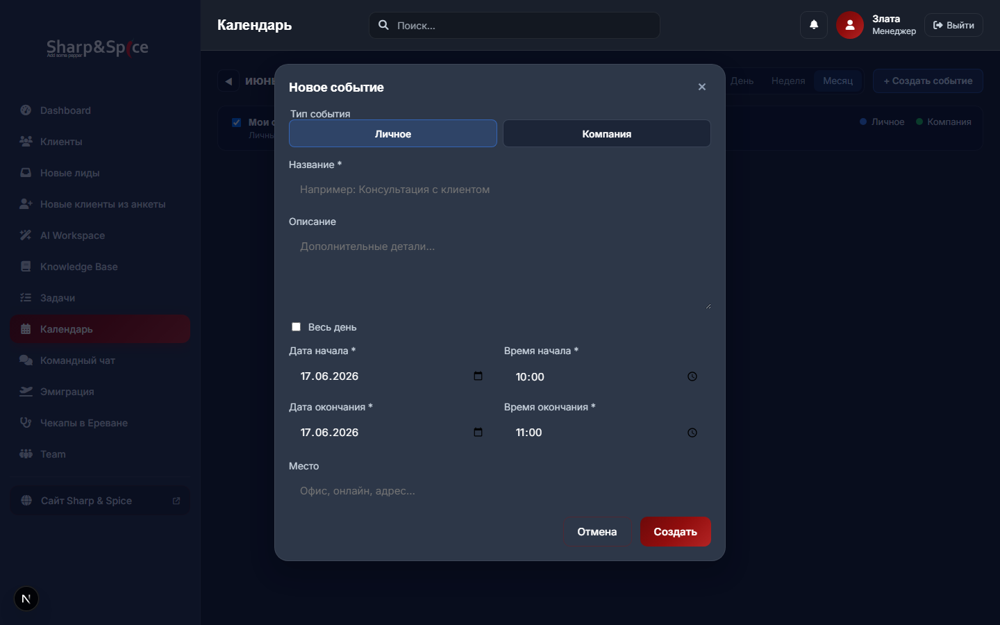
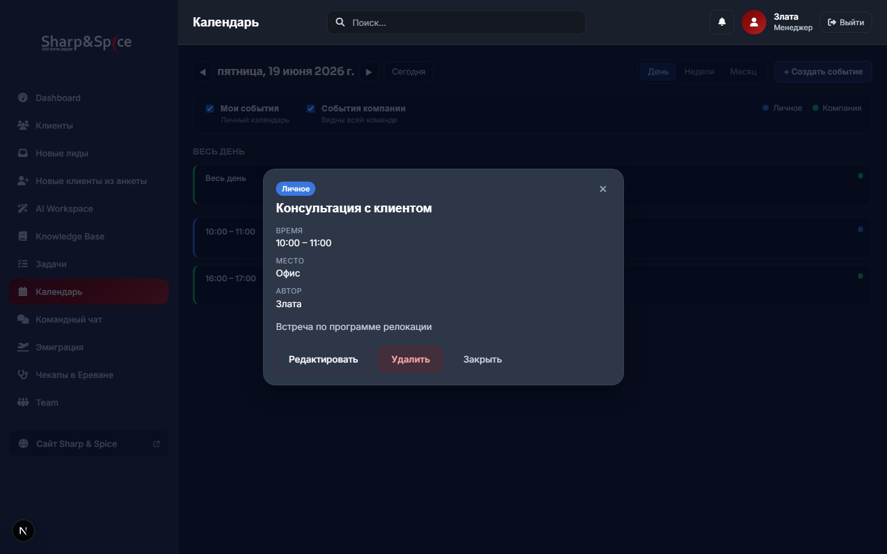

# Report — Calendar PR #7 (CRUD UI)

**Дата:** 2026-06-22  
**PR:** #7 (перенумерован: бывший PR #8 в плане) — Event CRUD UI  
**Scope:** create / view / edit / delete через UI  
**Зависит от:** PR #3 (API), PR #2 (RBAC), PR #5–#6 (Day/Month views)

---

## Результат

| Критерий | Статус |
|----------|--------|
| Кнопка «+ Создать событие» активна | ✅ |
| Модалка создания (Personal / Company) | ✅ |
| Просмотр события по клику на chip | ✅ |
| Редактирование (RBAC в UI) | ✅ |
| Удаление с подтверждением | ✅ |
| Day View — chip click → modal | ✅ |
| Month View — chip click → modal | ✅ |
| Toast после операций | ✅ |
| Refetch списка после мутаций | ✅ |
| Unit tests | ✅ 9 новых |
| `npm run build` | ✅ |
| `npm test` | ✅ 123/123 |

**Не в scope:** Week View, AI, CRM, notifications, Google Calendar.

---

## Новые файлы (8)

| Файл | Назначение |
|------|------------|
| `src/lib/calendar/form.ts` | Form values ↔ ISO timestamps, validation |
| `src/lib/calendar/form.test.ts` | Unit tests формы |
| `src/lib/calendar/permissions-client.ts` | UI RBAC (re-export server rules) |
| `src/lib/calendar/permissions-client.test.ts` | Unit tests RBAC UI |
| `src/components/calendar/CalendarEventForm.tsx` | Форма create/edit |
| `src/components/calendar/CalendarEventForm.module.css` | Стили формы |
| `src/components/calendar/CalendarEventModal.tsx` | Модалка просмотра + actions |
| `src/components/calendar/CalendarEventModal.module.css` | Стили модалки |
| `REPORT_PR7_CRUD_UI.md` | Этот отчёт |

---

## Изменённые файлы (5)

| Файл | Изменение |
|------|-----------|
| `src/components/calendar/CalendarView.tsx` | CRUD state, fetch mutations, modals, toast |
| `src/components/calendar/CalendarView.module.css` | Dialog overlay styles |
| `src/components/calendar/CalendarDayAgenda.tsx` | `onEventClick` prop |
| `src/components/calendar/CalendarMonthGrid.tsx` | `onEventClick` prop |
| `package.json` | +`form.test.ts`, `permissions-client.test.ts` |

---

## Архитектура

```
CalendarView
  ├── CalendarToolbar (+ Создать → create modal)
  ├── CalendarDayAgenda / CalendarMonthGrid (chip → view modal)
  ├── CalendarEventForm (create / edit dialogs)
  ├── CalendarEventModal (view + Edit/Delete actions)
  └── Toast (success / error)

API:
  POST   /api/calendar/events
  PATCH  /api/calendar/events/[id]
  DELETE /api/calendar/events/[id]
```

### RBAC в UI

| Действие | Условие (permissions-client) |
|----------|------------------------------|
| Редактировать | personal owner · company creator или owner |
| Удалить | mirrors edit |
| Создать | personal и company для всех auth users |

Кнопки скрыты, если нет прав; API возвращает 403 при обходе.

### Форма события

| Поле | Create | Edit |
|------|--------|------|
| Тип (Личное / Компания) | ✅ segmented | read-only badge |
| Название | ✅ | ✅ |
| Описание | ✅ | ✅ |
| Даты / время | ✅ | ✅ |
| Весь день | ✅ | ✅ |
| Место | ✅ | ✅ |

Часовой пояс: `Europe/Zagreb` через `form.ts`.

---

## UI Preview

**Среда:** `npm run dev`, JSON fallback, mock `.data/calendar-events.json`

### Модалка создания



### Просмотр события (Day View)



---

## Тесты

```
npm test → 123/123 passed (+9)
npm run build → success
```

### Новые тесты

| Suite | Cases |
|-------|-------|
| `form.test.ts` | defaults, roundtrip, validation, payload |
| `permissions-client.test.ts` | create, view, edit/delete gates |

---

## Diff summary

```
 package.json                                      |   2 +-
 src/components/calendar/CalendarView.tsx           | 207 +++
 src/components/calendar/CalendarView.module.css   |  70 +++
 src/components/calendar/CalendarDayAgenda.tsx    |   7 +-
 src/components/calendar/CalendarMonthGrid.tsx     |   3 +
 src/lib/calendar/form.ts                          | 220 (new)
 src/lib/calendar/form.test.ts                      |  98 (new)
 src/lib/calendar/permissions-client.ts            |   6 (new)
 src/lib/calendar/permissions-client.test.ts        |  72 (new)
 src/components/calendar/CalendarEventForm.tsx     | 210 (new)
 src/components/calendar/CalendarEventForm.module.css | 120 (new)
 src/components/calendar/CalendarEventModal.tsx     |  95 (new)
 src/components/calendar/CalendarEventModal.module.css | 95 (new)
 REPORT_PR7_CRUD_UI.md                             | (this file)
```

**~1200 строк** нового кода (без отчёта).

---

## SAFE TO COMMIT

| Проверка | Статус |
|----------|--------|
| Scope = CRUD UI only | ✅ |
| Build green | ✅ |
| Tests 123/123 | ✅ |
| Нет секретов | ✅ |
| Week / CRM / AI не затронуты | ✅ |
| Vertical slice create→view→edit→delete | ✅ |
| Migration не применялась | ✅ |

**Вердикт: SAFE TO COMMIT**

### Локальные артефакты (не коммитить)

| Путь | Причина |
|------|---------|
| `reports/pr7-crud-ui/` | Скриншоты |
| `scripts/capture-pr7-crud-ui.mjs` | Capture utility |
| `.env.development.local` | JSON fallback preview |

---

## Следующий шаг

**PR #8 (бывший PR #7):** Week View grid (`CalendarWeekGrid`, `week.ts`).
