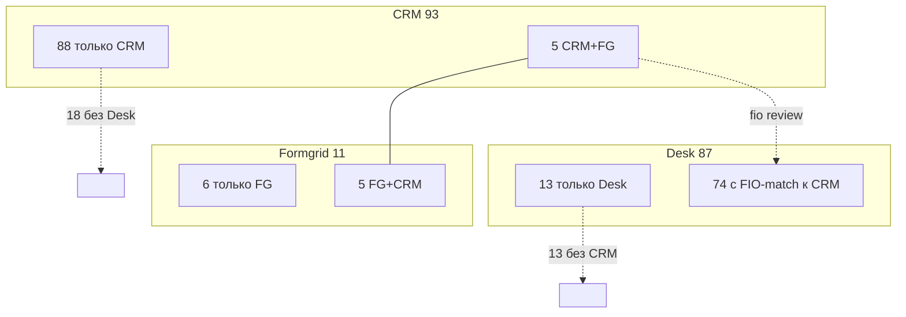

# Unified Client Index — карта проектирования

**Дата:** 9 июня 2026  
**Статус:** только проектирование. Код, миграции и таблицы **не создавались**.  
**Основа:** `CLIENT_DATA_SOURCE_OF_TRUTH_REPORT.md`, логика merge в `client-deduplication.ts` / `client-passport.ts`, живые данные (CSV export + Emigrant Desk Supabase, 9 июня 2026).

---

## 1. Цель UCI

Единая **read-модель клиента** для платформы: один `client_id`, несколько привязок к источникам, явные правила «кто главный» по каждому полю, прозрачный merge и очередь ручной проверки для слабых совпадений.

UCI **не заменяет** CRM, Formgrid и Desk — он **индексирует** их.

---

## 2. Как выглядит единый клиент

### 2.1. Каноническая запись (витрина)

```json
{
  "client_id": "uci_a3f8c2e1-4b5d-4e9a-9c1d-2f8e7b6a5d4c",
  "passport_norm": "763157608",
  "passport_display": "76 3157608",

  "name": "Давлятова Лола Бахтиёровна",
  "name_latin": "Davlyatova Lola",
  "phone": "+7 999 123-45-67",
  "email": "lola@example.com",
  "birth_date": "1990-05-12",
  "country": "Хорватия",
  "direction": "Хорватия",

  "client_status": "В работе",
  "case_status": "documents_submitted",
  "case_number": "HR-2025-0042",

  "manager": "Иван Петров",
  "referent": "Иван Петров",

  "booking": {
    "address": "Zagreb, …",
    "date_range": "12.03.2025–15.03.2025"
  },

  "notes_crm": "…текст из колонки Заметки CRM…",
  "notes_platform": [
    {
      "id": "note_…",
      "author": "Мария",
      "text": "…",
      "created_at": "2026-05-01T10:00:00Z"
    }
  ],

  "documents": {
    "drive_folder_hint": "Давлятова",
    "drive_file_ids": [],
    "desk_uploads": []
  },

  "sources": {
    "crm": {
      "linked": true,
      "spreadsheet_id": "138W2nHQcJu_xRsI2RBqeD6Oq8Tg9FbKH",
      "gid": "1431336126",
      "row": 42,
      "passport_raw": "76 3157608",
      "last_synced_at": "2026-06-09T12:00:00Z"
    },
    "formgrid": {
      "linked": true,
      "spreadsheet_id": "1S8Y0VCaAQ78wxg5Rxl8fcFMkwSsvr-X-cLrAlK4nF9Q",
      "row": 7,
      "submitted_at": "15.01.2025",
      "merge_reason": "passport"
    },
    "desk": {
      "linked": true,
      "user_id": "uuid-…",
      "case_number": "HR-2025-0042",
      "merge_reason": "fio_reviewed",
      "confidence": "medium"
    },
    "drive": {
      "linked": false,
      "match_method": null
    }
  },

  "field_provenance": {
    "name": { "value": "Давлятова Лола Бахтиёровна", "source": "formgrid" },
    "phone": { "value": "+7 …", "source": "formgrid" },
    "email": { "value": "lola@…", "source": "formgrid" },
    "client_status": { "value": "В работе", "source": "crm" },
    "case_status": { "value": "documents_submitted", "source": "desk" },
    "booking": { "source": "crm" }
  },

  "conflicts": [
    {
      "field": "case_status_vs_client_status",
      "values": [
        { "source": "crm", "value": "В работе" },
        { "source": "desk", "value": "documents_submitted" }
      ]
    }
  ],

  "merge_tier": "auto_strong",
  "updated_at": "2026-06-09T12:00:00Z"
}
```

### 2.2. Сырьевые блоки по источникам (не смешивать с витриной)

```json
{
  "client_id": "uci_…",
  "passport_norm": "763157608",

  "crm": {
    "row": 42,
    "surname": "Давлятова",
    "name_latin": "Davlyatova Lola",
    "passport": "76 3157608",
    "submitted_at": "10.02.2025",
    "expected_approval_at": "…",
    "referent": "Иван Петров",
    "booking_address": "…",
    "booking_range": "…",
    "approval_at": null,
    "notes": "…",
    "residence_card_issued_at": null,
    "app_password": "…",
    "partner": "…",
    "derived_status": "В работе"
  },

  "formgrid": {
    "row": 7,
    "full_name": "Давлятова Лола Бахтиёровна",
    "phone": "+7 …",
    "email": "",
    "passport": "763157608",
    "birth_date": "12.05.1990",
    "submitted_at": "15.01.2025",
    "survey_row": { "…": "все колонки анкеты" }
  },

  "desk": {
    "user_id": "uuid-…",
    "first_name": "Лола",
    "last_name": "Давлятова",
    "email": "lola@desk.example",
    "case_number": "HR-2025-0042",
    "current_status": "documents_submitted",
    "consulate": "…",
    "submission_city": "…",
    "submission_date": "…",
    "internal_comment": "…"
  },

  "drive": {
    "matched_files": [
      { "file_id": "…", "name": "Давлятова_паспорт.pdf", "match": "filename_fuzzy" }
    ]
  },

  "platform": {
    "notes_count": 3,
    "lead_review_status": null
  }
}
```

### 2.3. Идентификаторы

| ID | Назначение |
|----|------------|
| `client_id` | Синтетический UUID платформы (стабильный) |
| `passport_norm` | Бизнес-якорь (digits+letters, uppercase) |
| `crm.row` | Ссылка на строку External |
| `formgrid.row` | Ссылка на строку анкеты |
| `desk.user_id` | UUID профиля Desk |
| `case_number` | Номер дела Desk (не паспорт, не client_id) |

---

## 3. Какие поля брать из каждого источника

Правило: **витрина = одно поле → один SoT**. Остальное хранится в сырьевых блоках `crm` / `formgrid` / `desk`.

| Поле витрины | Главный источник | Fallback | Комментарий |
|--------------|------------------|----------|-------------|
| `passport_norm` | **CRM** | Formgrid | CRM = primary key списка клиентов |
| `name` | **Formgrid** | Desk → CRM | Самое полное ФИО (`pickLongestName`) |
| `name_latin` | **CRM** (`citizenship` col) | Formgrid | Латиница из External |
| `phone` | **Formgrid** | — | В CRM колонки нет |
| `email` | **Formgrid** | **Desk** | FG приоритетнее Desk |
| `birth_date` | **Formgrid** | — | Единственный источник |
| `country` / `direction` | **CRM** | константа | Сейчас всегда Хорватия |
| `client_status` | **CRM** (derived) | Formgrid `Новая заявка` | Lifecycle команды |
| `case_status` | **Desk** | — | Workflow кабинета |
| `case_number` | **Desk** | — | |
| `manager` / `referent` | **CRM** | — | Колонка «Имя референта» |
| `booking` | **CRM** | — | Адрес + даты |
| `notes_crm` | **CRM** | — | Колонка «Заметки» |
| `notes_platform` | **Supabase** | — | Отдельно от CRM |
| `documents` | **Drive** (+ Desk uploads позже) | — | Сейчас без ID-связи |
| `submitted_at` (операции) | **CRM** | Desk `submission_date` | Разная семантика — оба в сырье |
| `app_password` | **CRM** | — | Только CRM |
| `partner` | **CRM** col M | — | Сейчас не в API — добавить в сырье |
| `survey` (анкета) | **Formgrid** | — | Полная строка |
| `consulate`, `internal_comment` | **Desk** | — | |

Краткая шпаргалка:

```
телефон      → Formgrid
email        → Formgrid → Desk
дата рождения → Formgrid
букинг       → CRM
референт     → CRM
статус клиента → CRM (derived)
статус дела  → Desk
номер дела   → Desk
паспорт      → CRM (якорь)
ФИО          → Formgrid (display)
заметки CRM  → CRM
заметки UI   → Supabase
документы    → Drive (позже — Desk files)
```

---

## 4. Как происходит merge

### 4.1. Три уровня уверенности

| Tier | Условие | Действие |
|------|---------|----------|
| **auto_strong** | Совпадение **паспорта** (нормализованного, ≥6 символов) | Автоматический merge в один `client_id` |
| **auto_medium** | Совпадение **телефона** или **email** (оба непустые, нормализованные) | Автоматический merge, если нет конфликта паспорта |
| **review_queue** | Только **ФИО** (фамилия+имя, partial, overlap) | Кандидат в очередь ручной проверки, **не** auto-merge |
| **isolated** | Нет сигналов | Отдельная запись UCI только с одним источником |

**Конфликт паспорта:** если у двух записей валидные паспорта и они **разные** — **никогда** не склеивать по ФИО/телефону/email (hard block).

### 4.2. Порядок merge (алгоритм построения графа)

```
Шаг 1. Загрузить все записи из CRM, Formgrid, Desk как nodes.

Шаг 2. STRONG EDGES — паспорт
       CRM.passport_norm ↔ Formgrid.passport_norm
       (Desk паспорта не имеет — пропуск)

Шаг 3. MEDIUM EDGES — контакты (только между узлами БЕЗ конфликта паспорта)
       phone (нормализация, последние 10 цифр)
       email (exact, lower case)
       Порядок внутри tier: phone → email (телефон надёжнее при опечатках в email)

Шаг 4. WEAK EDGES — ФИО
       Только в review_queue, НЕ объединять автоматически в production UCI
       (текущий код merge по ФИО оставить для AI search, но не для канонического ID)

Шаг 5. DESK LINK (отдельный подграф)
       a) email: Formgrid/Ddesk или CRM+email (когда появится) ↔ Desk
       b) passport: нет
       c) ФИО fuzzy → review_queue
       При одобрении менеджером: desk.user_id пишется в sources.desk

Шаг 6. DRIVE LINK (позже)
       filename / folder contains surname + optional passport digits
       → всегда review_queue или low-confidence

Шаг 7. Connected components → один client_id на компоненту
       passport_norm = паспорт из CRM-узла, иначе из Formgrid, иначе synthetic

Шаг 8. Собрать витрину по таблице SoT (раздел 3)
```

### 4.3. Порядок приоритета сигналов (одна строка)

```
1. Паспорт     — strong auto
2. Телефон     — medium auto (если нет passport conflict)
3. Email       — medium auto (если нет passport conflict)
4. Telegram    — medium auto (только Formgrid, опционально)
5. ФИО         — manual review only
6. Drive filename — manual / AI assist
```

### 4.4. Отличие от текущего кода

Сегодня `areClientsDuplicates()` в `client-deduplication.ts` склеивает **по OR** (паспорт **или** email **или** телефон **или** ФИО) и **автоматически мержит ФИО**.

UCI должен:

- **Оставить** OR для AI search (как сейчас).
- **Разделить** для канонического индекса: auto только strong+medium; ФИО → review.

Паспорт Formgrid сейчас попадает в `debugRow.passport` (`client-context.ts`) — strong merge CRM↔Formgrid **работает**.

Desk в merge **не участвует** — только текстовый поиск по имени.

---

## 5. Покрытие: сколько клиентов можно объединить автоматически

**Дата замера:** 9 июня 2026  
**Объёмы:** CRM **93**, Formgrid **11**, Emigrant Desk **87**

### 5.1. CRM ↔ Formgrid

| Метрика | Значение |
|---------|----------|
| CRM с хотя бы одной парой Formgrid | **5 / 93** |
| **% от CRM** | **5,4%** |
| Formgrid с парой в CRM | **5 / 11** |
| **% от Formgrid** | **45,5%** |
| Только Formgrid (лиды без CRM) | **6** (54,5%) |
| Только CRM (нет в Formgrid) | **88** (94,6%) |
| Совпадение по паспорту | **5** (100% пар) |
| Совпадение только по ФИО без паспорта | **0** |
| Email как якорь | **0** (email в Formgrid **0 / 11**) |

**Подтверждённые пары (passport + fio):** Белкания, Давлятова, Куликова, Лысогорская, Смола.

> Если ожидали «70% CRM↔Formgrid» — **нет**. Formgrid маленький (11 анкет), в CRM 93 клиента. Покрытие лидов Formgrid в CRM высокое (**45%**), но большинство CRM-клиентов никогда не проходили Formgrid.

### 5.2. CRM ↔ Emigrant Desk

| Метрика | Значение | Уровень |
|---------|----------|---------|
| CRM с match по **ФИО** (текущая эвристика) | **75 / 93** | **80,6%** | review, не auto |
| Desk с match к CRM | **74 / 87** | **85,1%** | review |
| CRM без пары Desk | **18** | | |
| Desk без пары CRM | **13** | | |
| Match по **email** | **0** | CRM email пуст | |
| Match по **паспорту** | **0** | Desk не хранит паспорт | |
| CRM-строк с **неоднозначным** ФИО (2+ Desk) | **2** | | ручная проверка |

**Auto-merge CRM↔Desk по proposed UCI rules: ~0%** (нет shared strong/medium ключей).

**После review_queue (ФИО): потенциально до ~80% CRM**, с риском false positive на однофамильцах.

### 5.3. Все три источника вместе (CRM + Formgrid + Desk)

| Метрика | Значение |
|---------|----------|
| CRM в **всех трёх** (strong FG + FIO Desk) | **5 / 93** |
| **% от CRM** | **5,4%** |
| Имена | Белкания, Давлятова, Куликова, Лысогорская, Смола |

**Auto strong (passport) во всех трёх:** те же **5** клиентов — у них есть CRM + Formgrid по паспорту; Desk цепляется по ФИО.

### 5.4. Сводная таблица (главный ответ)

| Связка | Auto-merge сейчас | С proposed UCI | Примечание |
|--------|-------------------|----------------|------------|
| **CRM ↔ Formgrid** | **5,4%** CRM (45% FG) | **5,4%** strong (passport) | Телефон/email не добавляют пар (CRM пусто; FG email 0%) |
| **CRM ↔ Desk** | **0%** auto | **0%** auto, **~81%** review | Только ФИО; 2 неоднозначных |
| **Formgrid ↔ Desk** | **0%** auto | **~45%** review (5/11) | Те же 5 имён что в CRM |
| **Все три вместе** | **5,4%** CRM | **5,4%** auto + review Desk | 5 «золотых» клиентов |

### 5.5. Визуализация покрытия



---

## 6. Очереди и краевые случаи

### 6.1. Типы записей в UCI

| Тип | Пример | Действие |
|-----|--------|----------|
| **Golden** | 5 клиентов с CRM+FG+Desk | Эталон для тестов UCI |
| **CRM-only** | 88 клиентов | `client_id` = f(passport), desk link через review |
| **FG-only lead** | 6 анкет | Отдельный `client_id` до импорта в CRM |
| **Desk-only** | 13 профилей | Кабинет без строки в CRM |
| **Conflict** | Разные паспорта, одинаковый телефон | Block + alert |

### 6.2. Drive

Сейчас **0%** автоматической привязки. Проектировать как:

- `drive.linked: false` по умолчанию;
- поиск по `surname` + `passport_last4` в имени файла;
- всегда `confidence: low` до ручного подтверждения.

### 6.3. Platform notes

`client_notes.client_id` сегодня = **паспорт CRM**. При UCI:

- мигрировать на `uci_client_id` или оставить passport_norm как стабильный внешний ключ;
- не смешивать с `notes_crm`.

---

## 7. Поток обновления (без реализации)

```
Cron / webhook
  → fetch CRM CSV, Formgrid CSV, Desk API
  → rebuild edges (passport → phone → email)
  → apply review_queue rules
  → upsert read-model (in-memory cache или будущее хранилище)
  → emit conflicts + review tasks
```

Частота: CRM/FG — при открытии списка или каждые N минут; Desk — при AI-запросе или фоном.

---

## 8. Что нельзя потерять при внедрении UCI

1. **Паспорт** как стабильный ключ CRM-строки.  
2. **Сырые блоки** — витрина не должна затирать `crm.notes`, `desk.internal_comment`, `formgrid.survey_row`.  
3. **Разделение статусов** — `client_status` (CRM) ≠ `case_status` (Desk).  
4. **Два типа заметок** — CRM vs Supabase.  
5. **6 лидов Formgrid без CRM** — не сливать в случайного CRM-клиента без passport match.  
6. **Колонка «Партнёр»** — включить в `crm` сырье.

---

## 9. Рекомендуемые фазы (только план)

| Фаза | Содержание | Ожидаемый эффект |
|------|------------|------------------|
| **0** | Read-model в памяти / JSON cache, без БД | Видимость golden 5 |
| **1** | Review queue UI для Desk↔CRM (ФИО) | Поднять Desk link с 0% auto до ~80% confirmed |
| **2** | Import Formgrid → CRM (после Sheets migration) | Рост FG↔CRM с 5 до N |
| **3** | `client_id` в platform notes + Drive folder convention | Сквозная навигация |
| **4** | Персистентный индекс (когда понадобится) | Отдельное решение по хранилищу |

---

## 10. Итог

| Вопрос | Ответ |
|--------|--------|
| Единый клиент | JSON с `client_id`, витриной, `sources`, `field_provenance`, сырыми блоками |
| SoT по полям | Контакты → Formgrid; операции → CRM; дело → Desk |
| Merge order | **Паспорт → телефон → email → (review) ФИО** |
| CRM↔Formgrid auto | **5,4%** CRM, **45,5%** Formgrid |
| CRM↔Desk auto | **~0%** |
| CRM↔Desk с review | **~81%** |
| Все три auto | **5,4%** (5 клиентов) |

Цифры пересчитывать после роста Formgrid и импорта лидов в CRM — ожидается рост CRM↔Formgrid, не изменится логика Desk без email/паспорта в CRM.

---

*Замер покрытия: public CSV export Google Sheets + Supabase REST Emigrant Desk, правила merge из production-кода с tier-разделением для UCI.*
